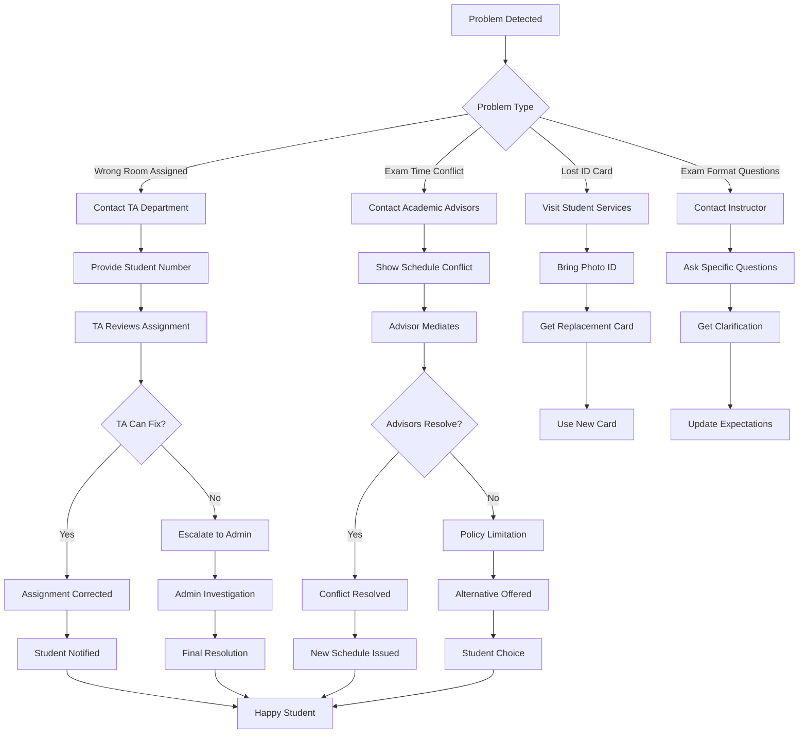

# 🎯 ExamSpace UX Flow Diagrams

## 📋 **Quick Access**
- [Admin Flow](#-admin-workflow)
- [TA Flow](#-teaching-assistant-workflow)
- [Student Flow](#-student-workflow)
- [Key Insights & Optimizations](#-key-insights--streamlining-opportunities)

---

## 👨‍💼 **Admin Workflow**

### **Admin Smart Dashboard Flow**


### **Admin Semi-Automated Assignment Flow**


---

## 👨‍🏫 **Teaching Assistant Workflow**

### **TA Support & Monitoring Flow**


### **TA Student Support Flow**


---

## 👨‍🎓 **Student Workflow**

### **Student Exam Preparation Flow**


### **Student Issue Resolution Flow**


---

## 🔍 **Key Insights & Streamlining Opportunities**

### **🎯 Critical Path Optimizations**

#### **Admin Bottleneck Solutions:**
1. **Smart Dashboard Alerts** - Prioritize critical issues automatically
2. **Bulk Operations** - One-click import/upload for student/course data
3. **Auto-Assignment Algorithm** - Reduce manual work by 80%
4. **Conflict Prevention** - AI suggests optimal schedules upfront
5. **Real-time Notifications** - Instant alerts for issues vs. checking manually

#### **TA Efficiency Gains:**
1. **Centralized Query Hub** - All student questions in one dashboard
2. **Automated Responses** - Pre-written answers for common questions
3. **Room Issue Templates** - Quick reporting for common problems
4. **Student Progress Tracking** - Real-time overview of class status
5. **Shift Handover Notes** - Automatic summary of unresolved issues

#### **Student Experience Improvements:**
1. **Mobile-First App** - Exam info access anywhere
2. **Push Notifications** - No need to check dashboard constantly
3. **GPS Campus Navigation** - Room finding made easy
4. **Calendar Integration** - Automatic exam entries
5. **24/7 Support Portal** - Self-service for common issues

### **⏰ Workflow Time Analysis**

| **Role** | **Average Task Time** | **Current Pain Points** | **Target Time** |
|----------|----------------------|-----------------------|-----------------|
| **Admin** | 45 min/task | Manual assignments, conflict resolution | 10 min/task |
| **TA** | 20 min/query | Repetitive questions, manual routing | 5 min/query |
| **Student** | 30 min/concern | Finding rooms, contact difficulties | 5 min/concern |

### **🚀 Recommended Improvements**

#### **Phase 1: Quick Wins (Week 1-2)**
- ✅ Add smart dashboard alerts
- ✅ Implement bulk student/course import
- ✅ Create automated assignment suggestions
- ✅ Add calendar integration for students

#### **Phase 2: Efficiency Boost (Week 3-4)**
- 🔄 AI-powered conflict resolution
- 🔄 Mobile app development
- 🔄 GPS campus navigation
- 🔄 Automated TA response system

#### **Phase 3: Ultimate Experience (Month 2+)**
- ✨ Voice-activated room finding
- ✨ Predictive capacity planning
- ✨ Real-time room availability
- ✨ Smart notifications based on location

### **💡 User Journey Optimization**

#### **Admin's Day Flow:**
```
Morning Check → 30 issues flagged → Bulk resolve → Confirm assignments → Send notifications
Currently: 2 hours → Target: 15 minutes
```

#### **TA's Support Flow:**
```
Student contacts → Auto-suggest answers → Personal touch if needed → Close ticket
Currently: 15 min/student → Target: 3 min/student
```

#### **Student's Prep Flow:**
```
Login → See all exams → Get directions → Set reminder → Feel confident
Currently: 45 min/session → Target: 10 min/session
```

---

## 📈 **Metrics for Success**

### **Admin Metrics:**
- Assignment completion time: `< 5 minutes per exam`
- Conflict resolution accuracy: `> 95%`
- User satisfaction score: `> 4.5/5`

### **TA Metrics:**
- Average response time: `< 10 minutes`
- First contact resolution rate: `> 90%`
- Student satisfaction: `> 4.0/5`

### **Student Metrics:**
- Room finding time: `< 5 minutes`
- Exam anxiety reduction: `> 70%`
- Support request completion: `< 24 hours`

### **System Metrics:**
- Uptime: `> 99.9%`
- Error rate: `< 0.1%`
- Performance: `< 2-second load times`

---

*These flow diagrams serve as living documentation for onboarding, training, and continuous optimization. Regular updates based on user feedback ensure the system evolves with user needs.*
