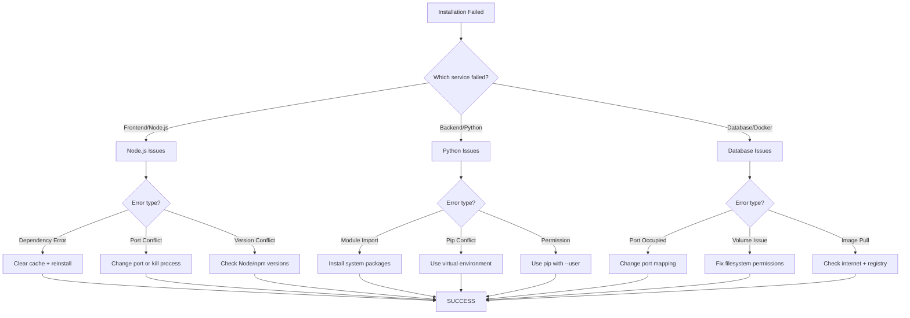
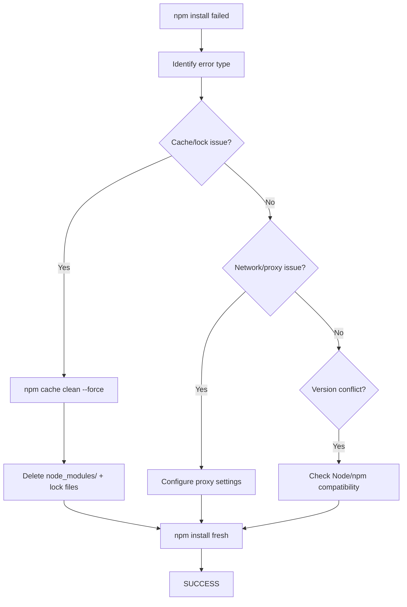
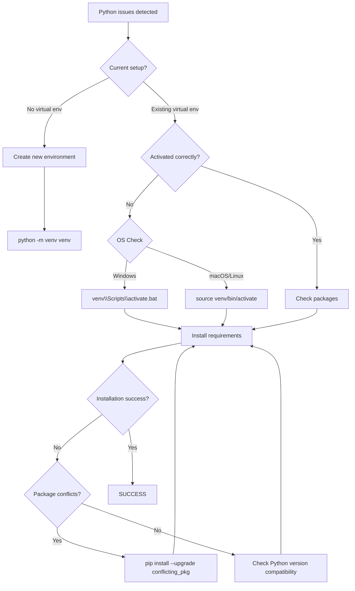

# 🛠️ Troubleshooting Guide

## Common Issues and Solutions

This guide covers the most frequently encountered issues and their solutions.

## 🚀 **Installation Issues Decision Tree**

### **Installation Problem Diagnosis**


### **Step-by-Step: Node.js Dependencies Failure**


### **Advanced: Python Virtual Environment Setup**


## 🔐 Authentication Issues

### Login Fails
**Problem**: Cannot login with valid credentials

**Solutions**:
1. Check database connection
2. Verify user exists in database
3. Reset database with `/init-db` endpoint
4. Check browser console for CORS errors

### Session Expires Too Quickly
**Problem**: Users are logged out frequently

**Solutions**:
1. Check session timeout settings in configuration
2. Verify cookie settings in browser
3. Check server-side session configuration

## 📊 Database Issues

### SQLite Database Locked
**Problem**: Database is locked or busy

**Solutions**:
1. Close all connections to the database
2. Delete the .db file and reinitialize:
   ```bash
   rm smartroomassign.db
   python app.py  # This recreates the database
   ```

### Migration Errors
**Problem**: Database schema changes fail

**Solutions**:
1. Backup current database
2. Check for data conflicts
3. Run database initialization again

## 🗺️ Map Issues

### Building Locator Map Not Loading
**Problem**: Map container not found or tiles not loading

**Solutions**:
1. Check internet connection for tile loading
2. Verify Leaflet CSS is imported
3. Check browser console for JavaScript errors
4. Ensure map container has proper dimensions

### Incorrect Building Coordinates
**Problem**: Buildings show in wrong locations

**Solutions**:
1. Update coordinates in BuildingLocator component
2. Verify coordinate format (Leaflet uses [lat, lng])
3. Check coordinate accuracy with mapping service

## 📤 Import/Export Issues

### CSV Import Fails
**Problem**: File upload or parsing fails

**Solutions**:
1. Verify CSV format matches expected structure
2. Check for required columns
3. Ensure proper encoding (UTF-8)
4. Validate file size (max 10MB)

### Export Not Working
**Problem**: CSV/PDF export fails

**Solutions**:
1. Check file permissions
2. Verify sufficient disk space
3. Check for special characters in data
4. Try exporting smaller datasets

## ⚡ Performance Issues

### Slow Page Loading
**Problem**: Pages take too long to load

**Solutions**:
1. Check database query performance
2. Optimize image sizes
3. Enable browser caching
4. Consider pagination for large datasets

### High Memory Usage
**Problem**: Application uses too much memory

**Solutions**:
1. Check for memory leaks in components
2. Optimize database queries
3. Implement proper cleanup in useEffect hooks
4. Monitor component re-renders

## 🔧 Development Issues

### Hot Reload Not Working
**Problem**: Changes not reflected in browser

**Solutions**:
1. Check file save status
2. Verify development server is running
3. Check browser console for errors
4. Restart development server

### ESLint Errors
**Problem**: Code quality warnings or errors

**Solutions**:
1. Fix unused variables and imports
2. Add proper dependency arrays to useEffect
3. Use appropriate React hooks patterns
4. Follow component best practices

## 🌐 Browser Compatibility

### Features Not Working in Some Browsers
**Problem**: Some features fail in certain browsers

**Solutions**:
1. Check browser compatibility for React features
2. Update browser to latest version
3. Check for polyfill requirements
4. Test in different browsers

## 📱 Mobile Responsiveness

### Layout Issues on Mobile
**Problem**: Interface doesn't work well on mobile devices

**Solutions**:
1. Check viewport meta tag
2. Test responsive design breakpoints
3. Verify touch interactions work
4. Check for horizontal scrolling issues

## 🔍 Debugging Tips

### Enable Debug Mode
1. Set `FLASK_ENV=development` for backend
2. Use React DevTools for frontend debugging
3. Check browser console for errors
4. Monitor network tab for API issues

### Logging
1. Check Flask application logs
2. Monitor browser console output
3. Review database query logs
4. Enable verbose logging if needed

## 📞 Getting Help

If you can't resolve an issue:

1. **Check this troubleshooting guide** first
2. **Search the documentation** for related topics
3. **Review recent changes** that might have caused the issue
4. **Contact support** with detailed information:
   - Steps to reproduce the issue
   - Expected vs actual behavior
   - Error messages and logs
   - System information (OS, browser, versions)

## 🚨 Emergency Procedures

### System Unavailable
1. Check if services are running
2. Verify database connectivity
3. Check for resource exhaustion
4. Review recent deployments

### Data Loss
1. Restore from recent backup
2. Check database integrity
3. Verify backup procedures are working
4. Implement additional monitoring

### Security Incident
1. Secure the system immediately
2. Change all passwords
3. Review access logs
4. Contact security team

---

*This troubleshooting guide is regularly updated with new issues and solutions.*
*Last Updated: October 2025*
