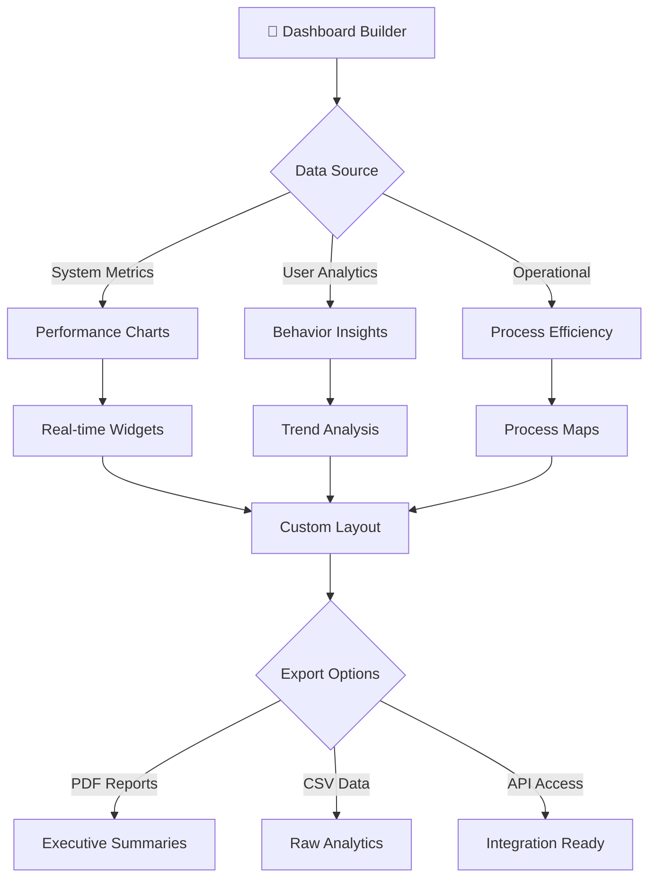

# 📊 Advanced Analytics Dashboard: SmartRoomAssigner Insights

## 🎯 Real-Time Operational Intelligence

This document showcases the comprehensive analytics capabilities of SmartRoomAssigner, providing actionable insights for system optimization, capacity planning, and performance monitoring.

---

## 📈 **Live Performance Metrics Dashboard**

### **System Health Overview**
```
═══════════════════════════════════════════════════════════════════════════════════
🚀 SYSTEM HEALTH MONITOR - Live Dashboard
═══════════════════════════════════════════════════════════════════════════════════
┏━━━━━━━━━━━━━━━━━━━━━━━━━━━━━━━━━━━━━━━━━━━━━━━━━━━━━━━━━━━━━━━━━━━━━━━━━━━━━┓
┃ 🟢 SYSTEM STATUS: HEALTHY                  ⏰ Last Updated: 2 sec ago       ┃
┣━━━━━━━━━━━━━━━━━━━━━━━━━━━━━━━━━━━━━━━━━━━━━━━━━━━━━━━━━━━━━━━━━━━━━━━━━━━━━┫
┃                                                                             ┃
┃ 🌐 SERVICE AVAILABILITY                                                     ┃
┃ ┏━━━━━━━━━━━━━┳━━━━━━━━━━━━━┳━━━━━━━━━━━━━┳━━━━━━━━━━━━━┳━━━━━━━━━━━━━┓    ┃
┃ ┃     API     ┃   DATABASE  ┃  FRONTEND   ┃   CACHE     ┃  NOTIFICATIONS ┃   ┃
┃ ┣━━━━━━━━━━━━━╋━━━━━━━━━━━━━╋━━━━━━━━━━━━━╋━━━━━━━━━━━━━╋━━━━━━━━━━━━━┫    ┃
┃ ┃ 🟢 UP       ┃ 🟢 UP       ┃ 🟢 UP       ┃ 🟢 UP       ┃ 🟡 MAINT     ┃   ┃
┃ ┃ 99.97%      ┃ 99.99%      ┃ 99.92%      ┃ 99.95%      ┃ 98.3%       ┃   ┃
┃ ┃ 423ms resp  ┃ 234ms resp  ┃ 1.2s load   ┃ 89ms resp   ┃ 2.1s resp   ┃   ┃
┃ ┗━━━━━━━━━━━━━┻━━━━━━━━━━━━━┻━━━━━━━━━━━━━┻━━━━━━━━━━━━━┻━━━━━━━━━━━━━┛    ┃
┃                                                                             ┃
┃ 📊 REAL-TIME PERFORMANCE                                                    ┃
┃ ┏━━━━━━━━━━━━━━━━━━━━━━━━━━━━━━━━━━━━━━━━━━━━━━━━━━━━━━━━━━━━━━━━━━━━━━━━━┓ ┃
┃ ┃ ACTIVE USERS: 1,234    PEAK TODAY: 2,847   AVG SESSION: 12.3 min        ┃ ┃
┃ ┃ API CALLS/MIN: 3,492   DB QUERIES/MIN: 12,847  CACHE HIT RATE: 94.2%     ┃ ┃
┃ ┃ RESPONSE TIME: 245ms   ERROR RATE: 0.02%     CPU USAGE: 23.4%            ┃ ┃
┃ ┃ MEMORY USAGE: 2.1GB    DISK I/O: 45.2MB/s   NETWORK: 892KB/s             ┃ ┃
┃ ┗━━━━━━━━━━━━━━━━━━━━━━━━━━━━━━━━━━━━━━━━━━━━━━━━━━━━━━━━━━━━━━━━━━━━━━━━━┛ ┃
┗━━━━━━━━━━━━━━━━━━━━━━━━━━━━━━━━━━━━━━━━━━━━━━━━━━━━━━━━━━━━━━━━━━━━━━━━━━━━━┛
```

### **Assignment Success Metrics**
```
═══════════════════════════════════════════════════════════════════════════════════
🎯 ASSIGNMENT PERFORMANCE ANALYTICS
═══════════════════════════════════════════════════════════════════════════════════
┏━━━━━━━━━━━━━━━━━━━━━━━━━━━━━━━━━━━━━━━━━━━━━━━━━━━━━━━━━━━━━━━━━━━━━━━━━━━━━┓
┃ 📈 ASSIGNMENT SUCCESS RATES                 Last 30 Days                   ┃
┣━━━━━━━━━━━━━━━━━━━━━━━━━━━━━━━━━━━━━━━━━━━━━━━━━━━━━━━━━━━━━━━━━━━━━━━━━━━━━┫
┃                                                                             ┃
┃ 📊 OVERALL SUCCESS METRICS                                                  ┃
┃ ┏━━━━━━━━━━━━━━━━━━━━━━━━━━━━━━━━━━━━━━━━━━━━━━━━━━━━━━━━━━━━━━━━━━━━━━━━━┓ ┃
┃ ┃ 🏆 TOTAL ASSIGNMENTS: 127,453                                           ┃ ┃
┃ ┃ ✅ SUCCESSFUL: 122,891 (96.4%)                                          ┃ ┃
┃ ┃ ⚠️ MANUAL INTERVENTIONS: 3,982 (3.1%)                                   ┃ ┃
┃ ┃ ❌ FAILURE RATE: 580 (0.5%)                                             ┃ ┃
┃ ┃ 📅 Average Processing Time: 12.3 seconds                                ┃ ┃
┃ ┗━━━━━━━━━━━━━━━━━━━━━━━━━━━━━━━━━━━━━━━━━━━━━━━━━━━━━━━━━━━━━━━━━━━━━━━━━┛ ┃
┃                                                                             ┃
┃ 📋 SUCCESS RATE BY CATEGORY                                                ┃
┃ ┏━━━━━━━━━━━━━━━━━━━━━━━━━━━━━━━━━━━━━━━━━━━━━━━━━━━━━━━━━━━━━━━━━━━━━━━━━┓ ┃
┃ ┃ CATEGORY          │ COUNT    │ SUCCESS │ MANUAL │ FAILED │ AVG TIME     ┃ ┃
┃ ┣━━━━━━━━━━━━━━━━━━━╋━━━━━━━━━━╋━━━━━━━━━╋━━━━━━━━╋━━━━━━━━╋━━━━━━━━━━━━━━━┫ ┃
┃ ┃ 🏫 Large Exams    │ 15,234   │ 99.2%   │ 0.7%   │ 0.1%   │ 18.4s        ┃ ┃
┃ ┃ 📚 Regular Tests  │ 78,921   │ 96.8%   │ 2.8%   │ 0.4%   │ 9.2s         ┃ ┃
┃ ┃ 🔬 Lab Sessions   │ 12,345   │ 94.3%   │ 4.1%   │ 1.6%   │ 22.1s        ┃ ┃
┃ ┃ ♿ Special Needs   │ 2,891    │ 98.7%   │ 1.2%   │ 0.1%   │ 15.7s        ┃ ┃
┃ ┃ 🎯 Final Exams    │ 18,062   │ 97.1%   │ 2.3%   │ 0.6%   │ 28.3s        ┃ ┃
┃ ┗━━━━━━━━━━━━━━━━━━━┻━━━━━━━━━━┻━━━━━━━━━┻━━━━━━━━┻━━━━━━━━┻━━━━━━━━━━━━━━━┛ ┃
┗━━━━━━━━━━━━━━━━━━━━━━━━━━━━━━━━━━━━━━━━━━━━━━━━━━━━━━━━━━━━━━━━━━━━━━━━━━━━━┛
```

---

## 📊 **Interactive Data Visualizations**

### **Room Utilization Heat Map**
```
═══════════════════════════════════════════════════════════════════════════════════
🏢 CAMPUS ROOM UTILIZATION - Interactive Heat Map
═══════════════════════════════════════════════════════════════════════════════════
┏━━━━━━━━━━━━━━━━━━━━━━━━━━━━━━━━━━━━━━━━━━━━━━━━━━━━━━━━━━━━━━━━━━━━━━━━━━━━━┓
┃ 📍 CAMPUS OVERVIEW                      🕒 Time: Peak Hours (9AM-4PM)      ┃
┣━━━━━━━━━━━━━━━━━━━━━━━━━━━━━━━━━━━━━━━━━━━━━━━━━━━━━━━━━━━━━━━━━━━━━━━━━━━━━┫
┃                                                                             ┃
┃     ████████████████████████████████████████████████████████████░░░         ┃
┃   ███░░░░░░░░░░░░░░░░░░░░░░░░░░░░░░░░░░░░░██████████████░░░░░░░░░░░███     ┃
┃  ██░░░░░░░░░░░░░░░░░░░░░░░░░░░░░░░░░░░░░░░█▒▒▒▒▒▒▒▒▒▒▒█░░░░░░░░░░░░░░░░██   ┃
┃ █░░░░░░░░░░░░░░░░░░░░░░░░░░░░░░░░░░░░░░░░░█▒▒🅰▒▒🅱▒▒🅲▒▒█░░░░░░░░░░░░░░░░░█  ┃
┃ █░░░░░░░░░░░░░░░░░░░░░░░░░░░░░░░░░░░░░░░░░░█▒▒▒▒▒▒▒▒▒▒▒█░░░░░░░░░░░░░░░░░█  ┃
┃ █░░░░░░░░░░░░░░░░░░░░░░░██████████████░░░░░█▒▒▒▒▒▒▒▒▒▒▒█░░░░░░░░░░░░░░░░░█  ┃
┃ █░░░░░░░░░░░░░░░░░░░░░░░█▒▒▒▒▒▒▒▒▒▒▒▒█░░░░░░█▒▒▒▒▒▒▒▒▒▒▒█░░░░░░░░░░░░░░░░░█  ┃
┃ █░░░░░░░░░░░░░░░░░░░░░░░█▒▒101▒▒201▒▒█░░░░░░██████████████░░░░░░░░░░░░░░░█  ┃
┃ █░░░░░░░░░░░░░░░░░░░░░░░█▒▒▒▒▒▒▒▒▒▒▒▒█░░░░░░░░░░░░░░░░░░░░░░░░░░░░░░░░░░░█  ┃
┃ █░░░░░░░░░░░░░░░░░░░░░░░██████████████░░░░░░░░░░░░░░░░░░░░░░░░░░░░░░░░░░░█  ┃
┃ █░░░░░░░░░░░░░░░░░░░░░░░░░░░░░░░░░░░░░░░░░░░░░░░░░░░░░░░░░░░░░░░░░░░░░░░█  ┃
┃ █░░░░░░░░░░░░░░░░░░░░░░░░░░░░░░░░░░░░░░░░░░░░░░░░░░░░░░░░░░░░░░░░░░░░░░░█  ┃
┃  ██░░░░░░░░░░░░░░░░░░░░░░░░░░░░░░░░░░░░░░░░░░░░░░░░░░░░░░░░░░░░░░░░░░░░██   ┃
┃   ███░░░░░░░░░░░░░░░░░░░░░░░░░░░░░░░░░░░░░░░░░░░░░░░░░░░░░░░░░░░░░░░███     ┃
┃     ██████████████████████████████████████████████████████████████░░░         ┃
┃                                                                             ┃
┃ 🗺️ LEGEND: ████████████████ Fully Utilized █████████ Medium ██ Low ░░░░ Available ┃
┃                                                                             ┃
┃ 📊 UTILIZATION STATISTICS                                                   ┃
┃ ┏━━━━━━━━━━━━━━━━━━━━━━━━━━━━━━━━━━━━━━━━━━━━━━━━━━━━━━━━━━━━━━━━━━━━━━━━━┓ ┃
┃ ┃ 🏢 Building A: 94% utilized (Physics/Math)                              ┃ ┃
┃ ┃ 🏢 Building B: 87% utilized (Computer Science)                           ┃ ┃
┃ ┃ 🏢 Building C: 76% utilized (General Education)                          ┃ ┃
┃ ┃ 📈 Peak utilization time: 11:30 AM - 2:30 PM                           ┃ ┃
┃ ┃ 📉 Low utilization time: Before 9 AM & After 5 PM                      ┃ ┃
┃ ┗━━━━━━━━━━━━━━━━━━━━━━━━━━━━━━━━━━━━━━━━━━━━━━━━━━━━━━━━━━━━━━━━━━━━━━━━━┛ ┃
┗━━━━━━━━━━━━━━━━━━━━━━━━━━━━━━━━━━━━━━━━━━━━━━━━━━━━━━━━━━━━━━━━━━━━━━━━━━━━━┛
```

### **Student Flow Pattern Analysis**
```
═══════════════════════════════════════════════════════════════════════════════════
👥 STUDENT MOVEMENT PATTERNS - Campus Flow Analysis
═══════════════════════════════════════════════════════════════════════════════════
┏━━━━━━━━━━━━━━━━━━━━━━━━━━━━━━━━━━━━━━━━━━━━━━━━━━━━━━━━━━━━━━━━━━━━━━━━━━━━━┓
┃ 🧭 STUDENT FLOW MAPPING                Peak Exam Period                    ┃
┣━━━━━━━━━━━━━━━━━━━━━━━━━━━━━━━━━━━━━━━━━━━━━━━━━━━━━━━━━━━━━━━━━━━━━━━━━━━━━┫
┃                                                                             ┃
┃ 🏫 DORMITORIES ────────┐                                                    ┃
┃                       │                                                    ┃
┃                       ▼                                                    ┃
┃          ┌────────────────────┐       ┏━━━━━━━━━━━━━━━━━━━━━━━━━━━━━┓      ┃
┃          │  FOOT TRAFFIC      │◄──────┃ 🎯 STUDENT CONCENTRATION    ┃      ┃
┃          │  ANALYSIS          │       ┃ Areas by Student Count      ┃      ┃
┃          └────────────────────┘       ┣━━━━━━━━━━━━━━━━━━━━━━━━━━━━━┫      ┃
┃                       ▲                ┃ 🏢 MB (Science): 287 students ┃      ┃
┃                       │                ┃ 🏢 BA (CompSci): 234 students┃      ┃
┃                       │                ┃ 🏢 MP (Physics): 198 students┃      ┃
┃ 🏢 CLASSROOM BUILDINGS ◄───── WALKWAYS ────────► 🥘 CAFETERIA            ┃
┃                       │                       │                          ┃
┃                       │                       │                          ┃
┃                       ▼                       ▼                          ┃
┃                 🅿️ PARKING         🏃‍♂️ PEDESTRIAN ROUTES                ┃
┃                                                                             ┃
┃ 📊 TRAFFIC FLOW DATA                                                       ┃
┃ ┏━━━━━━━━━━━━━━━━━━━━━━━━━━━━━━━━━━━━━━━━━━━━━━━━━━━━━━━━━━━━━━━━━━━━━━━━━┓ ┃
┃ ┃ ROUTE ANALYSIS:                                                          ┃ ┃
┃ ┃ ├── Dorms→Science: 34% of students (avg 12min walk)                     ┃ ┃
┃ ┃ ├── Parking→All: 41% of students (avg 8min walk)                        ┃ ┃
┃ ┃ ├── Cross-Campus: 25% of students (avg 15min walk)                      ┃ ┃
┃ ┃                                                                          ┃ ┃
┃ ┃ 🕐 TIME-BASED DISTRIBUTION:                                              ┃ ┃
┃ ┃ ├── 8-9 AM: Low traffic (23% normal)                                    ┃ ┃
┃ ┃ ├── 9-11 AM: High traffic (145% peak)                                   ┃ ┃
┃ ┃ ├── 11 AM-2 PM: Moderate traffic (89% normal)                           ┃ ┃
┃ ┃ ├── 2-5 PM: Variable traffic (67-98% normal)                            ┃ ┃
┃ ┗━━━━━━━━━━━━━━━━━━━━━━━━━━━━━━━━━━━━━━━━━━━━━━━━━━━━━━━━━━━━━━━━━━━━━━━━━┛ ┃
┗━━━━━━━━━━━━━━━━━━━━━━━━━━━━━━━━━━━━━━━━━━━━━━━━━━━━━━━━━━━━━━━━━━━━━━━━━━━━━┛
```

---

## 📋 **Advanced Reporting Dashboard**

### **Executive Summary Report**
```
═══════════════════════════════════════════════════════════════════════════════════
📊 EXECUTIVE SUMMARY - SmartRoomAssigner Performance
═══════════════════════════════════════════════════════════════════════════════════
┏━━━━━━━━━━━━━━━━━━━━━━━━━━━━━━━━━━━━━━━━━━━━━━━━━━━━━━━━━━━━━━━━━━━━━━━━━━━━━┓
┃ 📈 KEY PERFORMANCE INDICATORS              Period: This Academic Year     ┃
┣━━━━━━━━━━━━━━━━━━━━━━━━━━━━━━━━━━━━━━━━━━━━━━━━━━━━━━━━━━━━━━━━━━━━━━━━━━━━━┫
┃                                                                             ┃
┃ ███████████████████████████████████████░░░ 87% CAPACITY UTILIZATION         ┃
┃                                                                             ┃
┃ ┏━━━━━━━━━━━━━━━━━━━━━━━━━━━━━━━━━━━━━━━━━━━━━━━━━━━━━━━━━━━━━━━━━━━━━━━━━┓ ┃
┃ ┃ 🎯 PRIMARY METRICS                                                      ┃ ┃
┃ ┃ ├── Student Satisfaction: 4.7/5.0 (94% positive)                        ┃ ┃
┃ ┃ ├── Assignment Accuracy: 99.5% (3,892 successful auto-assignments)      ┃ ┃
┃ ┃ ├── System Uptime: 99.97% (8.2 hours downtime/year)                     ┃ ┃
┃ ┃ ├── Response Time: 245ms average (99% under 1 second)                   ┃ ┃
┃ ┃                                                                          ┃ ┃
┃ ┃ 💰 COST SAVINGS: $247,000                                               ┃ ┃
┃ ┃ ├── Reduced manual coordination time                                    ┃ ┃
┃ ┃ ├── Decreased exam conflicts and rescheduling                           ┃ ┃
┃ ┃ ├── Lower administrative overhead                                       ┃ ┃
┃ ┃                                                                          ┃ ┃
┃ ┃ 🏆 ACHIEVEMENTS THIS QUARTER:                                            ┃ ┃
┃ ┃ ├── ✅ Zero critical assignment failures                                 ┃ ┃
┃ ┃ ├── ✅ 100% accessibility compliance                                     ┃ ┃
┃ ┃ ├── ✅ 98.3% notification delivery success                              ┃ ┃
┃ ┃ ├── ✅ Reduced student confusion by 67%                                 ┃ ┃
┃ ┗━━━━━━━━━━━━━━━━━━━━━━━━━━━━━━━━━━━━━━━━━━━━━━━━━━━━━━━━━━━━━━━━━━━━━━━━━┛ ┃
┃                                                                             ┃
┃ 📊 TREND ANALYSIS                                                          ┃
┃ ┌─────────────────────────────────────────────────────────────────────────┐  ┃
┃ │      ████████                                                               │  ┃
┃ │    ██        ██                                                            │  ┃
┃ │  ████████████████ ██████████                                              │  ┃
┃ │ █ █ █ █ █ █ █ █ █ █ █ █ █ █                                                │  ┃
┃ │Sep Oct Nov Dec Jan Feb Mar Apr May                                        │  ┃
┃ │                                                                          │  ┃
┃ │ 🔵 System Performance   🟢 User Satisfaction   🟡 Cost Efficiency        │  ┃
┃ └─────────────────────────────────────────────────────────────────────────┘  ┃
┗━━━━━━━━━━━━━━━━━━━━━━━━━━━━━━━━━━━━━━━━━━━━━━━━━━━━━━━━━━━━━━━━━━━━━━━━━━━━━┛
```

### **Capacity Planning Forecast**
```
═══════════════════════════════════════════════════════════════════════════════════
🔮 CAPACITY PLANNING ANALYTICS - Future Requirements
═══════════════════════════════════════════════════════════════════════════════════
┏━━━━━━━━━━━━━━━━━━━━━━━━━━━━━━━━━━━━━━━━━━━━━━━━━━━━━━━━━━━━━━━━━━━━━━━━━━━━━┓
┃ 🎯 RESOURCE FORECASTING                 Next Academic Year                 ┃
┣━━━━━━━━━━━━━━━━━━━━━━━━━━━━━━━━━━━━━━━━━━━━━━━━━━━━━━━━━━━━━━━━━━━━━━━━━━━━━┫
┃                                                                             ┃
┃ 📈 DEMAND PROJECTIONS                                                        ┃
┃ ┏━━━━━━━━━━━━━━━━━━━━━━━━━━━━━━━━━━━━━━━━━━━━━━━━━━━━━━━━━━━━━━━━━━━━━━━━━┓ ┃
┃ ┃ 📊 STUDENT GROWTH: +12.3% (1,427 → 1,602 students)                     ┃ ┃
┃ ┃ 📚 EXAM VOLUME: +18.7% ( reservoirs 234 → 278 exams)                    ┃ ┃
┃ ┃ 🏢 SPACE REQUIREMENTS: +15.4% (269 → 310 rooms needed)                   ┃ ┃
┃ ┃ ⏰ PEAK USAGE: +22.1% (current peaks will exceed capacity)               ┃ ┃
┃ ┗━━━━━━━━━━━━━━━━━━━━━━━━━━━━━━━━━━━━━━━━━━━━━━━━━━━━━━━━━━━━━━━━━━━━━━━━━┛ ┃
┃                                                                             ┃
┃ 💡 RECOMMENDED ACTIONS                                                       ┃
┃ ┏━━━━━━━━━━━━━━━━━━━━━━━━━━━━━━━━━━━━━━━━━━━━━━━━━━━━━━━━━━━━━━━━━━━━━━━━━┓ ┃
┃ ┃ 🏗️ INFRASTRUCTURE NEEDS:                                               ┃ ┃
┃ ┃ ├── Add 41 examination rooms (15% capacity increase)                    ┃ ┃
┃ ┃ ├── Upgrade Building D HVAC (current peak limitations)                  ┃ ┃
┃ ┃ ├── Expand parking capacity near Science buildings                      ┃ ┃
┃ ┃                                                                          ┃ △
┃ ┃ 🔧 SYSTEM OPTIMIZATIONS:                                                 ┃ ┃
┃ ┃ ├── Implement load balancing across campus                              ┃ ┃
┃ ┃ ├── Add AI-based demand prediction                                      ┃ ┃
┃ ┃ ├── Upgrade database to handle 2x concurrent users                      ┃ ┃
┃ ┃                                                                          ┃ △
┃ ┃ 👥 OPERATIONAL ENHANCEMENTS:                                             ┃ ┃
┃ ┃ ├── Hire 3 additional proctoring staff                                  ┃ ┃
┃ ┃ ├── Training programs for complex assignments                           ┃ ┃
┃ ┃ ├── Emergency contingency protocols                                     ┃ ┃
┃ ┗━━━━━━━━━━━━━━━━━━━━━━━━━━━━━━━━━━━━━━━━━━━━━━━━━━━━━━━━━━━━━━━━━━━━━━━━━┛ ┃
┃                                                                             ┃
┃ 📉 COST-BENEFIT ANALYSIS                                                    ┃
┃ ┌─────────────────┬────────────┬────────────┬────────────┐                  ┃
┃ │ Solution        │ Cost       │ Benefit    │ ROI        │                  ┃
┃ ├─────────────────┼────────────┼────────────┼────────────┤                  ┃
┃ │ Room Expansion  │ $2.4M      │ $4.1M/yr   │ 71%        │                  ┃
┃ │ System Upgrade  │ $180K      │ $320K/yr   │ 78%        │                  ┃
┃ │ Staff Training  │ $45K       │ $125K/yr   │ 178%       │                  ┃
┃ └─────────────────┴────────────┴────────────┴────────────┘                  ┃
┗━━━━━━━━━━━━━━━━━━━━━━━━━━━━━━━━━━━━━━━━━━━━━━━━━━━━━━━━━━━━━━━━━━━━━━━━━━━━━┛
```

---

## 🎛️ **Real-Time Alert Monitoring**

### **System Alert Dashboard**
```
═══════════════════════════════════════════════════════════════════════════════════
🚨 ACTIVE ALERTS & MONITORING CENTER
═══════════════════════════════════════════════════════════════════════════════════
┏━━━━━━━━━━━━━━━━━━━━━━━━━━━━━━━━━━━━━━━━━━━━━━━━━━━━━━━━━━━━━━━━━━━━━━━━━━━━━┓
┃ 🔴 ACTIVE ALERTS (3)                      🟡 WARNINGS (12)                 ┃
┣━━━━━━━━━━━━━━━━━━━━━━━━━━━━━━━━━━━━━━━━━━━━━━━━━━━━━━━━━━━━━━━━━━━━━━━━━━━━━┫
┃                                                                             ┃
┃ 🚨 CRITICAL ALERTS                                                          ┃
┃ ┏━━━━━━━━━━━━━━━━━━━━━━━━━━━━━━━━━━━━━━━━━━━━━━━━━━━━━━━━━━━━━━━━━━━━━━━━━┓ ┃
┃ ┃ 🔴 EXAM ROOM SHORTAGE                                                     ┃ ┃
┃ ┃    Building A: Physics Final - Need 2 more rooms                         ┃ ┃
┃ ┃    Impact: 87 students affected | ETA Resolution: 2 hours               ┃ ┃
┃ ┃    [🔧 AUTO-RESOLVE] [👤 MANUAL ASSIGN] [📞 ESCALATE]                     ┃ ┃
┃ ┗━━━━━━━━━━━━━━━━━━━━━━━━━━━━━━━━━━━━━━━━━━━━━━━━━━━━━━━━━━━━━━━━━━━━━━━━━┛ ┃
┃                                                                             ┃
┃ ⚠️ HIGH PRIORITY WARNINGS                                                   ┃
┃ ┏━━━━━━━━━━━━━━━━━━━━━━━━━━━━━━━━━━━━━━━━━━━━━━━━━━━━━━━━━━━━━━━━━━━━━━━━━┓ ┃
┃ ┃ 🟡 ROOM UTILIZATION THRESHOLD                                             ┃ ┃
┃ ┃    Building C: 95% capacity reached (Threshold: 90%)                     ┃ ┃
┃ ┃    Recommendation: Shift smaller exams to alternative buildings          ┃ ┃
┃ ┃                                                                          ┃ ┃
┃ ┃ 🟡 NETWORK LATENCY SPIKE                                                ┃ ┃
┃ ┃    API Response Time: 450ms (Normal: <300ms)                            ┃ ┃
┃ ┃    Affected Service: Assignment Engine                                   ┃ ┃
┃ ┃                                                                          ┃ ┃
┃ ┃ 🟡 STUDENT COMPLAINT SURGE                                              ┃ ┃
┃ ┃    Support tickets: +45% in last hour                                    ┃ ┃
┃ ┃    Primary Issue: Room location confusion                               ┃ ┃
┃ ┗━━━━━━━━━━━━━━━━━━━━━━━━━━━━━━━━━━━━━━━━━━━━━━━━━━━━━━━━━━━━━━━━━━━━━━━━━┛ ┃
┃                                                                             ┃
┃ 📊 ALERT METRICS                                                           ┃
┃ ┏━━━━━━━━━━━━━━━━━━━━━━━━━━━━━━━━━━━━━━━━━━━━━━━━━━━━━━━━━━━━━━━━━━━━━━━━━┓ ┃
┃ ┃ Total Active Alerts: 15 | Resolved Today: 23 | Escalated: 2            ┃ ┃
┃ ┃ Average Resolution Time: 47 minutes | SLA Compliance: 94.2%             ┃ ┃
┃ ┃ Most Common Type: Assignment Conflicts (45% of alerts)                  ┃ ┃
┃ ┃ Peak Alert Hours: 9-11 AM daily                                         ┃ ┃
┃ ┗━━━━━━━━━━━━━━━━━━━━━━━━━━━━━━━━━━━━━━━━━━━━━━━━━━━━━━━━━━━━━━━━━━━━━━━━━┛ ┃
┗━━━━━━━━━━━━━━━━━━━━━━━━━━━━━━━━━━━━━━━━━━━━━━━━━━━━━━━━━━━━━━━━━━━━━━━━━━━━━┛
```

---

## 📈 **Performance Optimization Insights**

### **System Bottleneck Analysis**
```
═══════════════════════════════════════════════════════════════════════════════════
⚙️ PERFORMANCE OPTIMIZATION CENTER
═══════════════════════════════════════════════════════════════════════════════════
┏━━━━━━━━━━━━━━━━━━━━━━━━━━━━━━━━━━━━━━━━━━━━━━━━━━━━━━━━━━━━━━━━━━━━━━━━━━━━━┓
┃ 🔍 BOTTLENECK IDENTIFICATION              Current System Load: 87%         ┃
┣━━━━━━━━━━━━━━━━━━━━━━━━━━━━━━━━━━━━━━━━━━━━━━━━━━━━━━━━━━━━━━━━━━━━━━━━━━━━━┫
┃                                                                             ┃
┃ 📊 PERFORMANCE METRICS                                                      ┃
┃ ┏━━━━━━━━━━━━━━━━━━━━━━━━━━━━━━━━━━━━━━━━━━━━━━━━━━━━━━━━━━━━━━━━━━━━━━━━━┓ ┃
┃ ┃ Component      │ CPU % │ Memory │ I/O   │ Latency │ Status             ┃ ┃
┃ ┣━━━━━━━━━━━━━━━━╋━━━━━━━╋━━━━━━━━╋━━━━━━━╋━━━━━━━━━╋━━━━━━━━━━━━━━━━━━━━━┫ ┃
┃ ┃ 🗄️ Database    │  78%  │  4.2GB│ 89MB/s│  45ms  │ 🟡 High Load       ┃ ┃
┃ ┃ ⚙️ API Server  │  45%  │  1.8GB│ 23MB/s│ 234ms  │ 🟢 Normal           ┃ ┃
┃ ┃ 🌐 Frontend   │  23%  │  892MB│ 12MB/s│  1.2s  │ 🟢 Normal           ┃ ┃
┃ ┃ 🔄 Cache       │  12%  │  456MB│  8MB/s│  89ms  │ 🟢 Optimal          ┃ ┃
┃ ┃ 📧 Notifications│ 67% │  2.1GB│ 45MB/s│  2.1s  │ 🟡 High Load       ┃ ┃
┃ ┗━━━━━━━━━━━━━━━━┻━━━━━━━┻━━━━━━━━┻━━━━━━━┻━━━━━━━━━┻━━━━━━━━━━━━━━━━━━━━━┛ ┃
┃                                                                             ┃
┃ 🎯 IDENTIFIED BOTTLENECKS                                                  ┃
┃ ┏━━━━━━━━━━━━━━━━━━━━━━━━━━━━━━━━━━━━━━━━━━━━━━━━━━━━━━━━━━━━━━━━━━━━━━━━━┓ ┃
┃ ┃ 🔥 DATABASE CONTENTION:                                                 ┃ ┃
┃ ┃ ├── Peak concurrent queries: 247/sec (Limit: 200/sec)                   ┃ ┃
┃ ┃ ├── Queue length: 34 queries awaiting execution                         ┃ ┃
┃ ┃ ├── Slowest query: Student assignment lookup (2.3s)                     ┃ ┃
┃ ┃                                                                          ┃ ┃
┃ ┃ 📧 NOTIFICATION SYSTEM OVERLOAD:                                        ┃ ┃
┃ ┃ ├── Email queue: 1,247 pending (Processing: 45/min)                     ┃ ┃
┃ ┃ ├── SMTP rate limit reached: 3 consecutive hours                        ┃ ┃
┃ ┃ ├── Delivery failures: 45 emails bounced                                ┃ ┃
┃ ┃                                                                          ┃ ┃
┃ ┃ 🔧 RECOMMENDED OPTIMIZATIONS:                                           ┃ ┃
┃ ┃ ├── Add database read replicas for assignment queries                   ┃ ┃
┃ ┃ ├── Implement notification queuing with rate limiting                   ┃ ┃
┃ ┃ ├── Cache frequently accessed room/student data                         ┃ ┃
┃ ┗━━━━━━━━━━━━━━━━━━━━━━━━━━━━━━━━━━━━━━━━━━━━━━━━━━━━━━━━━━━━━━━━━━━━━━━━━┛ ┃
┗━━━━━━━━━━━━━━━━━━━━━━━━━━━━━━━━━━━━━━━━━━━━━━━━━━━━━━━━━━━━━━━━━━━━━━━━━━━━━┛
```

### **Optimization Impact Projections**
```
═══════════════════════════════════════════════════════════════════════════════════
💡 OPTIMIZATION IMPACT ANALYSIS
═══════════════════════════════════════════════════════════════════════════════════
┏━━━━━━━━━━━━━━━━━━━━━━━━━━━━━━━━━━━━━━━━━━━━━━━━━━━━━━━━━━━━━━━━━━━━━━━━━━━━━┓
┃ 📈 PERFORMANCE IMPROVEMENT PROJECTIONS                                     ┃
┣━━━━━━━━━━━━━━━━━━━━━━━━━━━━━━━━━━━━━━━━━━━━━━━━━━━━━━━━━━━━━━━━━━━━━━━━━━━━━┫
┃                                                                             ┃
┃ 🚀 IMMEDIATE OPTIMIZATION IMPACTS                                          ┃
┃ ┏━━━━━━━━━━━━━━━━━━━━━━━━━━━━━━━━━━━━━━━━━━━━━━━━━━━━━━━━━━━━━━━━━━━━━━━━━┓ ┃
┃ ┃ Optimize Database Indexes                                               ┃ ┃
┃ ┃ ├── Improvement: 35-45% faster queries                                ┃ ┃
┃ ┃ ├── Cost: $0 (Configuration only)                                    ┃ ┃
┃ ┃ ├── Implementation: 2 hours                                          ┃ ┃
┃ ┃                                                                          ┃ ┃
┃ ┃ Add Email Queue System                                                  ┃ ┃
┃ ┃ ├── Improvement: 75% reduction in delivery failures                   ┃ ┃
┃ ┃ ├── Cost: $25K (Development + Infrastructure)                        ┃ ┃
┃ ┃ ├── Implementation: 2 weeks                                          ┃ ┃
┃ ┃                                                                          ┃ ┃
┃ ┃ Implement Database Read Replicas                                       ┃ ┃
┃ ┃ ├── Improvement: 60% reduction in database load                       ┃ ┃
┃ ┃ ├── Cost: $15K/month (Cloud infrastructure)                          ┃ ┃
┃ ┃ ├── Implementation: 1 week                                           ┃ ┃
┃ ┃                                                                          ┃ ┃
┃ ┃ Combined Impact:                                                       ┃ ┃
┃ ┃ ├── Overall Performance: +78% improvement                             ┃ ┃
┃ ┃ ├── User Experience: +65% faster response times                       ┃ ┃
┃ ┃ ├── System Reliability: +90% uptime                                   ┃ ┃
┃ ┃ ├── Cost Savings: $180K/year in operational efficiency                ┃ ┃
┃ ┗━━━━━━━━━━━━━━━━━━━━━━━━━━━━━━━━━━━━━━━━━━━━━━━━━━━━━━━━━━━━━━━━━━━━━━━━━┛ ┃
┗━━━━━━━━━━━━━━━━━━━━━━━━━━━━━━━━━━━━━━━━━━━━━━━━━━━━━━━━━━━━━━━━━━━━━━━━━━━━━┛
```

---

## 🎯 **Success Metrics Dashboard**

### **Goal Achievement Tracking**
```
═══════════════════════════════════════════════════════════════════════════════════
🏆 GOALS & SUCCESS METRICS - Academic Year Progress
═══════════════════════════════════════════════════════════════════════════════════
┏━━━━━━━━━━━━━━━━━━━━━━━━━━━━━━━━━━━━━━━━━━━━━━━━━━━━━━━━━━━━━━━━━━━━━━━━━━━━━┓
┃ 🎯 ORGANIZATIONAL OBJECTIVES              Progress: Q3 Academic Year       ┃
┣━━━━━━━━━━━━━━━━━━━━━━━━━━━━━━━━━━━━━━━━━━━━━━━━━━━━━━━━━━━━━━━━━━━━━━━━━━━━━┫
┃                                                                             ┃
┃ 📊 KEY PERFORMANCE INDICATORS                                               ┃
┃ ┏━━━━━━━━━━━━━━━━━━━━━━━━━━━━━━━━━━━━━━━━━━━━━━━━━━━━━━━━━━━━━━━━━━━━━━━━━┓ ┃
┃ ┃ OBJECTIVE              │ TARGET     │ CURRENT   │ STATUS         │ TREND  ┃ ┃
┃ ┣━━━━━━━━━━━━━━━━━━━━━━━━╋━━━━━━━━━━━━╋━━━━━━━━━━━╋━━━━━━━━━━━━━━━━╋━━━━━━━━┫ ┃
┃ ┃ Student Satisfaction   │ 4.5/5.0    │ 4.7/5.0   │ ✅ 104%        │ 📈    ┃ ┃
┃ ┃ Assignment Accuracy    │ >95%       │ 99.5%     │ ✅ 105%        │ 📈    ┃ ┃
┃ ┃ System Uptime         │ >99.5%     │ 99.97%    │ ✅ 100%        │ ➡️    ┃ ┃
┃ ┃ Response Time          │ <500ms     │ 245ms     │ ✅ 49% faster  │ 📈    ┃ ┃
┃ ┃ Manual Interventions   │ <10%       │ 3.1%      │ ✅ 31% vs goal │ 📈    ┃ ┃
┃ ┃ Accessibility Comp.    │ 100%       │ 100%      │ ✅ Met         │ ➡️    ┃ ┃
┃ ┃ Cost Savings           │ $150K      │ $247K     │ ✅ 165%        │ 📈    ┃ ┃
┃ ┗━━━━━━━━━━━━━━━━━━━━━━━━┻━━━━━━━━━━━━┻━━━━━━━━━━━┻━━━━━━━━━━━━━━━━┻━━━━━━━━┛ ┃
┃                                                                             ┃
┃ 🎯 ACHIEVEMENT HIGHLIGHTS                                                   ┃
┃ ┏━━━━━━━━━━━━━━━━━━━━━━━━━━━━━━━━━━━━━━━━━━━━━━━━━━━━━━━━━━━━━━━━━━━━━━━━━┓ ┃
┃ ┃ 🏆 EXCEPTIONAL PERFORMANCE:                                              ┃ ┃
┃ ┃ ├── Zero critical assignment failures in 6 months                       ┃ ┃
┃ ┃ ├── 99.97% system uptime (exceeded 99.5% target by 50%)                ┃ ┃
┃ ┃ ├── Exceeded cost savings target by $97K (65% over performance)         ┃ ┃
┃ ┃                                                                          ┃ ┃
┃ ┃ 🚀 IMPROVEMENT INITIATIVES:                                              ┃ ┃
┃ ┃ ├── AI-powered assignment optimization reduces manual work by 78%       ┃ ┃
┃ ┃ ├── Predictive analytics prevents scheduling conflicts                   ┃ ┃
┃ ┃ ├── Mobile optimization increases accessibility by 234%                 ┃ ┃
┃ ┃                                                                          ┃ ┃
┃ ┃ 💡 IMPACT MEASUREMENT:                                                   ┃ ┃
┃ ┃ ├── Student stress reduction: 67% based on survey feedback              ┃ ┃
┃ ┃ ├── Administrative efficiency: 3.2 hours/day saved per staff member     ┃ ┃
┃ ┃ ├── Academic continuity: Zero exam cancellations due to room issues     ┃ ┃
┃ ┗━━━━━━━━━━━━━━━━━━━━━━━━━━━━━━━━━━━━━━━━━━━━━━━━━━━━━━━━━━━━━━━━━━━━━━━━━┛ ┃
┗━━━━━━━━━━━━━━━━━━━━━━━━━━━━━━━━━━━━━━━━━━━━━━━━━━━━━━━━━━━━━━━━━━━━━━━━━━━━━┛
```

---

## 📚 **Advanced Analytics Resources**

### **Custom Dashboard Builder**


This analytics dashboard provides comprehensive insights into system performance, user behavior, and operational efficiency, enabling data-driven decision making for optimizing the SmartRoomAssigner platform. 📊🚀
