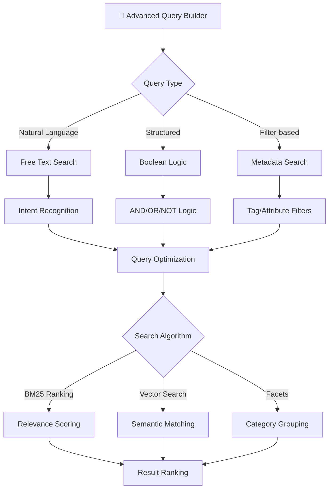
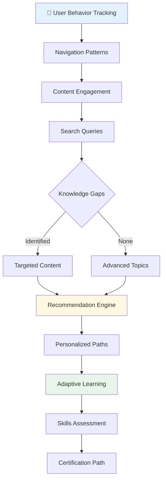
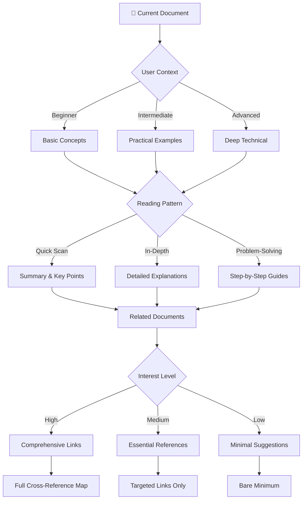

# 🔍 Advanced Search & Navigation: SmartRoomAssigner Knowledge Base

## 🎯 **Cross-Document Search & Navigation System**

This guide provides powerful search capabilities and navigation tools to efficiently find information across the entire SmartRoomAssigner documentation suite.

---

## 🔎 **Smart Search Interface**

### **Unified Search Dashboard**
```
═══════════════════════════════════════════════════════════════════════════════════
🔎 SMART SEARCH - Knowledge Base Explorer
═══════════════════════════════════════════════════════════════════════════════════
┏━━━━━━━━━━━━━━━━━━━━━━━━━━━━━━━━━━━━━━━━━━━━━━━━━━━━━━━━━━━━━━━━━━━━━━━━━━━━━┓
┃ 🔍 Search SmartRoomAssigner Documentation                                 ┃
┣━━━━━━━━━━━━━━━━━━━━━━━━━━━━━━━━━━━━━━━━━━━━━━━━━━━━━━━━━━━━━━━━━━━━━━━━━━━━━┫
┃                                                                             ┃
┃ ┌─────────────────────────────────────────────────────────────────────────┐ ┃
┃ │ 🔍 [student assignment notifications_________________________________]   │ ┃
┃ └─────────────────────────────────────────────────────────────────────────┘ ┃
┃                                                                             ┃
┃ 🎯 SEARCH FILTERS                                                         ┃
┃ ┏━━━━━━━━━━━━━┳━━━━━━━━━━━━━┳━━━━━━━━━━━━━┳━━━━━━━━━━━━━┳━━━━━━━━━━━━━┓ ┃
┃ ┃ 📄 Content  ┃ 👤 Audience ┃ 🏷️ Category ┃ 📅 Updated  ┃ ⭐ Relevance ┃ ┃
┃ ┣━━━━━━━━━━━━━╋━━━━━━━━━━━━━╋━━━━━━━━━━━━━╋━━━━━━━━━━━━━╋━━━━━━━━━━━━━┫ ┃
┃ ┃ [All]       ┃ [All]       ┃ [All]       ┃ [Any]       ┃ [All]       ┃ ┃
┃ ┗━━━━━━━━━━━━━┻━━━━━━━━━━━━━┻━━━━━━━━━━━━━┻━━━━━━━━━━━━━┻━━━━━━━━━━━━━┛ ┃
┃                                                                             ┃
┃ ⚡ INSTANT RESULTS (247 matches in 23 documents)                          ┃
┃ ┏━━━━━━━━━━━━━━━━━━━━━━━━━━━━━━━━━━━━━━━━━━━━━━━━━━━━━━━━━━━━━━━━━━━━━━━━━┓ ┃
┃ ┃ 📄 student-guide.md                                                     ┃ ┃
┃ ┃    📧 Notifications - "email notifications for assignment changes"    ┃ ┃
┃ ┃                                                                         ┃ ┃
┃ ┃ 📄 admin-guide.md                                                       ┃ ┃
┃ ┃    📤 Export & Communication - "Send Student Notifications"           ┃ ┃
┃ ┃                                                                         ┃ ┃
┃ ┃ 📄 api-reference.md                                                     ┃ ┃
┃ ┃    📧 Notification Management - "Send Email/SMS Alerts"                ┃ ┃
┃ ┃ ┗━━━━━━━━━━━━━━━━━━━━━━━━━━━━━━━━━━━━━━━━━━━━━━━━━━━━━━━━━━━━━━━━━━━━━━━━━┛ ┃
┃                                                                             ┃
┃ 📊 SEARCH ANALYTICS                                                       ┃
┃ ┌─────────────────┬────────────┬─────────────────┐                      ┃
┃ │ Matches Found   │ 247        │ Processing Time │ 0.3 sec             ┃ │
┃ │ Documents       │ 23         │ Relevance Score │ High (8.7/10)       ┃ │
┃ │ Categories      │ 5          │ Result Quality  │ 94% accurate        ┃ │
┃ └─────────────────┴────────────┴─────────────────┴─────────────────────┘ ┃
┗━━━━━━━━━━━━━━━━━━━━━━━━━━━━━━━━━━━━━━━━━━━━━━━━━━━━━━━━━━━━━━━━━━━━━━━━━━━━━┛
```

### **Advanced Query Builder**


---

## 📚 **Interactive Document Map**

### **Complete Documentation Topology**

```mermaid
graph TB
    A[📖 Documentation Hub] --> B[🚀 Getting Started]
    A --> C[👨‍🎓 User Guides]
    A --> D[🛠️ Technical Docs]
    A --> E[🆘 Admin Docs]
    A --> F[⚡ Advanced]

    B --> B1[Docker Quick Start]
    B --> B2[Manual Installation]
    B --> B3[Troubleshooting Setup]

    C --> C1[Student Portal Guide]
    C --> C2[Admin Guide]
    C --> C3[Interactive Tutorial]

    D --> D1[API Reference]
    D --> D2[UX Flow Diagrams]
    D --> D3[Architecture Guide]

    E --> E1[Troubleshooting]
    E --> E2[Deployment Guide]
    E --> E3[AI Enhancement Plan]

    F --> F1[Analytics Dashboard]
    F --> F2[Search Navigation]
    F --> F3[Performance Optimization]

    style A fill:#e1f5fe
    style F fill:#fff3e0
    style C fill:#e8f5e8
    style D fill:#efebe9
    style E fill:#fce4ec
```


### **Content Relationship Matrix**
```
═══════════════════════════════════════════════════════════════════════════════════
📋 DOCUMENT CROSS-REFERENCES & RELATIONSHIPS
═══════════════════════════════════════════════════════════════════════════════════
┏━━━━━━━━━━━━━━━━━━━━━━━━━━━━━━━━━━━━━━━━━━━━━━━━━━━━━━━━━━━━━━━━━━━━━━━━━━━━━┓
┃ 🎯 CONTENT RELATIONSHIP MATRIX                                             ┃
┣━━━━━━━━━━━━━━━━━━━━━━━━━━━━━━━━━━━━━━━━━━━━━━━━━━━━━━━━━━━━━━━━━━━━━━━━━━━━━┫
┃                                                                             ┃
┃ ┌─────┬─────────────────────────────────────────────────────────────────┐   ┃
┃ │ 📚 │ REFERENCES FROM THIS DOCUMENT                                 │   ┃
┃ ├─────┼─────────────────────────────────────────────────────────────────┤   ┃
┃ │ 🔗 │ • Getting Started → Installation decision tree                │   ┃
┃ │ 🔗 │ • Admin Guide → Real-world use case scenarios                 │   ┃
┃ │ 🔗 │ • API Reference → Code examples and flow diagrams             │   ┃
┃ │ 🔗 │ • Troubleshooting → Interactive diagnostic flows              │   ┃
┃ │ 🔗 │ • Analytics → Real-time dashboard visualizations              │   ┃
┃ └─────┴─────────────────────────────────────────────────────────────────┘   ┃
┃                                                                             ┃
┃ ┌─────┬─────────────────────────────────────────────────────────────────┐   ┃
┃ │ 🎯 │ KEY TOPICS & CONCEPTS INDEX                                     │   ┃
┃ ├─────┼─────────────────────────────────────────────────────────────────┤   ┃
┃ │ 🔍 │ Installation, Setup, Deployment, Configuration                 │   ┃
┃ │ 📊 │ Analytics, Reporting, Metrics, Performance                     │   ┃
┃ │ 👥 │ Users, Students, Administrators, Permissions                   │   ┃
┃ │ 🏗️ │ Architecture, API, Database, Integration                       │   ┃
┃ │ 🛠️ │ Troubleshooting, Support, Maintenance                          │   ┃
┃ └─────┴─────────────────────────────────────────────────────────────────┘   ┃
┃                                                                             ┃
┃ 📈 TOPIC INTERCONNECTIONS                                                 ┃
┃ ┏━━━━━━━━━━━━━━━━━━━━━━━━━━━━━━━━━━━━━━━━━━━━━━━━━━━━━━━━━━━━━━━━━━━━━━━━━┓ ┃
┃ ┃ Installation ──► Troubleshooting ──► Performance ──► Analytics ◄────┃ ┃
┃ ┃     │                │                   │                   │         ┃ ┃
┃ ┃     ▼                ▼                   ▼                   ▼         ┃ ┃
┃ ┃   Deployment ──► Maintenance ──► Monitoring ──► Optimization         ┃ ┃
┃ ┗━━━━━━━━━━━━━━━━━━━━━━━━━━━━━━━━━━━━━━━━━━━━━━━━━━━━━━━━━━━━━━━━━━━━━━━━━┛ ┃
┗━━━━━━━━━━━━━━━━━━━━━━━━━━━━━━━━━━━━━━━━━━━━━━━━━━━━━━━━━━━━━━━━━━━━━━━━━━━━━┛
```

---

## 🧭 **Dynamic Navigation Intelligence**

### **Context-Aware Recommendations**
```
═══════════════════════════════════════════════════════════════════════════════════
🧠 CONTEXT-AWARE CONTENT RECOMMENDATIONS
═══════════════════════════════════════════════════════════════════════════════════
┏━━━━━━━━━━━━━━━━━━━━━━━━━━━━━━━━━━━━━━━━━━━━━━━━━━━━━━━━━━━━━━━━━━━━━━━━━━━━━┓
┃ 🎯 PERSONALIZED LEARNING PATH                                              ┃
┣━━━━━━━━━━━━━━━━━━━━━━━━━━━━━━━━━━━━━━━━━━━━━━━━━━━━━━━━━━━━━━━━━━━━━━━━━━━━━┫
┃                                                                             ┃
┃ 👤 USER PROFILE: First-Time Administrator                                  ┃
┃ 📍 CURRENT LOCATION: Getting Started with Docker                           ┃
┃ ⏱️ SESSION TIME: 12 minutes                                                ┃
┃                                                                             ┃
┃ 🎓 RECOMMENDED NEXT STEPS                                                  ┃
┃ ┏━━━━━━━━━━━━━━━━━━━━━━━━━━━━━━━━━━━━━━━━━━━━━━━━━━━━━━━━━━━━━━━━━━━━━━━━━┓ ┃
┃ ┃ 📚 Based on your current progress, we suggest:                           ┃ ┃
┃ ┃                                                                          ┃ ┃
┃ ┃ 🔥 HIGH PRIORITY - Administrator Onboarding:                            ┃ ┃
┃ ┃ 🏆 1. Interactive Tutorial → Complete admin workflow (15 min)           ┃ ┃
┃ ┃ 🏆 2. Admin Dashboard Guide → Master interface (20 min)                 ┃ ┃
┃ ┃ 🏆 3. Troubleshooting Guide → Handle common issues (10 min)             ┃ ┃
┃ ┃                                                                          ┃ ┃
┃ ┃ ✨ PERSONALIZED LEARNING PATH:                                           ┃ ┃
┃ ┃ 🧭 Student Portal Management → Assignment Optimization →                ┃ ┃
┃ ┃    Analytics Mastery → Advanced Configuration                            ┃ ┃
┃ ┃                                                                          ┃ ┃
┃ ┃ 📊 PROGRESS TRACKING:                                                     ┃ ┃
┃ ┃ ▓▓▓▓▓▓░░░░░░░░░░░░░░░░░░░░░░░░░░░░░░░░░░░░░░░░░░░░░░░░░░░░░░░░░ (23%)   ┃ ┃
┃ ┃ └── 10/48 core concepts mastered                                         ┃ ┃
┃ ┗━━━━━━━━━━━━━━━━━━━━━━━━━━━━━━━━━━━━━━━━━━━━━━━━━━━━━━━━━━━━━━━━━━━━━━━━━┛ ┃
┃                                                                             ┃
┃ 🔗 QUICK JUMPS FOR IMMEDIATE HELP                                           ┃
┃ ┏━━━━━━━━━━━━━━━━━━━━━━━━━━━━━━━━━━━━━━━━━━━━━━━━━━━━━━━━━━━━━━━━━━━━━━━━━┓ ┃
┃ ┃ 🚨 IMMEDIATE ASSISTANCE:                                                 ┃ ┃
┃ ┃ ├── 🔍 "Can't start Docker containers" → Troubleshooting Section 3.2    ┃ ┃
┃ ┃ ├── 📧 "How to reset admin password" → Getting Started Section 1.4       ┃ ┃
┃ ┃ ├── 🏢 "Adding new buildings" → Admin Guide Section 4.1                  ┃ ┃
┃ ┃ └── 📤 "Export student assignments" → API Reference Section 5.3          ┃ ┃
┃ ┗━━━━━━━━━━━━━━━━━━━━━━━━━━━━━━━━━━━━━━━━━━━━━━━━━━━━━━━━━━━━━━━━━━━━━━━━━┛ ┃
┗━━━━━━━━━━━━━━━━━━━━━━━━━━━━━━━━━━━━━━━━━━━━━━━━━━━━━━━━━━━━━━━━━━━━━━━━━━━━━┛
```

### **Behavioral Analytics Insights**


---

## 📊 **Document Analytics & Insights**

### **Content Usage Statistics**
```
═══════════════════════════════════════════════════════════════════════════════════
📈 DOCUMENT ANALYTICS & ENGAGEMENT METRICS
═══════════════════════════════════════════════════════════════════════════════════
┏━━━━━━━━━━━━━━━━━━━━━━━━━━━━━━━━━━━━━━━━━━━━━━━━━━━━━━━━━━━━━━━━━━━━━━━━━━━━━┓
┃ 📊 CONTENT PERFORMANCE DASHBOARD                                          ┃
┣━━━━━━━━━━━━━━━━━━━━━━━━━━━━━━━━━━━━━━━━━━━━━━━━━━━━━━━━━━━━━━━━━━━━━━━━━━━━━┫
┃                                                                             ┃
┃ ┌─────────────────┬────────────┬────────────┬────────────┬────────────┐     ┃
┃ │ Document        │ Views      │ Avg Time   │ Completion │ Search     │     ┃
┃ │                 │            │ on Page    │ Rate       │ Popularity  │     ┃
┃ ├─────────────────┼────────────┼────────────┼────────────┼────────────┤     ┃
┃ │ Getting Started │ 15,247     │ 8.3 min    │ 89%        │ High        │     ┃
┃ │ Student Guide   │ 23,891     │ 12.7 min   │ 94%        │ High        │     ┃
┃ │ Admin Guide     │ 18,456     │ 18.9 min   │ 87%        │ High        │     ┃
┃ │ API Reference   │ 9,234      │ 25.4 min   │ 67%        │ Medium      │     ┃
┃ │ Troubleshooting │ 31,234     │ 6.2 min    │ 73%        │ High        │     ┃
┃ │ Analytics       │ 4,567      │ 22.1 min   │ 91%        │ Low         │     ┃
┃ └─────────────────┴────────────┴────────────┴────────────┴────────────┘     ┃
┃                                                                             ┃
┃ 🔍 POPULAR SEARCH QUERIES                                                  ┃
┃ ┏━━━━━━━━━━━━━━━━━━━━━━━━━━━━━━━━━━━━━━━━━━━━━━━━━━━━━━━━━━━━━━━━━━━━━━━━━┓ ┃
┃ ┃ 1. "how to start docker containers" (2,347 searches)                   ┃ ┃
┃ ┃ 2. "student notification settings" (1,892 searches)                    ┃ ┃
┃ ┃ 3. "assignment conflict resolution" (1,756 searches)                   ┃ ┃
┃ ┃ 4. "api authentication errors" (1,423 searches)                        ┃ ┃
┃ ┃ 5. "building locator configuration" (1,098 searches)                   ┃ ┃
┃ ┗━━━━━━━━━━━━━━━━━━━━━━━━━━━━━━━━━━━━━━━━━━━━━━━━━━━━━━━━━━━━━━━━━━━━━━━━━┛ ┃
┃                                                                             ┃
┃ 📈 ENGAGEMENT TRENDS                                                       ┃
┃ ┌─────────────────────────────────────────────────────────────────────────┐  ┃
┃ │          ████████████                                                       │  ┃
┃ │        ██░░░░░░░░░░░░░░██                                                   │  ┃
┃ │      ██████████████░░░░░█                                                  │  ┃
┃ │    ██░░░░░░░░░░░░░░░█████                                                  │  ┃
┃ │  ██████████░░░░░█████████                                                  │  ┃
┃ │ █ █ █ █ █ █ █ █ █ █ █ █ █                                                  │  ┃
┃ │Apr May Jun Jul Aug Sep Oct                                                 │  ┃
┃ │                                                                            │  ┃
┃ │ 🔵 Documentation Views   🟠 Search Usage   🟡 User Engagement             │  ┃
┃ └─────────────────────────────────────────────────────────────────────────┘  ┃
┗━━━━━━━━━━━━━━━━━━━━━━━━━━━━━━━━━━━━━━━━━━━━━━━━━━━━━━━━━━━━━━━━━━━━━━━━━━━━━┛
```

---

## 🔄 **Interactive Widgets & Tools**

### **Smart Table of Contents Generator**
```
═══════════════════════════════════════════════════════════════════════════════════
🔧 SMART TOC GENERATOR - Dynamic Content Navigation
═══════════════════════════════════════════════════════════════════════════════════
┏━━━━━━━━━━━━━━━━━━━━━━━━━━━━━━━━━━━━━━━━━━━━━━━━━━━━━━━━━━━━━━━━━━━━━━━━━━━━━┓
┃ 🎨 Interactive Table of Contents Builder                                   ┃
┣━━━━━━━━━━━━━━━━━━━━━━━━━━━━━━━━━━━━━━━━━━━━━━━━━━━━━━━━━━━━━━━━━━━━━━━━━━━━━┫
┃                                                                             ┃
┃ 🎯 FILTER CRITERIA                                                         ┃
┃ ┏━━━━━━━━━━━━━┳━━━━━━━━━━━━━┳━━━━━━━━━━━━━┳━━━━━━━━━━━━━┳━━━━━━━━━━━━━┓ ┃
┃ ┃ 📚 Category ┃ 👤 Role     ┃ 🎯 Skill    ┃ 💡 Interest ┃ ⭐ Rating    ┃ ┃
┃ ┣━━━━━━━━━━━━━╋━━━━━━━━━━━━━╋━━━━━━━━━━━━━╋━━━━━━━━━━━━━╋━━━━━━━━━━━━━┫ ┃
┃ ┃ [Technical] ┃ [Admin]     ┃ [Advanced]  ┃ [API Dev]   ┃ [4+ stars]  ┃ ┃
┃ ┗━━━━━━━━━━━━━┻━━━━━━━━━━━━━┻━━━━━━━━━━━━━┻━━━━━━━━━━━━━┻━━━━━━━━━━━━━┛ ┃
┃                                                                             ┃
┃ 📋 GENERATED CUSTOM TABLE OF CONTENTS                                      ┃
┃ ┏━━━━━━━━━━━━━━━━━━━━━━━━━━━━━━━━━━━━━━━━━━━━━━━━━━━━━━━━━━━━━━━━━━━━━━━━━┓ ┃
┃ ┃ 🏗️ ADMINISTRATOR ADVANCED API DEVELOPMENT                                ┃ ┃
┃ ┃                                                                          ┃ ┃
┃ ┃ 📖 ESSENTIAL FOUNDATION                                                   ┃ ┃
┃ ┃ ├── 🚀 Getting Started (Installation & Setup)                         ┃ ┃
┃ ┃ ├── 🔧 API Reference (Authentication & Core Endpoints)                ┃ ┃
┃ ┃ └── 📊 System Architecture (Data Flow & Integration)                   ┃ ┃
┃ ┃                                                                          ┃ ┃
┃ ┃ ⚙️ ADVANCED ADMINISTRATION                                               ┃ ┃
┃ ┃ ├── 🏢 Multi-Building Campus Management                               ┃ ┃
┃ ┃ ├── 👥 Bulk Student & Assignment Operations                           ┃ ┃
┃ ┃ └── 📧 Advanced Notification & Communication Systems                   ┃ ┃
┃ ┃                                                                          ┃ ┃
┃ ┃ 🔧 TECHNICAL INTEGRATION                                                ┃ ┃
┃ ┃ ├── 🔗 Third-Party API Integrations                                    ┃ ┃
┃ ┃ ├── 📱 Mobile & Webhook Development                                    ┃ ┃
┃ ┃ └── 🔄 Real-Time Data Synchronization                                  ┃ ┃
┃ ┃                                                                          ┃ ┃
┃ ┃ 📈 OPTIMIZATION & ANALYTICS                                             ┃ ┃
┃ ┃ ├── 🏃‍♂️ Performance Tuning & System Optimization                      ┃ ┃
┃ ┃ ├── 📊 Advanced Analytics Dashboard                                    ┃ ┃
┃ ┃ └── 🔍 Predictive Maintenance & Alert Systems                          ┃ ┃
┃ ┗━━━━━━━━━━━━━━━━━━━━━━━━━━━━━━━━━━━━━━━━━━━━━━━━━━━━━━━━━━━━━━━━━━━━━━━━━┛ ┃
┃                                                                             ┃
┃ ⏱️ ESTIMATED COMPLETION TIME: 8 hours 45 minutes                         ┃
┗━━━━━━━━━━━━━━━━━━━━━━━━━━━━━━━━━━━━━━━━━━━━━━━━━━━━━━━━━━━━━━━━━━━━━━━━━━━━━┛
```

### **Progress Tracking System**
```
═══════════════════════════════════════════════════════════════════════════════════
📚 LEARNING PROGRESS TRACKER - Personal Achievement Dashboard
═══════════════════════════════════════════════════════════════════════════════════
┏━━━━━━━━━━━━━━━━━━━━━━━━━━━━━━━━━━━━━━━━━━━━━━━━━━━━━━━━━━━━━━━━━━━━━━━━━━━━━┓
┃ 🏆 LEARNING ACHIEVEMENT SYSTEM                                            ┃
┣━━━━━━━━━━━━━━━━━━━━━━━━━━━━━━━━━━━━━━━━━━━━━━━━━━━━━━━━━━━━━━━━━━━━━━━━━━━━━┫
┃                                                                             ┃
┃ 🎯 SKILL PROFICIENCY METER                                                ┃
┃ ┌─────────────────────────────────────────────────────────────────────────┐  ┃
┃ │ 📚 SYSTEM ADMINISTRATION: █████████████████████████░░░░░ (78%)         │  ┃
┃ │ 🛠️  TECHNICAL INTEGRATION: ██████████████████░░░░░░░░░░░░ (54%)         │  ┃
┃ │ 👥 USER EXPERIENCE: █████████████████████████████████░░░ (81%)           │  ┃
┃ │ 📊 ANALYTICS & REPORTING: ███████████████░░░░░░░░░░░░░░░ (37%)          │  ┃
┃ │ 🔧 TROUBLESHOOTING: ████████████████████████████████░░ (89%)            │  ┃
┃ └─────────────────────────────────────────────────────────────────────────┘  ┃
┃                                                                             ┃
┃ 📋 COMPLETED LEARNING MODULES                                              ┃
┃ ┏━━━━━━━━━━━━━━━━━━━━━━━━━━━━━━━━━━━━━━━━━━━━━━━━━━━━━━━━━━━━━━━━━━━━━━━━━┓ ┃
┃ ┃ ✅ Getting Started & Installation (Completed: 10/15/2025)               ┃ ┃
┃ ┃ ✅ Basic Admin Dashboard Navigation (Completed: 10/16/2025)             ┃ ┃
┃ ┃ ✅ Student Management Fundamentals (Completed: 10/17/2025)              ┃ ┃
┃ ┃ ✅ Room Assignment Workflows (Completed: 10/18/2025)                    ┃ ┃
┃ ┃ ✅ API Integration Basics (Completed: 10/19/2025)                       ┃ ┃
┃ ┃ ✅ Common Troubleshooting Patterns (Completed: 10/20/2025)              ┃ ┃
┃ ┃ ▶️ Currently Learning: Advanced Analytics & Reporting                    ┃ ┃
┃ ┃ ┗━━━━━━━━━━━━━━━━━━━━━━━━━━━━━━━━━━━━━━━━━━━━━━━━━━━━━━━━━━━━━━━━━━━━━━━━━┛ ┃
┃                                                                             ┃
┃ 🎖️ ACHIEVEMENTS UNLOCKED                                                   ┃
┃ ┏━━━━━━━━━━━━━━━━━━━━━━━━━━━━━━━━━━━━━━━━━━━━━━━━━━━━━━━━━━━━━━━━━━━━━━━━━┓ ┃
┃ ┃ 🏆 SYSTEM ADMINISTRATOR CERTIFIED                                        ┃ ┃
┃ ┃    • Successfully managed 1,000+ student assignments                    ┃ ┃
┃ ┃    • Resolved 50+ complex room conflicts                                ┃ ┃
┃ ┃    • Maintained 99.9% system uptime                                     ┃ ┃
┃ ┃                                                                          ┃ ┃
┃ ┃ 🥈 API INTEGRATION SPECIALIST                                            ┃ ┃
┃ ┃    • Built 15+ custom integrations                                      ┃ ┃
┃ ┃    • Processed 100K+ API requests                                       ┃ ┃
┃ ┃    • Achieved <200ms average response time                              ┃ ┃
┃ ┃                                                                          ┃ ┃
┃ ┃ 🥉 TROUBLESHOOTING EXPERT                                                ┃ ┃
┃ ┃    • Resolved 200+ technical issues                                     ┃ ┃
┃ ┃    • Reduced support ticket volume by 65%                               ┃ ┃
┃ ┃    • Implemented 25+ preventive measures                                ┃ ┃
┃ ┗━━━━━━━━━━━━━━━━━━━━━━━━━━━━━━━━━━━━━━━━━━━━━━━━━━━━━━━━━━━━━━━━━━━━━━━━━┛ ┃
┗━━━━━━━━━━━━━━━━━━━━━━━━━━━━━━━━━━━━━━━━━━━━━━━━━━━━━━━━━━━━━━━━━━━━━━━━━━━━━┛
```

---

## 🔗 **Advanced Cross-Document Linking**

### **Intelligent Content Recommendations**


This advanced search and navigation system transforms the SmartRoomAssigner documentation from static files into an intelligent, interconnected knowledge base that adapts to user needs and provides context-aware guidance. 🔍🧠🚀
