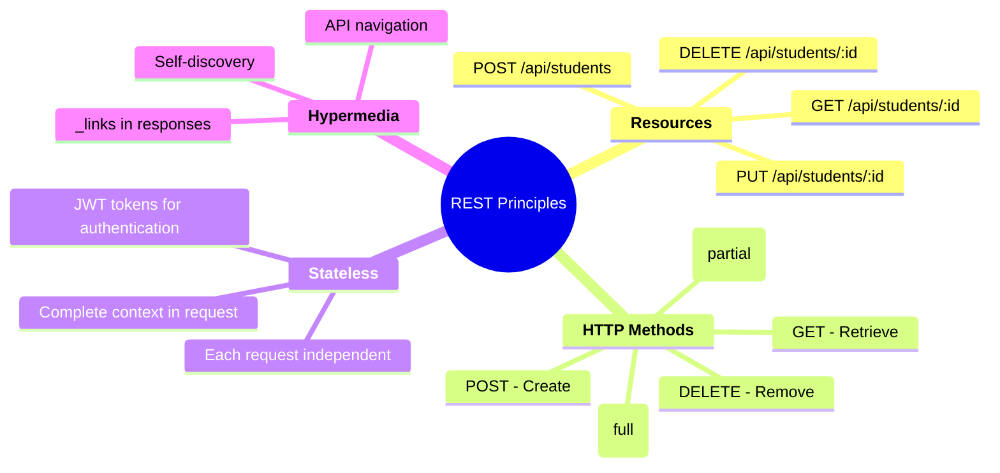

# 📝 **API Design & Development Guidelines**

## **RESTful API Standards for SmartRoomAssigner**

This guide establishes comprehensive standards for designing, developing, and maintaining consistent, scalable, and maintainable APIs in the SmartRoomAssigner system. These guidelines ensure a unified developer experience and predictable behavior across all endpoints.

---

## 🎯 **RESTful Principles Overview**

### **Core REST Principles**


### **HTTP Status Code Standards**
```javascript
// 📋 Standard Response Codes
const HTTP_STATUS = {
  // ✅ Success Responses
  "200": "OK - Request successful",
  "201": "Created - Resource created successfully",
  "202": "Accepted - Request accepted for processing",
  "204": "No Content - Request successful, no content returned",

  // 🔄 Redirection
  "301": "Moved Permanently - Resource moved",
  "302": "Found - Resource found at different location",

  // ❌ Client Errors
  "400": "Bad Request - Invalid request syntax",
  "401": "Unauthorized - Authentication required",
  "403": "Forbidden - Insufficient permissions",
  "404": "Not Found - Resource doesn't exist",
  "409": "Conflict - Resource state conflict",
  "422": "Unprocessable Entity - Validation failed",

  // 🚨 Server Errors
  "500": "Internal Server Error - Unexpected error",
  "502": "Bad Gateway - Upstream server error",
  "503": "Service Unavailable - Server temporarily down"
};
```

---

## 🏗️ **Resource Design Patterns**

### **URI Structure Standards**
```
🏗️ URI Construction Pattern:
{https}://{host}[:{port}]/{api-version}/{resource}/{resource-id}/{sub-resource}/{sub-resource-id}

📋 Examples:
GET    /api/v1/students              # List all students
GET    /api/v1/students/:id          # Get specific student
POST   /api/v1/students              # Create new student
PUT    /api/v1/students/:id          # Update student (full)
PATCH  /api/v1/students/:id          # Update student (partial)
DELETE /api/v1/students/:id          # Delete student

🚀 Advanced Patterns:
GET    /api/v1/students/:id/assignments    # Student's assignments
GET    /api/v1/buildings/:id/rooms         # Building's rooms
POST   /api/v1/admin/assignments/bulk      # Bulk operations
GET    /api/v1/students/search?q=smith     # Search and filtering
```

### **Resource Naming Conventions**
```javascript
// 📋 Resource Naming Standards
const RESOURCE_NAMING = {

  // ✅ Preferred: Plural nouns, lowercase, hyphens for compound words
  "students": "Individual students",
  "buildings": "Campus buildings",
  "assignments": "Exam assignments",
  "notifications": "System notifications",

  // ❌ Avoid: Singular nouns, camelCase, underscores
  "Student": "Not plural",
  "examAssignment": "Not kebab-case",
  "exam_assignment": "Not snake_case",

  // 🌍 International Resources
  "api/v1/students": "URI Format",
  "api/v1/admin/dashboard": "Admin resources use admin prefix",
  "api/v1/system/health": "System resources under system",

  // 🔗 Relationship Resources
  "GET /students/:id/assignments": "Parent-child relationship",
  "GET /courses/:id/students": "Reverse relationships",
  "POST /assignments/bulk": "Bulk operations"
};
```

### **Query Parameter Standards**
```javascript
// 📋 Query Parameters Pattern
const QUERY_PARAMETERS = {

  // 🔍 Filtering & Search
  "GET /api/v1/students?department=CS301&enrolled=true",
  "GET /api/v1/assignments?exam_date=2025-12-01&status=active",

  // 📄 Pagination (Required for list endpoints)
  "GET /api/v1/students?page=1&per_page=25",  // ✅ Standard pagination
  "GET /api/v1/students?offset=0&limit=25",   // ✅ Alternative

  // 🔀 Sorting
  "GET /api/v1/students?sort=last_name,first_name",     // ✅ Multiple fields
  "GET /api/v1/students?sort=-created_at",              // ✅ Descending with -

  // 📊 Field Selection
  "GET /api/v1/students?fields=id,email,last_name,first_name",  // ✅ Include only
  "GET /api/v1/students?exclude=created_at,updated_at",         // ✅ Exclude fields

  // 🔎 Advanced Search
  "GET /api/v1/students?q=smith&department=CS",  // ✅ Simple search
  "GET /api/v1/assignments?building_id=in:(1,2,3)", // ✅ Advanced filters
};
```

---

## 📋 **Request/Response Standards**

### **Request Body Format**
```json
// 📝 POST/PUT/PATCH Request Body Standard
{
  "data": {
    // Resource attributes
    "first_name": "John",
    "last_name": "Doe",
    "email": "john.doe@university.edu",
    "department": "Computer Science"
  },

  "relationships": {
    // Optional: Related resources
    "advisor": {
      "data": { "type": "staff", "id": "123" }
    }
  },

  "meta": {
    // Optional: Request metadata
    "source": "admin_panel",
    "timestamp": "2025-01-15T10:30:00Z"
  }
}

// 🧪 Validation Rules
const VALIDATION_RULES = {
  "required_fields": ["first_name", "last_name", "email"],
  "email_format": "^[a-zA-Z0-9._%+-]+@[a-zA-Z0-9.-]+\\.[a-zA-Z]{2,}$",
  "max_length": { "first_name": 50, "last_name": 50 },
  "allowed_values": { "department": ["CS", "MATH", "PHYSICS", "CHEM"] }
};
```

### **Response Body Format**
```json
// 📋 Standard Response Format
{
  "data": {
    // Primary resource data
    "id": "123",
    "type": "student",
    "attributes": {
      "first_name": "John",
      "last_name": "Doe",
      "email": "john.doe@university.edu",
      "department": "Computer Science",
      "enrolled": true,
      "created_at": "2025-01-15T10:30:00Z",
      "updated_at": "2025-01-15T10:30:00Z"
    },

    "relationships": {
      "assignments": {
        "links": {
          "self": "/api/v1/students/123/assignments",
          "related": "/api/v1/assignments?student_id=123"
        },
        "meta": { "count": 3 }
      }
    },

    "links": {
      "self": "/api/v1/students/123"
    }
  },

  "included": [
    // Optional: Related resources
    {
      "id": "456",
      "type": "assignment",
      "attributes": { "exam_date": "2025-12-01", "room": "MB-101" }
    }
  ],

  "meta": {
    // Response metadata
    "timestamp": "2025-01-15T10:30:05Z",
    "version": "1.2.3",
    "request_id": "req_123456789"
  }
}
```

### **Error Response Format**
```json
// 🚨 Standard Error Response
{
  "errors": [
    {
      "code": "VALIDATION_ERROR",
      "title": "Validation Error",
      "detail": "Email address already exists",
      "source": {
        "pointer": "/data/email",
        "parameter": "email"
      },
      "meta": {
        "field": "email",
        "value": "john.doe@university.edu"
      }
    }
  ],

  "meta": {
    "timestamp": "2025-01-15T10:30:10Z",
    "request_id": "req_123456789",
    "debug_info": {
      "trace_id": "trace_987654321",
      "component": "api.validation.email"
    }
  }
}

// 🔍 Error Code Standards
const ERROR_CODES = {
  "VALIDATION_ERROR": "Input data validation failed",
  "AUTHENTICATION_ERROR": "Invalid or missing credentials",
  "AUTHORIZATION_ERROR": "Insufficient permissions",
  "RESOURCE_NOT_FOUND": "Requested resource doesn't exist",
  "RESOURCE_CONFLICT": "Resource state conflict",
  "RATE_LIMITED": "Too many requests",
  "SYSTEM_BUSY": "Server temporarily unable to handle request",
  "MAINTENANCE_MODE": "System under maintenance"
};
```

---

## 🔐 **Authentication & Authorization**

### **JWT Token Standards**
```javascript
// 🔑 JWT Token Structure
const JWT_STRUCTURE = {
  header: {
    alg: "RS256",          // RSA signature algorithm
    typ: "JWT",            // Token type
    kid: "key_12345"       // Key ID for key rotation
  },

  payload: {
    // Standard claims
    iss: "smartroomassigner.api",    // Issuer
    sub: "user_123",                 // Subject (user ID)
    aud: "smartroomassigner",        // Audience
    exp: 1640995200,                 // Expiration timestamp
    iat: 1640908800,                 // Issued at timestamp
    jti: "jwt_67890",                // Unique token ID

    // Custom claims
    role: "admin",                   // User role
    permissions: ["read", "write"],  // Specific permissions
    department: "CS",                // User department
  }
};
```

### **API Key Authentication**
```bash
# 🔧 API Key Header Format
curl -H "X-API-Key: sk_test_4eC39HqLyjWDarjtT1zdp7dc" \
     -H "Content-Type: application/json" \
     https://api.smartroomassigner.com/v1/students

# 📋 API Key Standards:
# - Prefixed with 'sk_' for secret keys, 'pk_' for publishable keys
# - Length: 32+ characters
# - Base64 URL-safe encoding
# - Include checksum for validation
```

---

## 🚀 **Performance Standards**

### **Rate Limiting**
```javascript
// ⏱️ Rate Limit Headers
const RATE_LIMIT_HEADERS = {
  'X-RateLimit-Limit': '1000',              // Requests per window
  'X-RateLimit-Remaining': '987',            // Remaining requests
  'X-RateLimit-Reset': '1640995200',         // Reset timestamp (Unix)
  'X-RateLimit-Retry-After': '60'            // Seconds to wait
};

// 📊 Rate Limit Tiers
const RATE_LIMIT_TIERS = {
  free: { requests: 100, window: '1h' },
  standard: { requests: 1000, window: '1h' },
  premium: { requests: 10000, window: '1h' },
  admin: { requests: 'unlimited', window: 'none' }
};
```

### **Caching Strategies**
```javascript
// 🗄️ Cache Strategy Pattern
const CACHE_STRATEGIES = {

  // Browser Caching
  static_assets: {
    'Cache-Control': 'public, max-age=31536000',  // 1 year
    strategy: 'CDN + Browser'
  },

  // API Response Caching
  student_list: {
    ttl: 300,                    // 5 minutes
    strategy: 'Redis + ETag'
  },

  user_session: {
    ttl: 3600,                   // 1 hour
    strategy: 'Redis + JWT'
  },

  // Database Query Caching
  building_data: {
    ttl: 3600,                   // 1 hour (slow-changing)
    strategy: 'Redis + Lazy loading'
  }
};

// 🔧 Cache Invalidation
const CACHE_INVALIDATION = {
  on_update: ['student_*', 'assignment_*'],
  on_delete: ['{resource}:{id}:*'],
  on_bulk_operation: ['{resource}:list:*'],
  scheduled_cleanup: ['expired_sessions:*']
};
```

---

## 🧪 **Testing Standards**

### **API Testing Patterns**
```javascript
// 🧪 API Test Structure
describe('GET /api/v1/students/:id', () => {

  it('should return student data', async () => {
    // Arrange
    const studentId = '123';
    const authToken = generateAuthToken({ role: 'admin' });

    // Act
    const response = await request(app)
      .get(`/api/v1/students/${studentId}`)
      .set('Authorization', `Bearer ${authToken}`);

    // Assert
    expect(response.status).toBe(200);
    expect(response.body.data.id).toBe(studentId);
    expect(response.body.data.type).toBe('student');
  });

  it('should return 404 for non-existent student', async () => {
    // Test error handling
    const response = await request(app)
      .get('/api/v1/students/99999')
      .set('Authorization', `Bearer ${generateAuthToken()}`);

    expect(response.status).toBe(404);
    expect(response.body.errors[0].code).toBe('RESOURCE_NOT_FOUND');
  });

  it('should enforce authorization', async () => {
    // Test security
    const response = await request(app)
      .get('/api/v1/admin/dashboard');  // Admin-only endpoint

    expect(response.status).toBe(401);  // Unauthorized
  });
});
```

### **Integration Testing Standards**
```python
# 🧪 Backend Integration Tests
import pytest
from app import create_app
from app.models import Student, Assignment
from app.services import AssignmentService

@pytest.fixture
def client():
    app = create_app('testing')
    with app.test_client() as client:
        yield client

@pytest.fixture
def db_session():
    # Database setup/cleanup
    yield session
    session.rollback()
    Student.query.delete()
    Assignment.query.delete()

def test_assignment_creation_flow(client, db_session):
    """Test complete assignment creation workflow"""

    # Create student
    student_data = {
        'first_name': 'Alice',
        'last_name': 'Smith',
        'email': 'alice@university.edu'
    }

    # Create exam
    exam_data = {
        'course_code': 'CS301',
        'exam_date': '2025-12-01',
        'duration': 120
    }

    # Test assignment creation
    service = AssignmentService()
    result = service.create_assignment(student_data, exam_data, 'MB-101', 'A5')

    assert result.success is True
    assert result.assignment.student_id is not None
    assert result.assignment.seat_number == 'A5'
```

---

## 📊 **Monitoring & Observability**

### **API Metrics Collection**
```javascript
// 📈 Metrics Collection Points
const API_METRICS = {

  // Request Metrics
  request_duration: {
    histogram: true,
    buckets: [0.1, 0.5, 1, 2, 5, 10],
    labels: ['method', 'endpoint', 'status_code']
  },

  // Error Metrics
  request_errors: {
    counter: true,
    labels: ['method', 'endpoint', 'error_type', 'error_code']
  },

  // Business Metrics
  assignments_created: {
    counter: true,
    labels: ['building', 'exam_type', 'time_of_day']
  },

  // Performance Metrics
  database_query_time: {
    histogram: true,
    buckets: [0.01, 0.05, 0.1, 0.25, 0.5, 1.0, 2.0],
    labels: ['table', 'operation', 'query_type']
  }

  // Resource Usage
  active_connections: {
    gauge: true,
    labels: ['database', 'connection_pool']
  }
};
```

### **Logging Standards**
```javascript
// 📋 Log Level Standards
const LOG_LEVELS = {
  ERROR: 'system failures, exceptions',
  WARN: 'degraded performance, retry attempts',
  INFO: 'successful operations, user actions',
  DEBUG: 'detailed execution flow',
  TRACE: 'extremely detailed debugging'
};

// 🔍 Structured Logging Format
const LOG_FORMAT = {
  timestamp: '2025-01-15T10:30:00Z',
  level: 'INFO',
  service: 'smartroomassigner.api',
  request_id: 'req_123456',
  user_id: 'user_789',
  endpoint: 'GET /api/v1/students',
  duration_ms: 145,
  status_code: 200,
  user_agent: 'SmartRoomAssigner/1.2.3',
  ip_address: '192.168.1.100',
  message: 'Student list retrieved successfully',
  metadata: {
    filters_applied: ['department', 'enrolled'],
    result_count: 25,
    page_number: 1
  }
};
```

---

## 📚 **Implementation Examples**

### **Flask Route Implementation**
```python
# 📝 Flask API Endpoint Example
from flask import Blueprint, request, jsonify
from flask_jwt_extended import jwt_required, get_jwt_identity
from marshmallow import ValidationError

from app.models import Student
from app.schemas import StudentSchema
from app.services import StudentService
from app.utils import Paginator, handle_api_error

students_bp = Blueprint('students', __name__)

@students_bp.route('/api/v1/students', methods=['GET'])
@jwt_required()
def get_students():
    """Get paginated list of students with filtering"""
    try:
        # Extract query parameters
        page = int(request.args.get('page', 1))
        per_page = int(request.args.get('per_page', 25))
        department = request.args.get('department')
        enrolled = request.args.get('enrolled')

        # Build filters
        filters = {}
        if department:
            filters['department'] = department
        if enrolled is not None:
            filters['enrolled'] = enrolled.lower() == 'true'

        # Get paginated results
        paginator = Paginator(StudentService.get_students(filters))
        results = paginator.paginate(page, per_page)

        # Serialize response
        schema = StudentSchema(many=True)
        data = schema.dump(results.items)

        return jsonify({
            'data': data,
            'meta': {
                'page': page,
                'per_page': per_page,
                'total': paginator.total,
                'pages': paginator.pages,
                'has_next': paginator.has_next,
                'has_prev': paginator.has_prev
            },
            'links': {
                'self': request.url,
                'first': paginator.get_page_url(1),
                'last': paginator.get_page_url(paginator.pages),
                'next': paginator.get_page_url(page + 1) if paginator.has_next else None,
                'prev': paginator.get_page_url(page - 1) if paginator.has_prev else None
            }
        })

    except Exception as e:
        return handle_api_error(e)

@students_bp.route('/api/v1/students', methods=['POST'])
@jwt_required()
def create_student():
    """Create a new student"""
    try:
        # Validate request data
        schema = StudentSchema()
        data = schema.load(request.get_json())

        # Check permissions (admin only)
        current_user = get_jwt_identity()
        if not UserService.has_role(current_user['id'], 'admin'):
            return jsonify({
                'errors': [{
                    'code': 'AUTHORIZATION_ERROR',
                    'title': 'Insufficient Permissions',
                    'detail': 'Admin role required to create students'
                }]
            }), 403

        # Create student
        student = StudentService.create_student(data, created_by=current_user['id'])

        # Return created resource
        result = schema.dump(student)
        return jsonify({
            'data': result,
            'links': {
                'self': f'/api/v1/students/{student.id}'
            }
        }), 201

    except ValidationError as e:
        return jsonify({
            'errors': [{
                'code': 'VALIDATION_ERROR',
                'title': 'Validation Error',
                'detail': str(e),
                'source': { 'pointer': list(e.messages.keys())[0] }
            }]
        }), 422

    except Exception as e:
        return handle_api_error(e)

@students_bp.route('/api/v1/students/<int:student_id>', methods=['GET'])
@jwt_required()
def get_student(student_id):
    """Get a specific student by ID"""
    try:
        student = StudentService.get_student_by_id(student_id)

        if not student:
            return jsonify({
                'errors': [{
                    'code': 'RESOURCE_NOT_FOUND',
                    'title': 'Student Not Found',
                    'detail': f'Student with ID {student_id} does not exist'
                }]
            }), 404

        schema = StudentSchema()
        data = schema.dump(student)

        return jsonify({
            'data': data,
            'links': {
                'self': request.url,
                'assignments': f'/api/v1/students/{student_id}/assignments'
            }
        })

    except Exception as e:
        return handle_api_error(e)
```

### **Frontend API Client Implementation**
```typescript
// 🔗 API Client for React Frontend
import axios, { AxiosInstance, AxiosRequestConfig } from 'axios';

interface ApiConfig {
  baseURL: string;
  timeout: number;
}

class ApiClient {
  private client: AxiosInstance;

  constructor(config: ApiConfig) {
    this.client = axios.create({
      baseURL: config.baseURL,
      timeout: config.timeout,
      headers: {
        'Content-Type': 'application/json',
        'Accept': 'application/json',
      },
    });

    // Request interceptor for auth
    this.client.interceptors.request.use(
      (config) => {
        const token = localStorage.getItem('auth_token');
        if (token) {
          config.headers.Authorization = `Bearer ${token}`;
        }
        config.headers['X-Request-ID'] = generateRequestId();
        return config;
      },
      (error) => Promise.reject(error)
    );

    // Response interceptor for error handling
    this.client.interceptors.response.use(
      (response) => response,
      (error) => {
        const { response } = error;

        if (response?.status === 401) {
          // Auto-logout on auth failure
          localStorage.removeItem('auth_token');
          window.location.href = '/login';
          return Promise.reject(error);
        }

        // Transform API errors to consistent format
        if (response?.data?.errors) {
          const apiError = new ApiError(
            response.data.errors[0]?.detail || 'API request failed',
            response.data.errors[0]?.code,
            response.status
          );
          return Promise.reject(apiError);
        }

        // Handle generic errors
        const errorMessage = response?.data?.message || error.message || 'Network error';
        return Promise.reject(new Error(errorMessage));
      }
    );
  }

  // Generic API methods
  async get<T>(url: string, config?: AxiosRequestConfig): Promise<T> {
    const response = await this.client.get(url, config);
    return response.data;
  }

  async post<T>(url: string, data?: any, config?: AxiosRequestConfig): Promise<T> {
    const response = await this.client.post(url, data, config);
    return response.data;
  }

  async put<T>(url: string, data?: any, config?: AxiosRequestConfig): Promise<T> {
    const response = await this.client.put(url, data, config);
    return response.data;
  }

  async patch<T>(url: string, data?: any, config?: AxiosRequestConfig): Promise<T> {
    const response = await this.client.patch(url, data, config);
    return response.data;
  }

  async delete<T>(url: string, config?: AxiosRequestConfig): Promise<T> {
    const response = await this.client.delete(url, config);
    return response.data;
  }
}

// Error handling utilities
class ApiError extends Error {
  constructor(message: string, public code?: string, public status?: number) {
    super(message);
    this.name = 'ApiError';
  }
}

// Usage examples
const apiClient = new ApiClient({
  baseURL: process.env.REACT_APP_API_URL || 'http://localhost:5000',
  timeout: 10000,
});

// Student API endpoints
export const studentApi = {
  getStudents: (params?: StudentQueryParams) =>
    apiClient.get<StudentList>('/api/v1/students', { params }),

  getStudent: (id: number) =>
    apiClient.get<StudentDetail>(`/api/v1/students/${id}`),

  createStudent: (data: CreateStudentData) =>
    apiClient.post<StudentDetail>('/api/v1/students', data),

  updateStudent: (id: number, data: UpdateStudentData) =>
    apiClient.put<StudentDetail>(`/api/v1/students/${id}`, data),

  deleteStudent: (id: number) =>
    apiClient.delete(`/api/v1/students/${id}`),

  getStudentAssignments: (id: number, params?: AssignmentQueryParams) =>
    apiClient.get<StudentAssignments>(`/api/v1/students/${id}/assignments`, { params }),
};

// Types for API responses
export interface StudentList {
  data: Student[];
  meta: PaginationMeta;
  links: PaginationLinks;
}

export interface StudentDetail {
  data: Student;
  links: ResourceLinks;
}

export interface Student {
  id: number;
  type: 'student';
  attributes: StudentAttributes;
  relationships?: StudentRelationships;
  links: ResourceLinks;
}

export interface StudentAttributes {
  first_name: string;
  last_name: string;
  email: string;
  department: string;
  enrolled: boolean;
  created_at: string;
  updated_at: string;
}

// Export the configured client
export default apiClient;
