# 📋 **Contributing Guidelines & Code Standards**

## **SmartRoomAssigner Development Workflow**

This guide establishes the standards and processes for contributing to SmartRoomAssigner, ensuring consistent, high-quality code and collaborative development practices across the entire team.

---

## 🎯 **Contribution Workflow Overview**

### **Development Lifecycle**

```mermaid
flowchart TD
    A[🎯 Choose Task] --> B[📋 Create Issue]
    B --> C[🌿 Create Branch]
    C --> D[💻 Develop Feature]
    D --> E[✨ Write Tests]
    E --> F[📝 Commit Changes]
    F --> G[🚀 Push Branch]
    G --> H[🔄 Create Pull Request]

    H --> I{👀 Code Review}
    I -->|✅ Approved| J[🔀 Merge to Main]
    I -->|❌ Needs Changes| K[🔧 Address Feedback]
    K --> H

    J --> L[🚀 Deploy to Staging]
    L --> M[🧪 Integration Testing]
    M --> N[🏭 Production Release]

    style A fill:#e3f2fd
    style N fill:#e8f5e8
```


---

## 🔀 **Git Workflow & Branching Strategy**

### **Branch Naming Convention**
```bash
# Feature branches
feature/add-notification-system
feature/improve-assignment-algorithm
feature/user-profile-management

# Bug fixes
fix/database-connection-timeout
fix/login-validation-error
fix/campus-map-rendering

# Hotfixes (urgent production fixes)
hotfix/security-vulnerability-patch
hotfix/critical-database-migration

# Documentation
docs/api-reference-updates
docs/deployment-guide-improvements

# Experiments/Research
experiment/alternative-caching-strategy
research/machine-learning-integration
```

### **Git Commands Workflow**
```bash
# Start new feature
git checkout main
git pull origin main
git checkout -b feature/add-student-notifications

# Develop with regular commits
git add .
git commit -m "feat: add basic notification structure"
git push origin feature/add-student-notifications

# Before creating PR, sync with main
git checkout main
git pull origin main
git checkout feature/add-student-notifications
git rebase main

# Resolve any conflicts, then create PR
```

### **Commit Message Standards**
```bash
# Format: type(scope): description
# Types: feat, fix, docs, style, refactor, test, chore, perf, ci, build, revert

✅ Good Examples:
feat(auth): implement JWT token refresh mechanism
fix(assignment): resolve room capacity calculation bug
docs(api): update student endpoints documentation
test(validation): add assignment conflict detection tests
refactor(models): optimize database queries in UserService

❌ Avoid:
"fixed bug"
"updated code"
"changes made"
```

---

## 🎨 **Code Standards & Style Guidelines**

### **Backend (Python) Standards**
```python
# 📋 Python Code Style (PEP 8)

# Good: Proper naming and structure
class AssignmentService:
    """Service for managing exam assignments"""

    def __init__(self, db_session):
        self.db = db_session

    def create_assignment(self, student_id, room_id, exam_id):
        """Create a new assignment with validation"""
        assignment = Assignment(
            student_id=student_id,
            room_id=room_id,
            exam_id=exam_id,
            status='active'
        )
        self.db.add(assignment)
        return assignment

# Bad: Poor naming and structure
class assgnmnt_svc:
    def crt_assgnmnt(self,st_id,rm_id,ex_id):
        a=Assignment(st_id=st_id,rm_id=rm_id,ex_id=ex_id,status='active')
        self.db.add(a)
        return a
```

### **Frontend (TypeScript/React) Standards**
```typescript
// 📋 TypeScript/React Code Style

// Component structure (preferred)
import React, { useState, useEffect } from 'react';
import { Assignment } from '../types/assignment';

interface StudentAssignmentsProps {
  studentId: number;
  onAssignmentSelect?: (assignment: Assignment) => void;
}

export const StudentAssignments: React.FC<StudentAssignmentsProps> = ({
  studentId,
  onAssignmentSelect,
}) => {
  const [assignments, setAssignments] = useState<Assignment[]>([]);
  const [loading, setLoading] = useState(false);

  useEffect(() => {
    fetchAssignments();
  }, [studentId]);

  const fetchAssignments = async () => {
    try {
      setLoading(true);
      const response = await api.getAssignments(studentId);
      setAssignments(response.data);
    } catch (error) {
      console.error('Failed to fetch assignments:', error);
    } finally {
      setLoading(false);
    }
  };

  if (loading) return <LoadingSpinner />;

  return (
    <div className="assignments-container">
      {assignments.map((assignment) => (
        <AssignmentCard
          key={assignment.id}
          assignment={assignment}
          onClick={() => onAssignmentSelect?.(assignment)}
        />
      ))}
    </div>
  );
};
```

### **Linting & Formatting Configuration**
```json
// .eslintrc.js (Frontend)
module.exports = {
  extends: [
    'react-app',
    'react-app/jest',
    '@typescript-eslint/recommended',
    'prettier'
  ],
  rules: {
    // Custom rules
    '@typescript-eslint/no-unused-vars': 'error',
    'react-hooks/rules-of-hooks': 'error',
    'react-hooks/exhaustive-deps': 'warn',
    'no-console': 'warn'
  }
};

// .prettierrc (Code formatting)
{
  "semi": true,
  "trailingComma": "es5",
  "singleQuote": true,
  "printWidth": 80,
  "tabWidth": 2,
  "useTabs": false
}
```

---

## 🔍 **Code Review Process**

### **Review Checklist**
```markdown
## 🏆 Pull Request Review Checklist

### 🔍 **Code Quality**
- [ ] No linting errors or warnings
- [ ] Code follows established patterns
- [ ] No unused imports or variables
- [ ] Error handling is appropriate
- [ ] Comments are clear and helpful

### 🧪 **Testing**
- [ ] Unit tests written for new functionality
- [ ] Integration tests added for APIs
- [ ] Test coverage >80% for new code
- [ ] Tests pass locally
- [ ] No breaking existing tests

### 🔒 **Security**
- [ ] No sensitive data logged or exposed
- [ ] Input validation implemented
- [ ] Authorization checks in place
- [ ] No security vulnerabilities introduced

### 📊 **Performance**
- [ ] No unnecessary database queries
- [ ] Caching used appropriately
- [ ] Frontend bundle size reasonable
- [ ] No memory leaks or expensive operations

### 📚 **Documentation**
- [ ] Code is self-documenting with clear names
- [ ] Complex logic has explanatory comments
- [ ] API documentation updated if needed
- [ ] README/files updated for new features

### 🎯 **Business Logic**
- [ ] Requirements fully implemented
- [ ] Edge cases handled appropriately
- [ ] User experience considerations addressed
- [ ] Data integrity maintained
```

### **Review Guidelines for Reviewers**
```markdown
## 👀 Code Review Guidelines

### 💡 **Approach**
- Focus on code correctness and maintainability
- Suggest improvements, don't dictate solutions
- Be respectful and constructive
- Acknowledge good work and patterns

### 🎯 **Priority Areas**
- **Critical**: Security, data integrity, breaking changes
- **Important**: Performance, error handling, API contracts
- **Nice-to-have**: Code style, optimizations, documentation

### ✅ **Approval Criteria**
- **Required**: All tests pass, no critical issues, follows standards
- **Bravo**: Code is clean, well-tested, documentation updated
- **Request Changes**: Only for blocking issues, provide clear rationale

### ⏰ **Response Times**
- **Ack**: Within 24 hours (confirm receipt and estimate review time)
- **First Review**: Within 48 hours for urgent PRs
- **Follow-up**: Within 24 hours for requested changes
- **Final Decision**: Within 1 week unless urgent
```

---

## 🚀 **Pull Request Process**

### **PR Template Structure**
```markdown
## 📝 Pull Request Title
[type] Brief description of the change

## 🎯 Description
Detailed explanation of what this PR does and why it's needed.

## 🔗 Related Issues
Closes #123, Addresses #456

## ✅ Checklist
- [ ] Tests written/updated
- [ ] Documentation updated
- [ ] Breaking changes noted
- [ ] Migration scripts added (if needed)

## 📊 Test Coverage
- Unit tests: 85%
- Integration tests: 90%
- E2E tests: 75%

## 🔍 How to Test
1. Run `npm install` to install dependencies
2. Run `npm test` to verify tests pass
3. Visit localhost:3000 and navigate to [feature location]
4. Verify [expected behavior]

## 📸 Screenshots (UI Changes)
<!-- Add screenshots for visual changes -->

## 💡 Notes for Reviewers
<!-- Any specific areas to focus on or concerns -->

## 🏷️ Labels
<!-- Suggest labels: enhancement, bug, documentation, etc. -->
```

### **PR Size Guidelines**
```javascript
// 📏 Pull Request Size Standards
const PR_SIZE_GUIDELDS = {

  // Small (Preferred)
  small: {
    ideal: '< 200 lines changed',
    idealTime: '< 2 hours to review',
    files: '< 5 files modified'
  },

  // Medium (Acceptable)
  medium: {
    limit: '< 500 lines changed',
    limitTime: '< 4 hours to review',
    files: '< 10 files modified'
  },

  // Large (Needs Breaking Down)
  large: {
    warning: '> 500 lines changed',
    concern: 'Consider splitting into multiple PRs',
    exceptions: 'Major refactoring, critical fixes'
  },

  // Splitting Strategy
  split_strategy: {
    vertical: 'Split by feature area (UI, API, tests)',
    horizontal: 'Split by layers (frontend, backend, database)',
    temporal: 'Stage changes over multiple deployments',
    experimental: 'Use feature flags to gradually roll out'
  }
};
```

---

## 🐛 **Issue Tracking & Management**

### **Issue Types & Labels**
```markdown
# 🎫 Issue Classification
🏷️  Labels:     Priority:        Type:
bug           🔴 urgent          feature-request
enhancement   🟡 high            bug
documentation 🟢 medium          question
help-wanted   🔵 low             enhancement
good-first    ⚫ wishlist        documentation
question      ❓ triage          refactoring

# 📊 Priority Definitions
🔴 URGENT:    Production down, critical security issues (fix immediately)
🟡 HIGH:      Major features, important bugs (fix this sprint)
🟢 MEDIUM:    Nice-to-have features, minor improvements (plan for next sprint)
🔵 LOW:      Cleanup, optimizations, nice-to-have (backlog)
⚫ WISHLIST:  Future considerations, experimental ideas (parking lot)
```

### **Issue Template Examples**
```markdown
## 🐛 Bug Report Template
**Expected behavior:**

**Actual behavior:**

**Steps to reproduce:**
1. Go to '...'
2. Click on '...'
3. Scroll down to '...'
4. See error

**Environment:**
- OS: [e.g. Windows 11]
- Browser: [e.g. Chrome 91]
- Version: [e.g. v2.1.3]

**Additional context:**

## ✨ Feature Request Template
**Problem statement:**
What's the problem you're trying to solve?

**Proposed solution:**
What would you like to see implemented?

**Alternative solutions:**
Have you considered any alternatives?

**Additional context:**
Screenshots, designs, or additional information
```

---

## 🔧 **Development Tools & Automation**

### **Pre-commit Hooks Setup**
```bash
# 🔗 Pre-commit Configuration
#!/bin/sh
# .git/hooks/pre-commit

# Run linting
echo "🔍 Running linters..."
npm run lint
if [ $? -ne 0 ]; then
  echo "❌ Linting failed. Fix issues before committing."
  exit 1
fi

# Run type checking (frontend only)
if [ -f "tsconfig.json" ]; then
  echo "🔍 Running type checks..."
  npm run type-check
  if [ $? -ne 0 ]; then
    echo "❌ Type checking failed. Fix type errors before committing."
    exit 1
  fi
fi

# Run tests
echo "🧪 Running tests..."
npm test -- --watchAll=false --silent
if [ $? -ne 0 ]; then
  echo "❌ Tests failed. Fix failing tests before committing."
  exit 1
fi

echo "✅ All checks passed. Ready to commit!"
```

### **Automated Quality Gates**
```yaml
# 🚦 CI/CD Quality Gates
name: Quality Gates
on: [push, pull_request]

jobs:
  code-quality:
    runs-on: ubuntu-latest
    steps:
      - uses: actions/checkout@v3

      # Frontend quality checks
      - name: Setup Node.js
        uses: actions/setup-node@v3
        with:
          node-version: '18'

      - name: Install dependencies
        run: npm ci

      - name: Run linting
        run: npm run lint

      - name: Run type checking
        run: npm run type-check

      - name: Run tests with coverage
        run: npm run test:coverage

      # Backend quality checks
      - name: Setup Python
        uses: actions/setup-python@v4
        with:
          python-version: '3.11'

      - name: Install Python dependencies
        run: |
          cd backend
          pip install -r requirements.txt

      - name: Run Python linting
        run: |
          cd backend
          flake8 app/ tests/
          black --check app/ tests/

      - name: Run Python tests
        run: |
          cd backend
          python -m pytest --cov=app --cov-report=xml --cov-fail-under=80

      # Security scans
      - name: Security scan
        uses: securecodewarrior/github-actions-gosec@master
        with:
          args: ./...

      # Quality gate validation
      - name: Quality gate check
        run: |
          echo "Checking quality metrics..."
          # Add custom quality validation logic
```

---

## 📚 **Code Documentation Standards**

### **Function Documentation**
```python
# 📝 Python Function Documentation
def create_assignment(student_id, room_id, exam_id, db_session=None):
    """
    Create a new exam assignment for a student.

    This function handles the complete assignment creation process including:
    - Capacity validation for the selected room
    - Conflict detection with existing assignments
    - Notification scheduling for the affected student

    Args:
        student_id (int): The ID of the student to assign
        room_id (int): The ID of the room to assign to
        exam_id (int): The ID of the exam being assigned
        db_session (Session, optional): Database session to use. Defaults to None.

    Returns:
        Assignment: The created assignment object

    Raises:
        StudentNotFoundError: If the student doesn't exist
        RoomNotFoundError: If the room doesn't exist
        ExamNotFoundError: If the exam doesn't exist
        RoomFullError: If the room has no available capacity
        ConflictError: If there's a scheduling conflict

    Example:
        >>> assignment = create_assignment(1, 10, 5)
        >>> print(assignment.seat_number)
        A5
    """
```

### **Component Documentation**
```typescript
// 📋 React Component Documentation
interface StudentCardProps {
  /** The student object to display */
  student: Student;
  /** Callback when the student card is clicked */
  onClick?: (student: Student) => void;
  /** Whether the card is in a loading state */
  loading?: boolean;
  /** Additional CSS classes to apply */
  className?: string;
}

/**
 * StudentCard Component
 *
 * Displays a student's information in a card format with their photo,
 * name, department, and enrollment status. Supports click interactions
 * and loading states.
 *
 * @example
 * ```tsx
 * <StudentCard
 *   student={sampleStudent}
 *   onClick={(student) => console.log('Selected:', student.name)}
 * />
 * ```
 */
export const StudentCard: React.FC<StudentCardProps> = ({
  student,
  onClick,
  loading = false,
  className
}) => {
  // Implementation here...
};
```

---

## 🤝 **Team Collaboration Guidelines**

### **Communication Standards**
```markdown
## 💬 Communication Guidelines

### 📝 Pull Request Discussions
- Be specific about requested changes
- Provide context for why changes are needed
- Suggest solutions, not just identify problems
- Use screenshots or code examples when helpful

### 🔧 Pair Programming
- Rotate who drives the keyboard regularly
- Both participants actively engaged in problem-solving
- Take turns explaining approaches and reasoning
- Document important decisions for future reference

### 📞 Code Review Response Times
- **Acknowledgment**: Within 2 hours during work hours
- **Initial Review**: Within 24 hours for urgent PRs
- **Detailed Review**: Within 48 hours for standard PRs
- **Address Feedback**: Within 24 hours of review comments

### 🤝 Conflict Resolution
- Assume good intentions from team members
- Focus on facts and impacts, not personal opinions
- Escalate to tech lead for resolution when needed
- Document decisions for future reference
```

### **Team Norms**
```markdown
## 👥 Team Norms

### ✨ Recognition
- ⭐ **Star PRs** on GitHub for excellent work
- 💬 **Shout out** good practices in team messages
- 📜 **Document** lessons learned for future reference

### 👂 Active Listening
- 🎧 Listen to understand, not just to respond
- ❓ Ask clarifying questions when unsure
- 💡 Share relevant experiences and context

### 📈 Continuous Improvement
- 🔄 Regularly review and improve our processes
- 📚 Share new learnings with the team
- 🛠️ Experiment with better tools and techniques

### 🎯 Accountability
- ✋ Own up to mistakes and learn from them
- 📊 Deliver on commitments or communicate early if blocked
- 🏆 Celebrate team and individual wins
```

---

## 🏷️ **Issue & Bug Tracking Standards**

### **Bug Report Template**
```markdown
## 🐛 Bug Report

### Summary
Brief description of the issue

### Steps to Reproduce
1. Navigate to [page/component]
2. Perform [action]
3. Observe [unexpected behavior]

### Expected Behavior
What should happen

### Actual Behavior
What actually happens

### Environment
- Browser: Chrome 91.0.4472.124
- OS: Windows 11
- Server Version: v2.1.3
- Database: PostgreSQL 13.4

### Screenshots/Logs
[Attach relevant files]

### Severity
- 🔴 Critical: System unusable, data loss
- 🟡 Major: Feature broken, workaround available
- 🟢 Minor: Cosmetic issue, minor inconvenience

### Additional Context
[Any other relevant information]
```

This comprehensive contributing guide establishes the foundation for consistent, high-quality collaboration across the SmartRoomAssigner development team! 🚀👨‍💻📋
