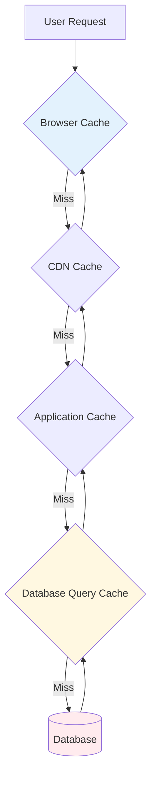
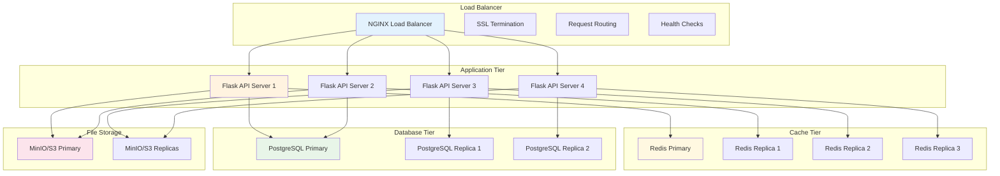

# 🏃‍♂️ **Performance Optimization Handbook**

## **Performance Tuning & Scaling Guide for SmartRoomAssigner**

This comprehensive guide provides developers with proven techniques, tools, and strategies to optimize SmartRoomAssigner performance, identify bottlenecks, and implement scalable solutions that maintain system responsiveness under load.

---

## 📊 **Performance Monitoring Foundation**

### **Key Performance Indicators (KPIs)**
```javascript
// 🎯 Performance Standards & SLAs
const PERFORMANCE_TARGETS = {

  // User Experience KPIs
  'page_load_time': '< 2 seconds',
  'first_contentful_paint': '< 1.5 seconds',
  'largest_contentful_paint': '< 2.5 seconds',
  'cumulative_layout_shift': '< 0.1',
  'first_input_delay': '< 100ms',

  // API Performance KPIs
  'api_response_time': '< 500ms (95th percentile)',
  'database_query_time': '< 100ms (95th percentile)',
  'cache_hit_ratio': '> 85%',
  'error_rate': '< 0.1%',

  // Infrastructure KPIs
  'cpu_utilization': '< 70% (peak)',
  'memory_utilization': '< 75% (peak)',
  'disk_iops': '< 80% capacity',
  'network_throughput': '< 70% capacity',

  // Business KPIs
  'concurrent_users': '500+ simultaneous',
  'requests_per_second': '1000+ sustained',
  'assignment_generation': '< 30 seconds (1000 assignments)',
  'report_generation': '< 60 seconds (large dataset)'
};

// 📈 Performance Budgets
const PERFORMANCE_BUDGETS = {
  'javascript_bundle': '< 200KB (gzipped)',
  'css_bundle': '< 50KB (gzipped)',
  'images_total': '< 1MB per page',
  'fonts': '< 100KB total',
  'third_party_scripts': '< 200KB total'
};
```

### **Performance Monitoring Setup**
```python
# 📊 Application Performance Monitoring (APM)
from flask import Flask, request, g
import time
import psutil
import logging

class PerformanceMonitor:
    """Performance monitoring middleware"""

    def __init__(self, app: Flask):
        self.app = app
        self.setup_monitoring()

    def setup_monitoring(self):
        """Initialize performance monitoring"""

        @self.app.before_request
        def start_timer():
            g.start_time = time.time()

        @self.app.after_request
        def log_performance(response):
            # Skip monitoring for static files
            if request.path.startswith('/static/'):
                return response

            duration = time.time() - g.start_time

            # Log slow requests
            if duration > 1.0:
                logging.warning(
                    f'Slow request: {request.method} {request.path} '
                    f'took {duration:.2f}s from {request.remote_addr}'
                )

            # Collect metrics
            self.record_metrics(request, response, duration)

            # Add performance headers
            response.headers['X-Response-Time'] = f'{duration:.2f}s'
            response.headers['X-Server-Time'] = time.ctime()

            return response

    def record_metrics(self, request, response, duration):
        """Record detailed performance metrics"""

        metrics = {
            'method': request.method,
            'path': request.path,
            'status_code': response.status_code,
            'duration': duration,
            'user_agent': request.headers.get('User-Agent', ''),
            'content_length': len(response.get_data()),
            'query_count': getattr(g, 'query_count', 0),
            'cache_hits': getattr(g, 'cache_hits', 0),
            'memory_usage': psutil.virtual_memory().percent,
            'cpu_usage': psutil.cpu_percent(interval=1)
        }

        # Send to monitoring system (Prometheus, DataDog, etc.)
        self.send_to_monitoring(metrics)

    def send_to_monitoring(self, metrics):
        """Send metrics to external monitoring system"""
        # Implementation depends on monitoring solution
        # e.g., Prometheus, New Relic, DataDog, etc.
        pass

# Usage
monitor = PerformanceMonitor(app)
```

---

## 💾 **Database Performance Optimization**

### **Query Optimization Techniques**
```python
# 🔍 Database Performance Patterns
from sqlalchemy import text, func, and_
from app import db

class QueryOptimizer:
    """Database query optimization utilities"""

    @staticmethod
    def optimize_student_assignments_query(filters=None):
        """
        Optimized query for student assignments with efficient joins
        """
        base_query = db.session.query(
            Assignment.id,
            Assignment.seat_number,
            Assignment.status,
            Assignment.created_at,
            # Pre-load related data to avoid N+1 queries
            Student.first_name,
            Student.last_name,
            Student.email,
            Room.room_number,
            Building.name.label('building_name'),
            Course.course_code,
            Exam.exam_date,
            Exam.start_time,
            Exam.end_time
        ).select_from(Assignment)\
         .join(Student, Assignment.student_id == Student.id)\
         .join(Room, Assignment.room_id == Room.id)\
         .join(Building, Room.building_id == Building.id)\
         .join(Exam, Assignment.exam_id == Exam.id)\
         .join(Course, Exam.course_id == Course.id)

        # Apply filters efficiently
        if filters:
            if 'department' in filters:
                base_query = base_query.filter(Student.department == filters['department'])
            if 'exam_date' in filters:
                base_query = base_query.filter(Exam.exam_date == filters['exam_date'])
            if 'building_id' in filters:
                base_query = base_query.filter(Room.building_id == filters['building_id'])

        # Use LIMIT for pagination to avoid large result sets
        if 'limit' in filters:
            base_query = base_query.limit(filters['limit'])
        if 'offset' in filters:
            base_query = base_query.offset(filters['offset'])

        return base_query

    @staticmethod
    def get_assignment_counts_optimized():
        """
        Efficient aggregate queries using database functions
        """
        # Single query with aggregation instead of multiple queries
        result = db.session.query(
            func.count(Assignment.id).label('total_assignments'),
            func.count(func.distinct(Student.id)).label('unique_students'),
            func.count(func.distinct(Room.id)).label('unique_rooms'),
            func.avg(func.extract('epoch', func.now() - Assignment.created_at)).label('avg_age_seconds')
        ).select_from(Assignment)\
         .join(Student)\
         .join(Room)\
         .first()

        return {
            'total_assignments': result.total_assignments,
            'unique_students': result.unique_students,
            'unique_rooms': result.unique_rooms,
            'avg_age_hours': result.avg_age_seconds / 3600 if result.avg_age_seconds else 0
        }

class DatabaseProfiler:
    """Database performance profiling"""

    def __init__(self):
        self.query_stats = {}

    def start_profiling(self):
        """Enable SQLAlchemy query logging"""
        import logging
        logging.basicConfig()
        logging.getLogger('sqlalchemy.engine').setLevel(logging.INFO)

    def profile_query(self, query, iterations=10):
        """Profile query performance"""
        import time

        times = []
        for _ in range(iterations):
            start_time = time.time()
            results = query.all()  # Execute query
            end_time = time.time()
            times.append(end_time - start_time)

        avg_time = sum(times) / len(times)
        min_time = min(times)
        max_time = max(times)

        return {
            'iterations': iterations,
            'avg_time': avg_time,
            'min_time': min_time,
            'max_time': max_time,
            'results_count': len(results) if results else 0
        }
```

### **Index Optimization Strategy**
```sql
-- 🚀 Database Index Optimization

-- Core Indexes (Essential for all queries)
CREATE INDEX CONCURRENTLY IF NOT EXISTS idx_assignments_exam_room
ON assignments(exam_id, room_id) WHERE status = 'active';

CREATE INDEX CONCURRENTLY IF NOT EXISTS idx_assignments_student_exam
ON assignments(student_id, exam_id);

CREATE INDEX CONCURRENTLY IF NOT EXISTS idx_students_department_enrolled
ON students(department, enrolled) WHERE enrolled = true;

-- Composite Indexes for Complex Queries
CREATE INDEX CONCURRENTLY IF NOT EXISTS idx_exams_date_time_room
ON assignments(exam_id, student_id)
INCLUDE (seat_number, assigned_at)
WHERE status = 'active';

-- Partial Indexes for Common Filters
CREATE INDEX CONCURRENTLY IF NOT EXISTS idx_rooms_active_capacity
ON rooms(building_id, room_number) WHERE is_active = true;

-- Functional Indexes for Computed Values
CREATE INDEX CONCURRENTLY IF NOT EXISTS idx_assignments_exam_date
ON assignments USING btree (date((exam_date AT TIME ZONE 'UTC')));

-- Covering Indexes (Include all columns needed)
CREATE INDEX CONCURRENTLY IF NOT EXISTS idx_notifications_user_read_created
ON notifications(user_id, is_read, created_at DESC)
INCLUDE (title, message, notification_type);

-- Index Maintenance
-- Analyze index usage
SELECT schemaname, tablename, attname, n_distinct, correlation
FROM pg_stats
WHERE schemaname = 'public'
ORDER BY n_distinct DESC;

-- Find unused indexes
SELECT indexrelname, idx_scan, idx_tup_read, idx_tup_fetch
FROM pg_stat_user_indexes
WHERE idx_scan = 0
ORDER BY indexrelname;

-- Index sizing for performance
SELECT
    schemaname,
    tablename,
    indexname,
    pg_size_pretty(pg_relation_size(indexrelid)) as index_size
FROM pg_stat_user_indexes
ORDER BY pg_relation_size(indexrelid) DESC;
```

---

## ⚡ **Caching Strategies & Implementation**

### **Multi-Level Caching Architecture**


### **Redis Caching Implementation**
```python
# 🗄️ Redis Caching Patterns
import redis
import json
from typing import Any, Optional
import hashlib

class CacheManager:
    """Redis-based caching with TTL and invalidation"""

    def __init__(self):
        self.redis = redis.Redis(
            host='localhost',
            port=6379,
            db=0,
            decode_responses=True
        )
        self.default_ttl = 3600  # 1 hour

    def cache_key(self, namespace: str, *args) -> str:
        """Generate consistent cache keys"""
        key_parts = [namespace] + [str(arg) for arg in args]
        key_string = ':'.join(key_parts)
        return hashlib.md5(key_string.encode()).hexdigest()[:16]

    def get(self, key: str) -> Optional[Any]:
        """Get cached value"""
        try:
            data = self.redis.get(key)
            if data:
                # Track cache hits
                self.redis.incr(f"stats:cache:hits:{key.split(':')[0]}")
                return json.loads(data)
        except Exception:
            pass
        return None

    def set(self, key: str, value: Any, ttl: int = None) -> bool:
        """Set cached value with TTL"""
        try:
            serialized = json.dumps(value)
            return self.redis.setex(
                key,
                ttl or self.default_ttl,
                serialized
            )
        except Exception:
            return False

    def delete(self, pattern: str) -> int:
        """Delete keys matching pattern"""
        try:
            keys = self.redis.keys(pattern)
            if keys:
                return self.redis.delete(*keys)
        except Exception:
            pass
        return 0

    def get_or_set(self, key: str, func, ttl: int = None):
        """Get from cache or compute and cache"""
        cached = self.get(key)
        if cached is not None:
            return cached

        # Compute value
        value = func()
        if value is not None:
            self.set(key, value, ttl)
        return value

class SmartRoomAssignerCache:
    """Domain-specific caching for SmartRoomAssigner"""

    def __init__(self):
        self.cache = CacheManager()

    def get_student_assignments(self, student_id: int):
        """Cache student assignments with smart invalidation"""
        key = self.cache.cache_key('student_assignments', student_id)

        def fetch_assignments():
            # Database query with monitoring
            assignments = Assignment.query.filter_by(
                student_id=student_id, status='active'
            ).all()
            return [assignment.to_dict() for assignment in assignments]

        return self.cache.get_or_set(key, fetch_assignments, ttl=1800)  # 30 min

    def get_room_availability(self, building_id: int, exam_date: str):
        """Cache room availability with short TTL"""
        key = self.cache.cache_key('room_availability', building_id, exam_date)

        def calculate_availability():
            # Complex calculation for room availability
            rooms = Room.query.filter_by(building_id=building_id).all()
            availability = []

            for room in rooms:
                assignments = Assignment.query.filter(
                    Assignment.room_id == room.id,
                    func.date(Exam.exam_date) == exam_date,
                    Assignment.status == 'active'
                ).count()

                availability.append({
                    'room_id': room.id,
                    'room_number': room.room_number,
                    'capacity': room.capacity,
                    'assigned': assignments,
                    'available': room.capacity - assignments
                })

            return availability

        return self.cache.get_or_set(key, calculate_availability, ttl=300)  # 5 min

    def invalidate_student_cache(self, student_id: int):
        """Invalidate all caches related to a student"""
        patterns = [
            f"student_assignments:{student_id}",
            f"student_*:{student_id}*",
            "assignment_counts:*",
            "dashboard_stats:*"
        ]

        for pattern in patterns:
            self.cache.delete(pattern)

# Flask integration
@app.before_request
def setup_request_cache():
    g.cache = SmartRoomAssignerCache()

@app.after_request
def cleanup_cache_metrics(response):
    # Log cache performance metrics
    if hasattr(g, 'cache_hits'):
        app.logger.info(f"Cache hits: {g.cache_hits}, Cache misses: {g.cache_misses}")
    return response
```

---

## 🌐 **Frontend Performance Optimization**

### **React Performance Patterns**
```typescript
// ⚛️ React Performance Optimization Patterns
import React, { useMemo, useCallback, memo, useEffect } from 'react';
import { Assignment } from '../types';

// Component memoization for expensive renders
const AssignmentCard = memo<AssignmentCardProps>(({
  assignment,
  onSelect,
  isSelected
}) => {
  console.log('AssignmentCard render', assignment.id);

  return (
    <div
      className={`assignment-card ${isSelected ? 'selected' : ''}`}
      onClick={() => onSelect(assignment)}
    >
      <h3>{assignment.exam_title}</h3>
      <p>{assignment.room_number} - Seat {assignment.seat_number}</p>
      <small>{new Date(assignment.exam_date).toLocaleDateString()}</small>
    </div>
  );
});

// Callback memoization to prevent unnecessary re-renders
const AssignmentListComponent: React.FC = () => {
  const [assignments, setAssignments] = useState<Assignment[]>([]);
  const [filter, setFilter] = useState('');

  // Memoize expensive computation
  const filteredAssignments = useMemo(() => {
    if (!filter) return assignments;
    return assignments.filter(assignment =>
      assignment.exam_title.toLowerCase().includes(filter.toLowerCase())
    );
  }, [assignments, filter]);

  // Memoize callbacks
  const handleAssignmentSelect = useCallback((assignment: Assignment) => {
    console.log('Selected assignment:', assignment.id);
    // Handle selection logic
  }, []);

  // Debounce filter updates
  const debouncedSetFilter = useDebounce(setFilter, 300);

  return (
    <div>
      <input
        type="text"
        placeholder="Filter assignments..."
        onChange={(e) => debouncedSetFilter(e.target.value)}
      />
      <div className="assignment-grid">
        {filteredAssignments.map(assignment => (
          <AssignmentCard
            key={assignment.id}
            assignment={assignment}
            onSelect={handleAssignmentSelect}
            isSelected={false}
          />
        ))}
      </div>
    </div>
  );
};

// Custom hooks for data fetching with caching
const useAssignments = (studentId: number) => {
  const [assignments, setAssignments] = useState<Assignment[]>([]);
  const [loading, setLoading] = useState(true);
  const [error, setError] = useState<string | null>(null);

  useEffect(() => {
    const fetchAssignments = async () => {
      try {
        setLoading(true);
        const response = await api.getStudentAssignments(studentId);
        setAssignments(response.data);
      } catch (err) {
        setError(err.message);
      } finally {
        setLoading(false);
      }
    };

    if (studentId) {
      fetchAssignments();
    }
  }, [studentId]);

  // Memoize computed values
  const assignmentCount = useMemo(() => assignments.length, [assignments]);
  const upcomingAssignments = useMemo(() =>
    assignments.filter(a => new Date(a.exam_date) > new Date()),
    [assignments]
  );

  return {
    assignments,
    loading,
    error,
    assignmentCount,
    upcomingAssignments
  };
};

// Debounce hook
const useDebounce = (value: any, delay: number) => {
  const [debouncedValue, setDebouncedValue] = useState(value);

  useEffect(() => {
    const handler = setTimeout(() => {
      setDebouncedValue(value);
    }, delay);

    return () => {
      clearTimeout(handler);
    };
  }, [value, delay]);

  return debouncedValue;
};
```

### **Bundle Optimization & Code Splitting**
```javascript
// 📦 Bundle Optimization Configuration
import { lazy, Suspense } from 'react';

// Lazy load heavy components
const AdminDashboard = lazy(() => import('./components/admin/AdminDashboard'));
const ReportsPage = lazy(() => import('./components/admin/ReportsPage'));
const AnalyticsPage = lazy(() => import('./components/advanced/AnalyticsPage'));

// Route-based code splitting
const App: React.FC = () => (
  <Router>
    <Suspense fallback={<LoadingSpinner />}>
      <Routes>
        <Route path="/" element={<StudentPortal />} />
        <Route
          path="/admin/dashboard"
          element={
            <ProtectedRoute role="admin">
              <AdminDashboard />
            </ProtectedRoute>
          }
        />
        <Route
          path="/admin/reports"
          element={
            <ProtectedRoute role="admin">
              <ReportsPage />
            </ProtectedRoute>
          }
        />
        <Route
          path="/analytics"
          element={
            <ProtectedRoute role="admin">
              <AnalyticsPage />
            </ProtectedRoute>
          }
        />
      </Routes>
    </Suspense>
  </Router>
);

// Webpack bundle analyzer configuration
// webpack.config.js
const BundleAnalyzerPlugin = require('webpack-bundle-analyzer').BundleAnalyzerPlugin;

module.exports = {
  mode: 'production',
  plugins: [
    new BundleAnalyzerPlugin({
      analyzerMode: 'static',
      reportFilename: './bundle-report.html',
      openAnalyzer: false
    })
  ],
  optimization: {
    splitChunks: {
      chunks: 'all',
      cacheGroups: {
        vendor: {
          test: /[\\/]node_modules[\\/]/,
          name: 'vendors',
          chunks: 'all',
        },
        ui: {
          test: /[\\/]components[\\/]ui[\\/]/,
          name: 'ui-components',
          chunks: 'all',
        }
      }
    }
  }
};

// Dynamic imports for heavy features
const loadHeavyFeature = async () => {
  const module = await import('./heavy-feature-module');
  return module.default;
};
```

---

## 🏗️ **Scalability Patterns & Load Balancing**

### **Horizontal Scaling Architecture**


### **Kubernetes Scaling Configuration**
```yaml
# 🚀 Kubernetes Horizontal Pod Autoscaler
apiVersion: autoscaling/v2
kind: HorizontalPodAutoscaler
metadata:
  name: smartroomassigner-api-hpa
spec:
  scaleTargetRef:
    apiVersion: apps/v1
    kind: Deployment
    name: smartroomassigner-api
  minReplicas: 3
  maxReplicas: 20
  metrics:
  - type: Resource
    resource:
      name: cpu
      target:
        type: Utilization
        averageUtilization: 70
  - type: Resource
    resource:
      name: memory
      target:
        type: Utilization
        averageUtilization: 80
  - type: Object
    object:
      metric:
        name: requests-per-second
      describedObject:
        apiVersion: networking.k8s.io/v1
        kind: Ingress
        name: smartroomassigner-ingress
      target:
        type: Value
        value: "1000"  # RPS target

---
# 📊 Vertical Pod Autoscaler
apiVersion: autoscaling.k8s.io/v1
kind: VerticalPodAutoscaler
metadata:
  name: smartroomassigner-api-vpa
spec:
  targetRef:
    apiVersion: apps/v1
    kind: Deployment
    name: smartroomassigner-api
  updatePolicy:
    updateMode: "Auto"
  resourcePolicy:
    containerPolicies:
    - containerName: smartroomassigner-api
      minAllowed:
        cpu: 250m
        memory: 256Mi
      maxAllowed:
        cpu: 2000m
        memory: 4096Mi
      controlledResources: ["cpu", "memory"]

---
# 🎯 Pod Disruption Budget
apiVersion: policy/v1
kind: PodDisruptionBudget
metadata:
  name: smartroomassigner-api-pdb
spec:
  minAvailable: 2
  selector:
    matchLabels:
      app: smartroomassigner-api
```

---

## 📊 **Performance Profiling & Debugging**

### **Application Performance Profiling**
```python
# 🔬 Performance Profiling Tools
import cProfile
import pstats
from functools import wraps
from flask import current_app, g
import time

class PerformanceProfiler:
    """Application performance profiling utilities"""

    @staticmethod
    def profile_function(func):
        """Decorator to profile function performance"""
        @wraps(func)
        def wrapper(*args, **kwargs):
            if not current_app.config.get('PROFILE_PERFORMANCE', False):
                return func(*args, **kwargs)

            profiler = cProfile.Profile()
            profiler.enable()

            start_time = time.time()
            try:
                result = func(*args, **kwargs)
                end_time = time.time()

                # Log execution time
                execution_time = end_time - start_time
                current_app.logger.info(
                    f"Function {func.__name__} executed in {execution_time:.4f} seconds"
                )

                return result
            finally:
                profiler.disable()

                # Save profile stats if execution was slow
                if execution_time > 1.0:  # More than 1 second
                    stats = pstats.Stats(profiler)
                    stats_file = f"/tmp/{func.__name__}_{int(time.time())}.prof"
                    stats.dump_stats(stats_file)
                    current_app.logger.warning(
                        f"Slow function detected. Profile saved to {stats_file}"
                    )

        return wrapper

    @staticmethod
    def profile_sqlalchemy_queries():
        """Profile SQLAlchemy queries for optimization"""

        from sqlalchemy import event
        from sqlalchemy.engine import Engine

        @event.listens_for(Engine, "before_cursor_execute")
        def before_cursor_execute(conn, cursor, statement, parameters, context, executemany):
            conn.info.setdefault('query_start_time', []).append(time.time())
            current_app.logger.debug(f"SQL Query Start: {statement}")

        @event.listens_for(Engine, "after_cursor_execute")
        def after_cursor_execute(conn, cursor, statement, parameters, context, executemany):
            total_time = time.time() - conn.info['query_start_time'].pop()

            if total_time > 0.1:  # Log slow queries (> 100ms)
                current_app.logger.warning(
                    f"SLOW QUERY ({total_time:.4f}s): {statement}"
                )

            # Track query metrics
            g.query_count = getattr(g, 'query_count', 0) + 1

class MemoryProfiler:
    """Memory usage profiling"""

    @staticmethod
    def profile_memory_usage(func):
        """Decorator to profile memory usage"""
        @wraps(func)
        def wrapper(*args, **kwargs):
            import tracemalloc
            import psutil

            if not current_app.config.get('PROFILE_MEMORY', False):
                return func(*args, **kwargs)

            # Start memory tracing
            tracemalloc.start()
            process = psutil.Process()

            memory_before = process.memory_info().rss / 1024 / 1024  # MB

            try:
                result = func(*args, **kwargs)
                return result
            finally:
                memory_after = process.memory_info().rss / 1024 / 1024  # MB
                memory_diff = memory_after - memory_before

                current_app, logger.info(
                    f"Memory usage: {memory_before:.2f}MB → {memory_after:.2f}MB "
                    f"(Δ{memory_diff:+.2f}MB)"
                )

                # Get top memory allocations
                snapshot = tracemalloc.take_snapshot()
                top_stats = snapshot.statistics('lineno')

                current_app.logger.info("Top memory allocations:")
                for stat in top_stats[:5]:
                    current_app.logger.info(f"  {stat}")

                tracemalloc.stop()

        return wrapper

# Usage examples
@PerformanceProfiler.profile_function
@MemoryProfiler.profile_memory_usage
def generate_large_report():
    """Generate a large assignment report with profiling"""
    # Implementation here...
    pass

# Flask integration
PerformanceProfiler.profile_sqlalchemy_queries()
```

### **Database Performance Profiling**
```sql
-- 🔍 Database Performance Analysis

-- Query performance monitoring
CREATE OR REPLACE FUNCTION log_slow_queries()
RETURNS event_trigger
LANGUAGE plpgsql
AS $$
BEGIN
    -- Log slow queries to custom table
    INSERT INTO slow_query_log (query, execution_time, pid)
    SELECT
        query,
        total_exec_time / 1000 as execution_time_seconds,
        pid
    FROM pg_stat_activity
    WHERE state = 'active'
    AND total_exec_time > 1000;  -- Log queries over 1 second
END;
$$;

-- Set up event trigger for slow queries
CREATE EVENT TRIGGER log_slow_queries_trigger
    ON ddl_command_end
    EXECUTE FUNCTION log_slow_queries();

-- Performance monitoring views
CREATE OR REPLACE VIEW active_query_performance AS
SELECT
    pid,
    datname,
    usename,
    client_addr,
    query,
    state,
    now() - query_start as duration,
    waiting,
    pg_blocking_pids(pid) as blocked_by
FROM pg_stat_activity
WHERE state != 'idle'
ORDER BY duration DESC;

-- Index usage analysis
CREATE OR REPLACE VIEW index_usage_stats AS
SELECT
    schemaname,
    tablename,
    indexname,
    idx_scan,
    idx_tup_read,
    idx_tup_fetch,
    CASE
        WHEN idx_scan > 0 THEN
            round((idx_tup_read::numeric / idx_scan), 2)
        ELSE 0
    END as avg_tuples_per_scan,
    pg_size_pretty(pg_relation_size(indexrelid)) as index_size
FROM pg_stat_user_indexes
ORDER BY idx_scan DESC, idx_tup_read DESC;

-- Table bloat analysis
CREATE OR REPLACE VIEW table_bloat_analysis AS
SELECT
    schemaname,
    tablename,
    n_dead_tup,
    n_live_tup,
    CASE
        WHEN n_live_tup > 0 THEN
            round((n_dead_tup::numeric / n_live_tup) * 100, 2)
        ELSE 0
    END as bloat_ratio,
    pg_size_pretty(pg_total_relation_size(relid)) as total_size
FROM pg_stat_user_tables t
JOIN pg_class c ON t.relid = c.oid
WHERE n_dead_tup > 0
ORDER BY bloat_ratio DESC;

-- Query to monitor long-running transactions
SELECT
    datname,
    pid,
    usename,
    client_addr,
    xact_start,
    query_start,
    state_change,
    now() - xact_start as xact_age,
    now() - query_start as query_age,
    state,
    query
FROM pg_stat_activity
WHERE xact_start IS NOT NULL
AND now() - xact_start > interval '30 seconds'
ORDER BY xact_age DESC;
```

---

## 🚨 **Performance Alerting & Monitoring**

### **Automated Performance Alerting**
```python
# 🚨 Performance Alerting System
class PerformanceAlertManager:
    """Automated performance monitoring and alerting"""

    def __init__(self):
        self.alert_thresholds = {
            'response_time_p95': 500,      # ms
            'error_rate_percentage': 1.0,  # %
            'cpu_usage_percentage': 80,    # %
            'memory_usage_percentage': 85, # %
            'database_connections': 90     # % of max
        }

        self.alert_cooldown = {
            'response_time': 300,  # 5 minutes
            'error_rate': 600,     # 10 minutes
            'system_resources': 900  # 15 minutes
        }

    def check_performance_alerts(self, metrics):
        """Check current metrics against thresholds"""

        alerts = []

        # Response time alerts
        if metrics.get('p95_response_time', 0) > self.alert_thresholds['response_time_p95']:
            alerts.append({
                'type': 'response_time',
                'severity': 'high',
                'message': f'P95 response time {metrics["p95_response_time"]}ms exceeds threshold',
                'threshold': self.alert_thresholds['response_time_p95']
            })

        # Error rate alerts
        if metrics.get('error_rate', 0) > self.alert_thresholds['error_rate_percentage']:
            alerts.append({
                'type': 'error_rate',
                'severity': 'critical',
                'message': f'Error rate {metrics["error_rate"]}% exceeds threshold',
                'threshold': self.alert_thresholds['error_rate_percentage']
            })

        # System resource alerts
        if metrics.get('cpu_usage', 0) > self.alert_thresholds['cpu_usage_percentage']:
            alerts.append({
                'type': 'cpu_usage',
                'severity': 'medium',
                'message': f'CPU usage {metrics["cpu_usage"]}% exceeds threshold',
                'threshold': self.alert_thresholds['cpu_usage_percentage']
            })

        return alerts

    def send_alerts(self, alerts):
        """Send alerts to monitoring systems"""
        for alert in alerts:
            # Send to configured alert channels
            self.send_to_slack(alert)
            self.send_to_pagerduty(alert)
            self.log_to_monitoring(alert)

    def initiate_performance_response(self, alert_type):
        """Automatically respond to performance issues"""

        if alert_type == 'high_response_time':
            # Scale up application instances
            self.scale_application_up()

        elif alert_type == 'high_error_rate':
            # Enable circuit breakers
            self.enable_circuit_breakers()

        elif alert_type == 'high_resource_usage':
            # Trigger database maintenance
            self.trigger_db_maintenance_mode()

# Integration with monitoring
def performance_monitoring_hook():
    """Hook called by monitoring system"""
    metrics_collector = MetricsCollector()
    alert_manager = PerformanceAlertManager()

    current_metrics = metrics_collector.get_current_metrics()
    alerts = alert_manager.check_performance_alerts(current_metrics)

    if alerts:
        alert_manager.send_alerts(alerts)
        for alert in alerts:
            if alert['severity'] in ['critical', 'high']:
                alert_manager.initiate_performance_response(alert['type'])
```

This comprehensive performance optimization handbook equips developers with the knowledge and tools to maintain high-performance SmartRoomAssigner applications at any scale! 🏃‍♂️📊🚀
