# 🔒 **Security Implementation Guide**

## **Comprehensive Security Standards for SmartRoomAssigner**

This guide outlines the security principles, implementation patterns, and best practices for developing secure features in SmartRoomAssigner, ensuring the protection of student data, exam integrity, and system reliability.

---

## 🛡️ **Security Architecture Overview**

### **Defense in Depth Strategy**

```mermaid
flowchart TD
    A[🌐 Network Security] --> B[🔐 Authentication]
    A --> C[📝 Input Validation]
    A --> D[🚪 Authorization]

    B --> E[🔑 JWT Tokens]
    E --> F[📊 Sessions]
    F --> G[🎫 Permissions]

    C --> H[🧹 Sanitization]
    H --> I[✅ Validation Rules]
    I --> J[🚫 SQL Injection Prevention]

    D --> K[👤 Role-Based Access]
    D --> L[🎯 Attribute-Based Access]
    D --> M[🚫 Unauthorized Access Prevention]

    N[💾 Data Protection] --> O[🔐 Encryption at Rest]
    N --> P[🔒 Encryption in Transit]
    N --> Q[🗑️ Secure Deletion]

    R[📊 Monitoring & Response] --> S[📋 Audit Logging]
    R --> T[🚨 Security Alerts]
    R --> U[🔍 Threat Detection]

    style A fill:#ffebee
    style N fill:#fff3e0
    style R fill:#e8f5e8
```


### **Security Principles**
```javascript
// 🛡️ Core Security Principles
const SECURITY_PRINCIPLES = {

  // Defense in Depth
  defense_in_depth: {
    network: 'Firewall, rate limiting, DDoS protection',
    application: 'Input validation, authentication, authorization',
    data: 'Encryption, access controls, secure deletion'
  },

  // Zero Trust
  zero_trust: {
    'never_trust': 'Assume all inputs are malicious',
    'always_verify': 'Check permissions for every request',
    'assume_compromise': 'Design for breached security'
  },

  // Principle of Least Privilege
  least_privilege: {
    'minimal_access': 'Grant minimum required permissions',
    'role_separation': 'Separate admin and user functions',
    'temporary_elevation': 'Elevate privileges only when needed'
  },

  // Secure by Default
  secure_defaults: {
    'fail_securely': 'Default to deny access',
    'secure_settings': 'Most restrictive configuration by default',
    'explicit_grants': 'Explicitly grant permissions, never assume'
  }
};
```

---

## 🔐 **Authentication & Authorization**

### **JWT Token Implementation**
```javascript
// 🔑 JWT Implementation Standards
const JWT_STANDARDS = {

  // Token Structure
  claims: {
    standard: ['iss', 'sub', 'aud', 'exp', 'iat', 'jti'],
    custom: ['role', 'permissions', 'department', 'session_id'],
    sensitive: [] // Never include passwords, keys, etc.
  },

  // Security Measures
  security: {
    algorithm: 'RS256',           // RSA signature, not HS256
    key_rotation: '30 days',      // Regular key rotation
    token_lifetime: '1 hour',     // Short-lived tokens
    refresh_strategy: 'sliding_window' // Automatic refresh
  },

  // Storage Guidelines
  storage: {
    client: 'httpOnly cookie',    // Prevent XSS access
    mobile: 'secure encrypted storage',
    avoid: ['localStorage', 'sessionStorage'] // Vulnerable to XSS
  },

  // Validation Rules
  validation: {
    expiration: 'Check exp claim',
    signature: 'Verify with current public key',
    issuer: 'Validate iss claim',
    audience: 'Check aud claim',
    revocation: 'JWT blacklist for logout',
    replay: 'Unique jti prevents replay attacks'
  }
};
```

### **Role-Based Access Control (RBAC)**
```python
# 👥 RBAC Implementation
from enum import Enum
from functools import wraps
from flask import g, jsonify

class UserRole(str, Enum):
    STUDENT = 'student'
    TA = 'teaching_assistant'
    ADMIN = 'administrator'
    SYSTEM = 'system'

class Permission(Enum):
    # Student permissions
    VIEW_OWN_ASSIGNMENTS = 'view_own_assignments'
    UPDATE_PROFILE = 'update_profile'

    # TA permissions
    VIEW_STUDENT_ASSIGNMENTS = 'view_student_assignments'
    MANAGE_EXAM_ASSIGNMENTS = 'manage_exam_assignments'
    VIEW_REPORTS = 'view_reports'

    # Admin permissions
    MANAGE_USERS = 'manage_users'
    MANAGE_BUILDINGS = 'manage_buildings'
    CONFIGURE_SYSTEM = 'configure_system'
    ACCESS_AUDIT_LOGS = 'access_audit_logs'

# Permission mapping by role
ROLE_PERMISSIONS = {
    UserRole.STUDENT: [
        Permission.VIEW_OWN_ASSIGNMENTS,
        Permission.UPDATE_PROFILE,
    ],
    UserRole.TA: [
        Permission.VIEW_STUDENT_ASSIGNMENTS,
        Permission.MANAGE_EXAM_ASSIGNMENTS,
        Permission.VIEW_REPORTS,
    ] + ROLE_PERMISSIONS[UserRole.STUDENT],
    UserRole.ADMIN: [
        Permission.MANAGE_USERS,
        Permission.MANAGE_BUILDINGS,
        Permission.CONFIGURE_SYSTEM,
        Permission.ACCESS_AUDIT_LOGS,
    ] + ROLE_PERMISSIONS[UserRole.TA],
}

def require_permission(permission: Permission):
    """Decorator to require specific permission"""
    def decorator(f):
        @wraps(f)
        def decorated_function(*args, **kwargs):
            current_user = g.current_user

            if not current_user:
                return jsonify({
                    'error': 'Authentication required',
                    'code': 'AUTHENTICATION_ERROR'
                }), 401

            user_permissions = ROLE_PERMISSIONS.get(current_user.role, [])
            if permission not in user_permissions:
                return jsonify({
                    'error': 'Insufficient permissions',
                    'code': 'AUTHORIZATION_ERROR',
                    'required': permission.value
                }), 403

            return f(*args, **kwargs)
        return decorated_function
    return decorator

def require_role(role: UserRole):
    """Decorator to require specific role"""
    def decorator(f):
        @wraps(f)
        def decorated_function(*args, **kwargs):
            current_user = g.current_user

            if not current_user or current_user.role != role:
                return jsonify({
                    'error': 'Role access required',
                    'code': 'AUTHORIZATION_ERROR',
                    'required_role': role.value
                }), 403

            return f(*args, **kwargs)
        return decorated_function
    return decorator

# Usage examples
@app.route('/api/admin/users', methods=['GET'])
@require_role(UserRole.ADMIN)
def get_users():
    """Admin-only endpoint"""
    pass

@app.route('/api/students/<student_id>/assignments', methods=['GET'])
@require_permission(Permission.MANAGE_EXAM_ASSIGNMENTS)
def get_student_assignments(student_id):
    """TA or Admin can view student assignments"""
    # Ensure user can only access if they are assigned to the student's course
    pass
```

---

## 📝 **Input Validation & Sanitization**

### **Input Validation Patterns**
```python
# 🧹 Input Validation Framework
from marshmallow import Schema, fields, ValidationError, validates, validates_schema
from wtforms import Form, StringField, validators
import bleach

class InputValidation:

    # Content Security Policies
    ALLOWED_HTML_TAGS = ['p', 'br', 'strong', 'em', 'ul', 'ol', 'li']
    ALLOWED_HTML_ATTRIBUTES = {}

    @staticmethod
    def sanitize_html(html_content: str) -> str:
        """Sanitize HTML content to prevent XSS"""
        return bleach.clean(
            html_content,
            tags=InputValidation.ALLOWED_HTML_TAGS,
            attributes=InputValidation.ALLOWED_HTML_ATTRIBUTES,
            strip=True
        )

    @staticmethod
    def validate_sql_injection(text: str) -> bool:
        """Check for potential SQL injection patterns"""
        dangerous_patterns = [
            r';\s*drop\s+table',
            r';\s*delete\s+from',
            r';\s*update.*set.*--',
            r';\s*shutdown',
            r'union\s+select.*--',
        ]
        for pattern in dangerous_patterns:
            if re.search(pattern, text, re.IGNORECASE):
                return False
        return True

class StudentSchema(Schema):
    """Marshmallow schema for student validation"""

    first_name = fields.Str(
        required=True,
        validate=[
            validators.Length(min=1, max=50),
            validators.Regexp(r'^[A-Za-z\s\-\'\'\.]+$', error='Invalid name format')
        ]
    )
    last_name = fields.Str(
        required=True,
        validate=[
            validators.Length(min=1, max=50),
            validators.Regexp(r'^[A-Za-z\s\-\'\'\.]+$', error='Invalid name format')
        ]
    )
    email = fields.Email(required=True)
    student_number = fields.Str(
        required=True,
        validate=[
            validators.Length(equal=9),
            validators.Regexp(r'^\d{9}$', error='Must be 9 digits')
        ]
    )

    @validates_schema
    def validate_unique_email(self, data, **kwargs):
        """Validate email uniqueness"""
        from app.models import Student
        existing = Student.query.filter_by(email=data['email']).first()
        if existing:
            raise ValidationError('Email address already registered')

    @validates('first_name')
    def validate_first_name(self, value):
        """Custom validation for first name"""
        if any(char.isdigit() for char in value):
            raise ValidationError('First name cannot contain numbers')

class AssignmentSchema(Schema):
    """Schema for assignment creation with security validations"""

    student_id = fields.Int(required=True, validate=validators.Range(min=1))
    room_id = fields.Int(required=True, validate=validators.Range(min=1))
    exam_id = fields.Int(required=True, validate=validators.Range(min=1))
    seat_number = fields.Str(
        validate=[
            validators.Length(max=10),
            validators.Regexp(r'^[A-Z]\d+$', error='Invalid seat format (e.g., A5, B12)')
        ]
    )

    @validates_schema
    def validate_business_rules(self, data, **kwargs):
        """Validate business rules and security constraints"""
        from app.models import Student, Room, Exam
        from app.services import AssignmentService

        # Validate student exists and is enrolled
        student = Student.query.get(data['student_id'])
        if not student:
            raise ValidationError('Student not found')
        if not student.enrolled:
            raise ValidationError('Student is not enrolled')

        # Validate room availability
        room = Room.query.get(data['room_id'])
        if not room or not room.is_active:
            raise ValidationError('Room not available')

        # Check for scheduling conflicts
        service = AssignmentService()
        if service.detect_conflicts(data):
            raise ValidationError('Scheduling conflict detected')

def validate_api_input(schema_class, data, partial=False):
    """Generic API input validation with security"""
    try:
        schema = schema_class()
        validated_data = schema.load(data, partial=partial)

        # Additional security checks
        for key, value in validated_data.items():
            if isinstance(value, str):
                # SQL injection check
                if not InputValidation.validate_sql_injection(value):
                    raise ValidationError(f'Potentially unsafe input: {key}')

        return validated_data

    except ValidationError as e:
        # Don't expose internal implementation details
        sanitized_errors = {}
        for field, messages in e.messages.items():
            if isinstance(messages, list):
                sanitized_errors[field] = ['Invalid input' for _ in messages]
            else:
                sanitized_errors[field] = 'Invalid input'

        raise ValidationError(sanitized_errors)
```

---

## 💾 **Data Protection & Privacy**

### **Data Classification & Handling**
```javascript
// 📊 Data Classification Standards
const DATA_CLASSIFICATION = {

  // Public Data (no restrictions)
  public: {
    sensitivity: 'low',
    examples: ['building names', 'course codes', 'general announcements'],
    controls: 'none required'
  },

  // Internal Data (authentication required)
  internal: {
    sensitivity: 'medium',
    examples: ['student schedules', 'room assignments', 'grade reports'],
    controls: 'authentication required, role-based access'
  },

  // Sensitive Data (strict controls)
  sensitive: {
    sensitivity: 'high',
    examples: ['student personal information', 'exam details', 'security logs'],
    controls: 'encryption at rest, audit logging, access restrictions'
  },

  // Confidential Data (maximum protection)
  confidential: {
    sensitivity: 'critical',
    examples: ['user passwords', 'database keys', 'authentication secrets'],
    controls: 'never logged, encrypted storage, limited access'
  }
};

// 🔐 Data Handling Procedures
const DATA_HANDLING = {

  // Logging Rules
  logging: {
    'never_log': ['passwords', 'secret_keys', 'authentication_tokens'],
    'sanitize_before_log': ['email_addresses', 'personal_identifiers'],
    'encrypt_sensitive_logs': ['payment_data', 'medical_info', 'financial_records']
  },

  // Storage Rules
  storage: {
    'encrypt_at_rest': true,
    'use_parameterized_queries': true,
    'validate_data_before_storage': true,
    'implement_data_retention_policies': true
  },

  // Transmission Rules
  transmission: {
    'always_use_https': true,
    'encrypt_sensitive_data': true,
    'implement_rate_limiting': true,
    'validate_request_origin': true
  }
};
```

### **Encryption Implementation**
```python
# 🔐 Encryption Utilities
import os
import base64
from cryptography.fernet import Fernet
from cryptography.hazmat.primitives import hashes
from cryptography.hazmat.primitives.kdf.pbkdf2 import PBKDF2HMAC
from flask import current_app

class EncryptionService:
    """Encryption service for sensitive data"""

    def __init__(self):
        self.key = self._load_encryption_key()

    def _load_encryption_key(self) -> bytes:
        """Load encryption key from secure environment"""
        key_env = os.environ.get('ENCRYPTION_KEY')
        if not key_env:
            # Generate a new key (development only)
            if current_app.config['ENV'] == 'development':
                key = base64.urlsafe_b64encode(os.urandom(32))
                os.environ['ENCRYPTION_KEY'] = key.decode()
                return key
            else:
                raise ValueError("ENCRYPTION_KEY environment variable required")

        return base64.urlsafe_b64decode(key_env)

    def encrypt_sensitive_data(self, data: str) -> str:
        """Encrypt sensitive data before storage"""
        f = Fernet(self.key)
        encrypted = f.encrypt(data.encode())
        return base64.urlsafe_b64encode(encrypted).decode()

    def decrypt_sensitive_data(self, encrypted_data: str) -> str:
        """Decrypt sensitive data for authorized access only"""
        try:
            f = Fernet(self.key)
            decoded = base64.urlsafe_b64decode(encrypted_data.encode())
            decrypted = f.decrypt(decoded)
            return decrypted.decode()
        except Exception as e:
            current_app.logger.warning(f"Failed to decrypt data: {str(e)}")
            raise ValueError("Invalid encrypted data")

class HashingService:
    """Secure hashing for passwords and sensitive strings"""

    @staticmethod
    def hash_password(password: str) -> str:
        """Hash password using Argon2"""
        from argon2 import PasswordHasher
        ph = PasswordHasher()
        return ph.hash(password)

    @staticmethod
    def verify_password(hashed_password: str, plain_password: str) -> bool:
        """Verify password against hash"""
        from argon2 import PasswordHasher
        ph = PasswordHasher()
        try:
            ph.verify(hashed_password, plain_password)
            return True
        except Exception:
            return False

    @staticmethod
    def hash_data_for_storage(data: str, salt: str = None) -> str:
        """Hash data for secure storage (non-password)"""
        if salt is None:
            salt = os.urandom(32)

        kdf = PBKDF2HMAC(
            algorithm=hashes.SHA256(),
            length=32,
            salt=salt,
            iterations=100000,
        )

        key = base64.urlsafe_b64encode(kdf.derive(data.encode()))
        salt_b64 = base64.urlsafe_b64encode(salt)

        return f"{key.decode()}.{salt_b64.decode()}"

# Usage in models
class Student(db.Model):
    # ... other fields ...

    ssn = db.Column(db.Text)  # Store encrypted
    password_hash = db.Column(db.Text)  # Store hashed

    def set_ssn(self, ssn):
        """Set encrypted SSN"""
        self.ssn = EncryptionService().encrypt_sensitive_data(ssn)

    def get_ssn(self):
        """Get decrypted SSN (for authorized access only)"""
        return EncryptionService().decrypt_sensitive_data(self.ssn)

    def set_password(self, password):
        """Set hashed password"""
        self.password_hash = HashingService.hash_password(password)

    def check_password(self, password):
        """Verify password"""
        return HashingService.verify_password(self.password_hash, password)
```

---

## 📊 **Security Monitoring & Auditing**

### **Audit Logging Implementation**
```python
# 📋 Security Audit Logging
from datetime import datetime
from enum import Enum
import json

class AuditEvent(Enum):
    LOGIN_SUCCESS = 'login_success'
    LOGIN_FAILURE = 'login_failure'
    PASSWORD_CHANGE = 'password_change'
    PERMISSION_GRANTED = 'permission_granted'
    PERMISSION_REVOKED = 'permission_revoked'
    SENSITIVE_DATA_ACCESS = 'sensitive_data_access'
    ASSIGNMENT_MODIFIED = 'assignment_modified'
    SYSTEM_CONFIG_CHANGE = 'system_config_change'
    SECURITY_INCIDENT = 'security_incident'

class AuditService:
    """Security audit logging service"""

    def __init__(self, db_session):
        self.db = db_session

    def log_security_event(self, event: AuditEvent, user_id: int = None,
                          ip_address: str = None, user_agent: str = None,
                          details: dict = None, severity: str = 'info'):
        """Log security-related event"""

        audit_entry = AuditLog(
            event_type=event.value,
            user_id=user_id,
            ip_address=ip_address,
            user_agent=user_agent,
            details=json.dumps(details) if details else None,
            severity=severity,
            timestamp=datetime.utcnow()
        )

        # Write to database
        self.db.add(audit_entry)

        # Critical events to external monitoring
        if severity in ['critical', 'high']:
            self._send_to_monitoring(event, user_id, details)

        # Don't fail the main operation if logging fails
        try:
            self.db.commit()
        except Exception as e:
            # Log to alternative location if database fails
            import logging
            logging.error(f"Audit logging failed: {str(e)}")

    def _send_to_monitoring(self, event, user_id, details):
        """Send critical events to external monitoring"""
        # Integration with security monitoring tools
        # e.g., send to SIEM, security dashboard, etc.
        pass

# Flask integration
from flask import request, g

def log_security_event(event: AuditEvent, details: dict = None, severity: str = 'info'):
    """Convenience function to log security events"""
    audit_service = AuditService(db.session)
    audit_service.log_security_event(
        event=event,
        user_id=g.get('current_user', {}).get('id'),
        ip_address=request.remote_addr,
        user_agent=request.headers.get('User-Agent'),
        details=details,
        severity=severity
    )

# Usage in application
@app.route('/api/auth/login', methods=['POST'])
def login():
    try:
        # Login logic...
        if login_successful:
            log_security_event(AuditEvent.LOGIN_SUCCESS,
                             {'method': 'password', 'attempts': login_attempts})
            return success_response()
        else:
            log_security_event(AuditEvent.LOGIN_FAILURE,
                             {'method': 'password', 'reason': 'invalid_credentials'},
                             severity='warning')
            return error_response()

    except Exception as e:
        log_security_event(AuditEvent.SECURITY_INCIDENT,
                         {'error': str(e), 'endpoint': request.path},
                         severity='critical')
        return error_response()
```

### **Security Alerts & Response**
```python
# 🚨 Security Monitoring & Response
class SecurityMonitoring:
    """Security monitoring and automated response"""

    def __init__(self):
        self.alert_thresholds = {
            'failed_login_attempts': 5,    # per IP per hour
            'suspicious_requests': 10,     # per IP per minute
            'admin_endpoint_access': 100,  # per user per hour
            'data_export_requests': 20,    # per user per hour
        }

    def check_security_alert(self, event_type: str, identifier: str) -> bool:
        """Check if an event triggers a security alert"""
        # Redis-based rate limiting and alert checking
        key = f"security:{event_type}:{identifier}"
        count = redis.incr(key)

        # Set expiration for sliding window
        redis.expire(key, 3600)  # 1 hour window

        return count >= self.alert_thresholds.get(event_type, 100)

    def handle_security_alert(self, alert_type: str, details: dict):
        """Handle security alerts with appropriate response"""

        if alert_type == 'brute_force_attempt':
            # Temporary IP ban
            self.block_ip(details['ip_address'], duration_minutes=15)

        elif alert_type == 'suspicious_activity':
            # Enhanced monitoring for user
            self.enable_enhanced_monitoring(details['user_id'])

        elif alert_type == 'data_breach_attempt':
            # Immediate security response
            self.initiate_incident_response(details)

        # Send notifications
        self.send_security_notification(alert_type, details)

    def block_ip(self, ip_address: str, duration_minutes: int):
        """Add IP to temporary block list"""
        key = f"blocked_ip:{ip_address}"
        redis.setex(key, duration_minutes * 60, "blocked")

        # Log blocking action
        log_security_event(
            AuditEvent.SECURITY_INCIDENT,
            {
                'action': 'ip_blocked',
                'ip_address': ip_address,
                'duration_minutes': duration_minutes
            },
            severity='high'
        )

    def enable_enhanced_monitoring(self, user_id: int):
        """Enable enhanced security monitoring for user"""
        key = f"enhanced_monitoring:user:{user_id}"
        redis.setex(key, 3600 * 24, "enabled")  # 24 hours

    def initiate_incident_response(self, details: dict):
        """Initiate comprehensive incident response"""
        # This would trigger a full security incident response
        # - Alert security team
        # - Enable full audit logging
        # - Restrict system access if needed
        # - Begin forensic analysis
        pass
```

---

## 🚨 **Security Incident Response**

### **Incident Response Plan**
```markdown
## 📋 Security Incident Response Procedure

### Phase 1: Detection & Assessment (0-15 minutes)
1. **Detect** - Security monitoring alerts trigger
2. **Assess** - Evaluate severity and impact
   - Data compromised?
   - System access gained?
   - Ongoing attack?
3. **Contain** - Immediate mitigation
   - Block suspicious IPs
   - Disable compromised accounts
   - Limit system access

### Phase 2: Investigation (15-60 minutes)
1. **Gather Evidence** - Secure logs and system state
2. **Determine Root Cause** - Analyze attack vector
3. **Assess Damage** - Identify affected systems/data
4. **Document Findings** - Create incident report

### Phase 3: Remediation & Recovery (1-24 hours)
1. **Eliminate Threats** - Remove backdoors/malware
2. **Restore Systems** - From clean backups if needed
3. **Patch Vulnerabilities** - Apply security fixes
4. **Strengthen Defenses** - Implement additional protections

### Phase 4: Post-Incident Analysis (24 hours - 1 week)
1. **Conduct Retrospective** - What happened and why?
2. **Update Procedures** - Improve incident response
3. **Enhance Monitoring** - Prevent similar incidents
4. **Share Learnings** - Team-wide security improvements

### Communication Protocol
- **Internal**: Immediate team notification
- **Management**: Escalate within 30 minutes
- **Legal**: Notify within 24 hours if personal data affected
- **External**: Public notification within required timeframe

### Roles & Responsibilities
- **Security Lead**: Overall incident management
- **Technical Team**: Investigation and remediation
- **Legal/Compliance**: Regulatory requirements
- **Communications**: Stakeholder notifications
- **Management**: Executive oversight and decisions
```

This comprehensive security implementation guide provides the framework for developing secure, privacy-compliant features in SmartRoomAssigner while protecting student data and maintaining system integrity! 🛡️🔒🚀
