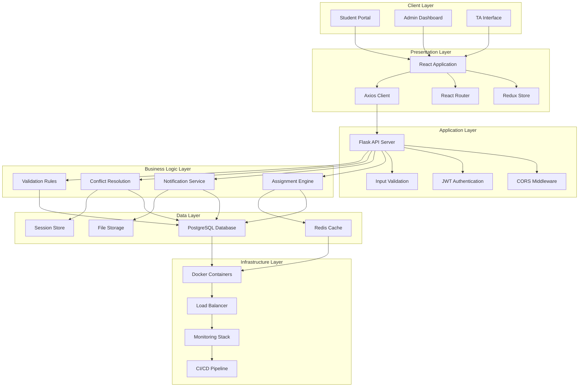
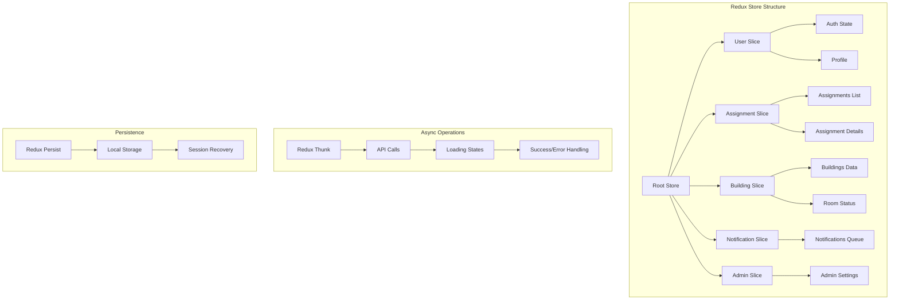
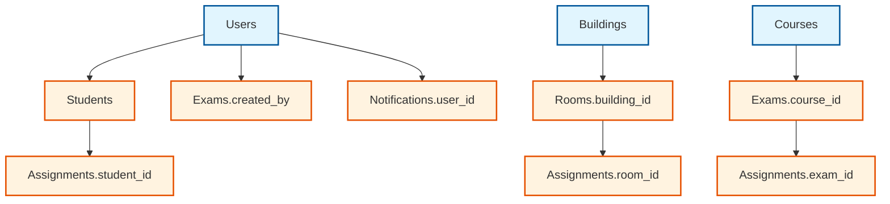
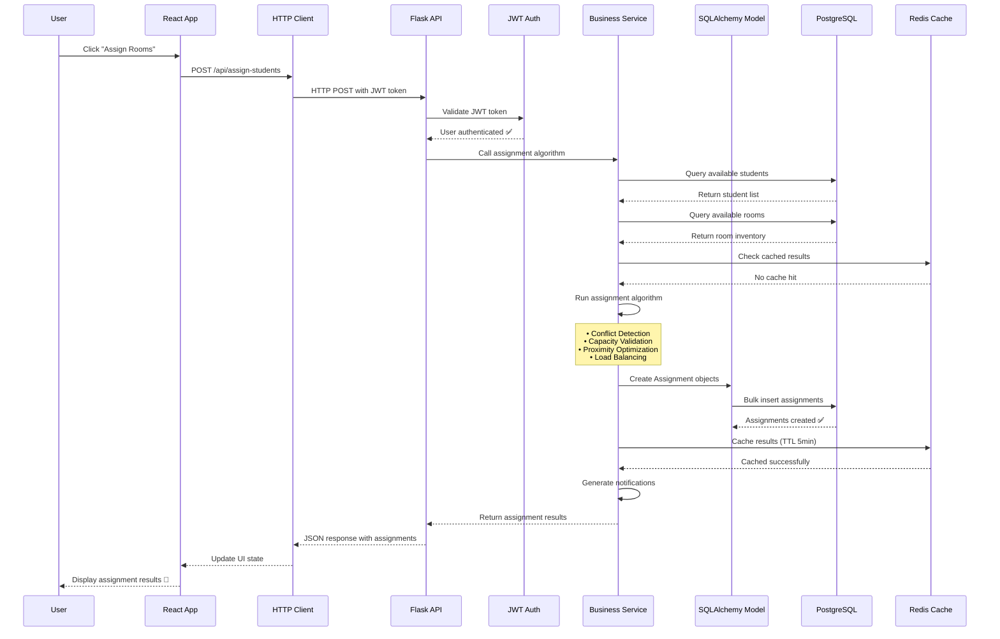
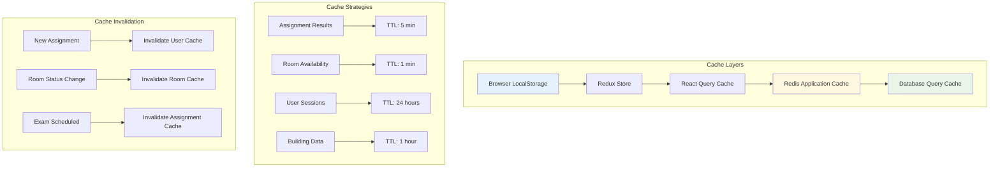
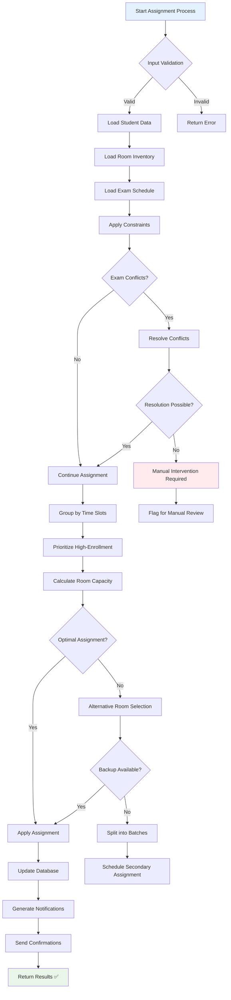
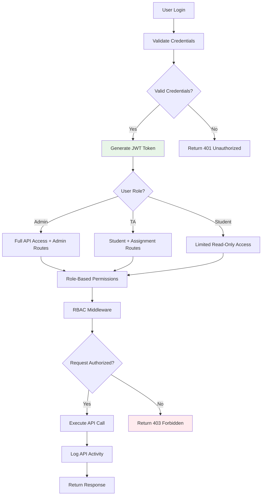
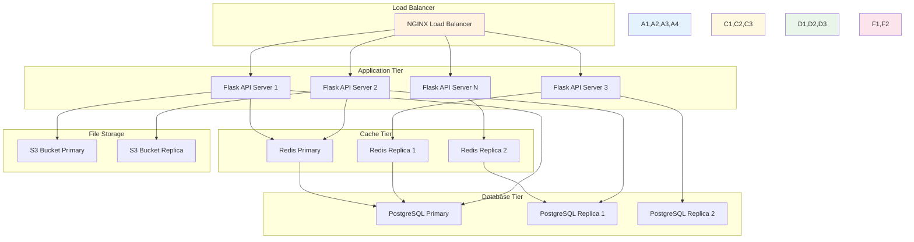
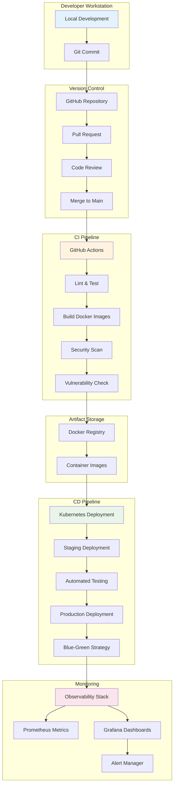

# 🏗️ **System Architecture Deep Dive**

## **SmartRoomAssigner Technical Architecture Overview**

This document provides a comprehensive technical overview of SmartRoomAssigner's architecture, components, data flow, and design decisions for developers who need to understand, maintain, or extend the system.

---

## 🎯 **Architecture Overview**

### **High-Level System Architecture**


---

## 🌐 **Component Deep Dive**

### **Frontend Architecture (React Application)**

#### **Technology Stack**
```
Frontend Stack:
├── React 18.2.0 - Core framework
├── TypeScript - Type safety
├── Redux Toolkit - State management
├── React Router 6.4 - Routing
├── Axios - HTTP client
├── Tailwind CSS - Styling
├── React Hook Form - Form handling
├── React Testing Library - Testing
└── Leaflet - Maps integration
```

#### **Application Structure**
```
frontend/
├── src/
│   ├── components/          # Reusable UI components
│   │   ├── admin/           # Admin-specific components
│   │   ├── student/         # Student-specific components
│   │   ├── common/          # Shared components
│   │   └── layout/          # Layout components
│   ├── hooks/               # Custom React hooks
│   ├── services/            # API service layer
│   ├── store/               # Redux store configuration
│   ├── utils/               # Utility functions
│   ├── types/               # TypeScript type definitions
│   └── styles/              # Global styles and themes
├── public/                  # Static assets
└── tests/                   # Test files
```

#### **State Management Architecture**


### **Backend Architecture (Flask API Server)**

#### **Technology Stack**
```
Backend Stack:
├── Flask 2.3.0 - Web framework
├── Flask-SQLAlchemy - ORM
├── Flask-JWT-Extended - JWT authentication
├── Flask-CORS - Cross-origin support
├── PostgreSQL 13 - Primary database
├── Redis 6.2 - Caching and sessions
├── Celery 5.3 - Task queuing
└── Gunicorn - WSGI server
```

#### **API Structure**
```
backend/
├── app/
│   ├── models/              # SQLAlchemy models
│   │   ├── user.py          # User model
│   │   ├── student.py       # Student model
│   │   ├── room.py          # Room model
│   │   ├── assignment.py    # Assignment model
│   │   └── exam.py          # Exam model
│   ├── routes/              # API route handlers
│   │   ├── auth.py          # Authentication routes
│   │   ├── students.py      # Student CRUD
│   │   ├── rooms.py         # Room management
│   │   ├── assignments.py   # Assignment operations
│   │   └── system.py        # System utilities
│   ├── services/            # Business logic services
│   │   ├── assignment_service.py
│   │   ├── notification_service.py
│   │   └── validation_service.py
│   ├── extensions/          # Flask extensions
│   ├── utils/               # Helper utilities
│   └── config/              # Configuration management
├── migrations/              # Database migrations
├── tests/                   # Unit and integration tests
└── requirements.txt         # Python dependencies
```

---

## 💾 **Database Architecture**

### **Database Schema Overview**
```sql
-- Core Tables and Relationships
SmartRoomAssigner Database Schema

users (
    id SERIAL PRIMARY KEY,
    email VARCHAR(255) UNIQUE NOT NULL,
    password_hash VARCHAR(255) NOT NULL,
    role VARCHAR(50) NOT NULL,
    created_at TIMESTAMP DEFAULT NOW()
)

students (
    id SERIAL PRIMARY KEY,
    first_name VARCHAR(100) NOT NULL,
    last_name VARCHAR(100) NOT NULL,
    student_number VARCHAR(50) UNIQUE,
    student_id VARCHAR(50) UNIQUE,
    department VARCHAR(100),
    user_id INTEGER REFERENCES users(id)
)

buildings (
    id SERIAL PRIMARY KEY,
    name VARCHAR(255) NOT NULL,
    code VARCHAR(10) UNIQUE NOT NULL,
    address TEXT,
    latitude DECIMAL(10,8),
    longitude DECIMAL(11,8)
)

rooms (
    id SERIAL PRIMARY KEY,
    building_id INTEGER REFERENCES buildings(id),
    room_number VARCHAR(50) NOT NULL,
    capacity INTEGER NOT NULL,
    floor INTEGER,
    room_type VARCHAR(50),
    is_active BOOLEAN DEFAULT TRUE
)

courses (
    id SERIAL PRIMARY KEY,
    course_code VARCHAR(20) UNIQUE NOT NULL,
    course_name VARCHAR(255) NOT NULL,
    instructor VARCHAR(255)
)

exams (
    id SERIAL PRIMARY KEY,
    course_id INTEGER REFERENCES courses(id),
    exam_date DATE NOT NULL,
    start_time TIME NOT NULL,
    end_time TIME NOT NULL,
    duration INTEGER, -- minutes
    created_by INTEGER REFERENCES users(id)
)

assignments (
    id SERIAL PRIMARY KEY,
    exam_id INTEGER REFERENCES exams(id),
    student_id INTEGER REFERENCES students(id),
    room_id INTEGER REFERENCES rooms(id),
    seat_number VARCHAR(10),
    assigned_at TIMESTAMP DEFAULT NOW(),
    status VARCHAR(20) DEFAULT 'active'
)

notifications (
    id SERIAL PRIMARY KEY,
    user_id INTEGER REFERENCES users(id),
    title VARCHAR(255) NOT NULL,
    message TEXT,
    notification_type VARCHAR(50),
    is_read BOOLEAN DEFAULT FALSE,
    created_at TIMESTAMP DEFAULT NOW()
)
```

### **Database Relationships**


### **Indexing Strategy**
```sql
-- Performance Indexes
CREATE INDEX idx_students_student_number ON students(student_number);
CREATE INDEX idx_students_student_id ON students(student_id);
CREATE INDEX idx_rooms_building_room ON rooms(building_id, room_number);
CREATE INDEX idx_assignments_exam_room ON assignments(exam_id, room_id);
CREATE INDEX idx_exams_date_time ON exams(exam_date, start_time);
CREATE INDEX idx_notifications_user_read ON notifications(user_id, is_read);
CREATE INDEX idx_assignments_status ON assignments(status);

-- Partial Indexes for Active Records
CREATE INDEX idx_rooms_active ON rooms(building_id, room_number) WHERE is_active = TRUE;
CREATE INDEX idx_assignments_active ON assignments(exam_id) WHERE status = 'active';

-- Composite Indexes for Common Queries
CREATE INDEX idx_students_name ON students(last_name, first_name);
CREATE INDEX idx_exams_course_date ON exams(course_id, exam_date);
```

---

## 🔄 **Data Flow Architecture**

### **Complete Request Flow Example**


### **Caching Architecture**


---

## 🚀 **Assignment Engine Architecture**

### **Smart Assignment Algorithm Flow**


### **Algorithm Optimization Techniques**
```mermaid
graph TD
    subgraph "Algorithm Strategies"
        A[Greedy Algorithm] --> B[Sort by Priority]
        A --> C[First-Fit Assignment]
        A --> D[Constraint Satisfaction]

        E[Genetic Algorithm] --> F[Crossover Operations]
        E --> G[Mutation Strategies]
        E --> H[Fitness Functions]

        I[Constraint Programming] --> J[Variable Domains]
        I --> K[Constraint Propagation]
        I --> L[Backtracking Search]
    end

    subgraph "Performance Optimizations"
        M[Priority Queues] --> N[O(log n) insertions]
        O[Bloom Filters] --> P[Fast set membership]
        Q[Spatial Indexing] --> R[Geographic optimization]
        S[Parallel Processing] --> T[Multi-core utilization]
    end

    subgraph "Caching Optimizations"
        U[Result Memoization] --> V[Identical request caching]
        W[Partial Result Cache] --> X[Incremental computation]
        Y[Distributed Cache] --> Z[Horizontal scaling]
    end
```

---

## 🔐 **Security Architecture**

### **Authentication & Authorization Flow**


### **Security Layers**
```
Security Implementation Layers:

1. 🔐 Network Security
├── HTTPS/TLS encryption
├── Rate limiting (100 req/min)
├── IP whitelisting for admin access
└── DDoS protection

2. 🔑 Application Security
├── JWT token authentication
├── Password hashing (Argon2)
├── Input validation & sanitization
├── CSRF protection
└── XSS prevention

3. 💾 Database Security
├── SQL injection prevention (ORM)
├── Row-level security
├── Encrypted sensitive data
├── Audit logging
└── Backup encryption

4. 📊 Monitoring & Response
├── Security threat detection
├── Automated alerts
├── Incident response plans
└── Security audit trails
```

---

## 📊 **Performance & Scalability Architecture**

### **System Performance Characteristics**
```
Performance Benchmarks & SLAs:

Response Times:
├── API Health Check: <50ms (99.9% uptime)
├── Student Lookup: <100ms (99.5% uptime)
├── Room Assignment: <500ms (95% uptime)
├── Bulk Import: <30s for 1000 records
└── Report Generation: <10s for 10K records

Throughput:
├── Concurrent Users: 500 simultaneous connections
├── API Requests/sec: 1000 sustained load
├── Database Queries/sec: 5000 read operations
├── File Uploads: 100 concurrent uploads
└── Notification Processing: 1000 emails/min

Scalability Limits:
├── Vertical Scaling: 16-core CPU, 64GB RAM
├── Horizontal Scaling: 10+ container instances
├── Database Connections: 200 maximum pool
├── File Storage: 10TB capacity
└── CDN Edge Locations: Global distribution
```

### **Load Balancing & High Availability**


---

## 🚀 **Deployment & DevOps Architecture**

### **CI/CD Pipeline Architecture**


### **Infrastructure as Code Structure**
```
infrastructure/
├── docker/
│   ├── Dockerfile.frontend    # React build
│   ├── Dockerfile.backend     # Flask application
│   ├── docker-compose.yml     # Local development
│   └── docker-compose.prod.yml # Production setup
├── kubernetes/
│   ├── deployment.yaml        # Application deployment
│   ├── service.yaml          # Load balancing
│   ├── ingress.yaml          # External access
│   ├── configmap.yaml        # Configuration
│   └── secrets.yaml          # Sensitive data
├── terraform/
│   ├── main.tf               # Infrastructure provision
│   ├── variables.tf          # Configuration variables
│   ├── outputs.tf            # Resource outputs
│   └── modules/              # Reusable components
├── monitoring/
│   ├── prometheus.yml        # Metrics collection
│   ├── grafana/              # Dashboard definitions
│   │   ├── dashboards/       # Custom dashboards
│   │   └── datasources/      # Data source configs
│   └── alerts.yml            # Alert rules
└── scripts/
    ├── deploy.sh            # Deployment automation
    ├── backup.sh            # Database backup
    └── health-check.sh      # System monitoring
```

---

## 🎯 **Architecture Decision Records**

### **Key Technical Decisions**

#### **ADR 001: Database Choice - PostgreSQL**
**Context**: Need for robust relational database supporting complex queries, transactions, and JSON operations.

**Decision**: PostgreSQL 13+ as primary database
**Rationale**:
- Full ACID compliance for assignment transactions
- Advanced indexing and query optimization
- Native JSON support for flexible data models
- Excellent concurrency handling for multi-user scenarios
- Mature tooling and extensive community support

#### **ADR 002: API Framework - Flask REST**
**Context**: Need lightweight, flexible API framework for rapid development and maintenance.

**Decision**: Flask with Flask-RESTful extension
**Rationale**:
- Minimal overhead and fast startup times
- Extensive middleware ecosystem
- Python-native for seamless data model integration
- RESTful design patterns aligned with HTTP standards
- Easy testing and debugging capabilities

#### **ADR 003: Frontend Framework - React with TypeScript**
**Context**: Need maintainable, scalable frontend with strong type safety and developer experience.

**Decision**: React 18 with TypeScript and Redux Toolkit
**Rationale**:
- Component-based architecture for maintainability
- TypeScript prevents runtime type errors
- Redux for predictable state management at scale
- Rich ecosystem for UI components and testing
- Modern development tooling and hot reloading

#### **ADR 004: Caching Strategy - Redis Multi-Layer**
**Context**: Need to optimize database performance and reduce response times for frequently accessed data.

**Decision**: Redis-based caching with application-level and database-level layers
**Rationale**:
- Sub-millisecond data retrieval for hot data
- Configurable TTL for different data types
- Pub/Sub capabilities for real-time features
- Persistence options for data durability
- Horizontal scaling capabilities

This comprehensive architecture guide provides developers with deep technical understanding necessary for maintaining, debugging, and extending the SmartRoomAssigner system effectively! 🏗️🚀
