# 🧪 **Testing Strategy & Best Practices**

## **Comprehensive Testing Framework for SmartRoomAssigner**

This guide outlines the complete testing strategy for SmartRoomAssigner, covering unit tests, integration tests, end-to-end tests, and performance testing. It provides developers with clear patterns, tools, and best practices to ensure code quality and system reliability.

---

## 🎯 **Testing Pyramid Overview**

### **Testing Strategy Architecture**

```mermaid
flowchart TD
    A[🧪 Testing Pyramid] --> B[Foundation: Unit Tests]
    A --> C[Integration: Service Tests]
    A --> D[Validation: E2E Tests]

    B --> B1[Functions & Classes]
    B --> B2[Components & Hooks]
    B --> B3[Utilities & Helpers]
    B --> B4[Models & Schemas]

    C --> C1[API Endpoints]
    C --> C2[Database Operations]
    C --> C3[External Services]
    C --> C4[Business Logic]

    D --> D1[User Workflows]
    D --> D2[Critical Paths]
    D --> D3[Browser Compatibility]

    B1 --> E[Fast Feedback ⚡]
    B2 --> E
    C1 --> F[Quality Gates 🔒]
    C2 --> F
    D1 --> G[Confidence 🚀]
    D2 --> G

    style A fill:#e3f2fd
    style B fill:#c8e6c9
    style C fill:#fff3e0
    style D fill:#fce4ec
```


### **Testing Priorities & Coverage**
```javascript
// 📊 Testing Coverage Standards
const TESTING_REQUIREMENTS = {

  // Unit Tests: 80%+ coverage required
  unit_tests: {
    coverage: '>=80%',
    files: ['*.py', '*.ts', '*.tsx', '*.js'],
    scope: 'functions, classes, components'
  },

  // Integration Tests: 90%+ coverage required
  integration_tests: {
    coverage: '>=90%',
    files: ['routes/*.py', 'services/*.py', 'api/*.ts'],
    scope: 'API endpoints, services, database operations'
  },

  // E2E Tests: Critical paths only
  e2e_tests: {
    coverage: '25-50%',  // Highest-impact user journeys
    files: ['e2e/*.spec.ts'],
    scope: 'login→dashboard, assignment→submission, admin→reports'
  },

  // Performance Tests: Baseline requirements
  performance_tests: {
    response_time: '<500ms',
    concurrent_users: '>=100',
    throughput: '>=1000 requests/min',
    scope: 'load testing, stress testing'
  }
};
```

---

## 🔧 **Testing Tools & Framework**

### **Backend Testing Stack**
```python
# 🐍 Backend Testing Tools
TESTING_STACK = {

  # Core Testing Framework
  pytest: {
    version: '7.4.x',
    purpose: 'Test runner and assertions',
    features: ['fixtures', 'parametrization', 'plugins']
  },

  # HTTP Testing
  pytest_flask: {
    version: '1.3.x',
    purpose: 'Flask-specific testing utilities',
    features: ['test client', 'request context', 'session handling']
  },

  # Database Testing
  pytest_postgresql: {
    version: '5.0.x',
    purpose: 'PostgreSQL test database management',
    features: ['database fixtures', 'transaction rollback']
  },

  # Coverage & Quality
  pytest_cov: {
    version: '4.1.x',
    purpose: 'Code coverage reporting',
    features: ['HTML reports', 'XML output', 'threshold checking']
  },

  # Mocking & Fixtures
  pytest_mock: {
    version: '3.12.x',
    purpose: 'Function and object mocking',
    features: ['monkeypatch', 'mock objects', 'side effect control']
  }
}
```

### **Frontend Testing Stack**
```typescript
// ⚛️ Frontend Testing Tools
FRONTEND_TESTING = {

  // React Testing Library
  '@testing-library/react': {
    version: '^13.4.0',
    purpose: 'React component testing',
    features: ['query methods', 'user events', 'accessibility checks']
  },

  // Testing Framework
  '@testing-library/jest-dom': {
    version: '^5.16.0',
    purpose: 'Custom Jest matchers for DOM',
    features: ['toBeInTheDocument', 'toHaveClass', 'toBeDisabled']
  },

  // Mocking & Utils
  '@testing-library/user-event': {
    version: '^14.4.0',
    purpose: 'User interaction simulation',
    features: ['click', 'type', 'keyboard events']
  },

  // E2E Testing
  '@playwright/test': {
    version: '^1.32.0',
    purpose: 'Cross-browser E2E testing',
    features: ['multiple browsers', 'API testing', 'visual regression']
  }
}
```

---

## 🏗️ **Unit Testing Patterns**

### **Backend Unit Test Structure**
```python
# 📁 Backend Unit Test Organization
tests/
├── conftest.py              # Shared fixtures and configuration
├── test_models/             # Model layer tests
│   ├── test_student.py      # Student model tests
│   ├── test_assignment.py   # Assignment model tests
│   └── test_user.py         # User model tests
├── test_services/           # Business logic tests
│   ├── test_assignment_service.py
│   ├── test_notification_service.py
│   └── test_validation_service.py
├── test_utils/              # Utility function tests
│   ├── test_auth_utils.py
│   ├── test_date_utils.py
│   └── test_validation_utils.py
├── test_routes/             # API endpoint unit tests
│   ├── test_student_routes.py
│   ├── test_assignment_routes.py
│   └── test_auth_routes.py
└── test_integrations/       # Integration tests
    ├── test_database_integration.py
    ├── test_cache_integration.py
    └── test_external_services.py
```

### **Unit Test Example - Assignment Service**
```python
# 🧪 Assignment Service Unit Tests
import pytest
from unittest.mock import Mock, patch
from app.services.assignment_service import AssignmentService
from app.models.assignment import Assignment
from app.models.student import Student
from app.models.room import Room

class TestAssignmentService:
    """Test suite for AssignmentService business logic"""

    def test_create_assignment_success(self, db_session):
        """Test successful assignment creation"""
        # Arrange
        student = Student(id=1, first_name='John', last_name='Doe')
        room = Room(id=1, room_number='101', capacity=50)

        # Act
        service = AssignmentService()
        result = service.create_assignment(student, room, exam_id=1)

        # Assert
        assert result.success is True
        assert result.assignment.student_id == student.id
        assert result.assignment.room_id == room.id
        assert result.assignment.status == 'active'

    def test_create_assignment_room_full(self, db_session):
        """Test assignment creation when room is at capacity"""
        # Arrange
        room = Mock()
        room.capacity = 2
        room.current_assignments = 2  # Room is full

        # Act & Assert
        service = AssignmentService()
        with pytest.raises(RoomFullError):
            service.create_assignment(
                Mock(id=1), room, exam_id=1
            )

    @patch('app.services.assignment_service.cache')
    def test_create_assignment_with_cache(self, mock_cache, db_session):
        """Test assignment creation with caching"""
        # Arrange
        mock_cache.get.return_value = None  # Cache miss
        service = AssignmentService()

        # Act
        result = service.create_assignment(
            Mock(id=1), Mock(id=1, capacity=50), exam_id=1
        )

        # Assert
        assert result.success is True
        mock_cache.set.assert_called_once()  # Cache was updated

    def test_assignment_conflict_detection(self, db_session):
        """Test detection of conflicting assignments"""
        # Arrange
        student = Student(id=1)
        existing_assignment = Assignment(
            student_id=1,
            exam_date='2025-12-01',
            start_time='09:00',
            end_time='11:00'
        )

        # Act
        service = AssignmentService()
        conflict = service.detect_conflicts(
            student, '2025-12-01', '10:00', '12:00'
        )

        # Assert
        assert conflict is True
        assert service.get_conflict_details() is not None
```

---

## 🔗 **Integration Testing Patterns**

### **API Integration Test Structure**
```python
# 📋 API Integration Test Template
import pytest
from flask import json
from app import create_app
from app.models import db, Student, User

class TestStudentAPI:
    """Integration tests for Student API endpoints"""

    @pytest.fixture
    def client(self):
        """Create test client with clean database"""
        app = create_app('testing')
        with app.app_context():
            db.create_all()  # Create tables
            yield app.test_client()
            db.drop_all()    # Clean up

    @pytest.fixture
    def auth_token(self, client):
        """Generate authentication token for tests"""
        # Create test user and generate JWT token
        return generate_test_token(role='admin')

    def test_get_students_list(self, client, auth_token):
        """Test GET /api/v1/students endpoint"""
        # Arrange - Create test records
        with client.application.app_context():
            user = User(email='admin@test.com', role='admin')
            student1 = Student(
                first_name='Alice',
                last_name='Smith',
                email='alice@test.com',
                user=user
            )
            student2 = Student(
                first_name='Bob',
                last_name='Johnson',
                email='bob@test.com',
                user=user
            )
            db.session.add_all([user, student1, student2])
            db.session.commit()

        # Act
        response = client.get(
            '/api/v1/students',
            headers={'Authorization': f'Bearer {auth_token}'}
        )

        # Assert
        assert response.status_code == 200
        data = json.loads(response.data)

        assert 'data' in data
        assert len(data['data']) == 2
        assert data['data'][0]['attributes']['first_name'] == 'Alice'
        assert data['data'][1]['attributes']['first_name'] == 'Bob'

    def test_create_student_validation(self, client, auth_token):
        """Test POST /api/v1/students with validation"""
        # Test successful creation
        valid_data = {
            'data': {
                'first_name': 'Charlie',
                'last_name': 'Brown',
                'email': 'charlie@example.com',
                'department': 'Computer Science'
            }
        }

        response = client.post(
            '/api/v1/students',
            json=valid_data,
            headers={'Authorization': f'Bearer {auth_token}'}
        )

        assert response.status_code == 201
        data = json.loads(response.data)
        assert data['data']['attributes']['first_name'] == 'Charlie'

    def test_create_student_invalid_data(self, client, auth_token):
        """Test POST /api/v1/students with invalid data"""
        invalid_data = {
            'data': {
                'first_name': '',  # Empty first name
                'last_name': 'Brown',
                'email': 'invalid-email',  # Invalid email
                'department': 'Computer Science'
            }
        }

        response = client.post(
            '/api/v1/students',
            json=invalid_data,
            headers={'Authorization': f'Bearer {auth_token}'}
        )

        assert response.status_code == 422
        data = json.loads(response.data)
        assert 'errors' in data
        assert len(data['errors']) >= 1  # At least one validation error

    def test_student_not_found(self, client, auth_token):
        """Test GET /api/v1/students/:id for non-existent student"""
        response = client.get(
            '/api/v1/students/99999',
            headers={'Authorization': f'Bearer {auth_token}'}
        )

        assert response.status_code == 404
        data = json.loads(response.data)
        assert 'errors' in data
        assert data['errors'][0]['code'] == 'RESOURCE_NOT_FOUND'

    def test_unauthorized_access(self, client):
        """Test API access without authentication"""
        response = client.get('/api/v1/students')
        assert response.status_code == 401
```

---

## 🌐 **End-to-End Testing Patterns**

### **E2E Test Structure with Playwright**
```typescript
// 🎭 E2E Test Structure
import { test, expect } from '@playwright/test';

test.describe('Student Assignment Workflow', () => {

  test.beforeEach(async ({ page }) => {
    // Reset database and create test data
    await page.request.post('/api/test/reset');
    await page.request.post('/api/test/fixtures');
  });

  test('complete student assignment flow', async ({ page }) => {
    // Navigate to application
    await page.goto('http://localhost:3000');

    // Login as student
    await page.fill('[data-testid="email-input"]', 'alice@university.edu');
    await page.fill('[data-testid="password-input"]', 'password');
    await page.click('[data-testid="login-button"]');

    // Verify dashboard loads
    await expect(page.locator('[data-testid="dashboard"]')).toBeVisible();

    // Check for assignment notifications
    const notificationCount = page.locator('[data-testid="notification-count"]');
    await expect(notificationCount).toContainText('1');

    // Navigate to assignments
    await page.click('[data-testid="assignments-tab"]');

    // Verify assignment details
    await expect(page.locator('[data-testid="exam-name"]')).toContainText('Computer Science 301');
    await expect(page.locator('[data-testid="exam-date"]')).toContainText('December 1, 2025');
    await expect(page.locator('[data-testid="room-assignment"]')).toContainText('MB-101, Seat A5');

    // Test map functionality (if available)
    const mapElement = page.locator('[data-testid="campus-map"]');
    if (await mapElement.isVisible()) {
      await mapElement.click();
      await expect(page.locator('[data-testid="directions-panel"]')).toBeVisible();
    }

    // Logout
    await page.click('[data-testid="user-menu"]');
    await page.click('[data-testid="logout-button"]');

    // Verify logout success
    await expect(page.locator('[data-testid="login-form"]')).toBeVisible();
  });

  test('admin assignment management', async ({ page }) => {
    // Login as admin
    await page.goto('http://localhost:3000/login');
    await page.fill('[data-testid="email-input"]', 'admin@university.edu');
    await page.fill('[data-testid="password-input"]', 'admin123');
    await page.click('[data-testid="login-button"]');

    // Navigate to assignment management
    await page.click('[data-testid="admin-panel"]');
    await page.click('[data-testid="assignments-tab"]');

    // Run smart assignment
    await page.click('[data-testid="run-smart-assignment"]');

    // Verify assignment progress
    await expect(page.locator('[data-testid="assignment-progress"]')).toBeVisible();
    await page.waitForSelector('[data-testid="assignment-complete"]');

    // Check assignment results
    await expect(page.locator('[data-testid="assignments-assigned"]')).toContainText('247');
    await expect(page.locator('[data-testid="utilization-rate"]')).toContainText('73%');

    // Export assignments
    await page.click('[data-testid="export-button"]');
    await page.click('[data-testid="pdf-export"]');

    // Verify download starts
    const download = page.waitForEvent('download');
    expect(download).toBeTruthy();
  });

  test('assignment conflict resolution', async ({ page }) => {
    // Setup conflicting scenario through API
    await page.request.post('/api/test/create-conflict');

    // Login as admin
    await page.goto('http://localhost:3000/login');
    await page.fill('[data-testid="email-input"]', 'admin@university.edu');
    await page.fill('[data-testid="password-input"]', 'admin123');
    await page.click('[data-testid="login-button"]');

    // Check for alerts
    await expect(page.locator('[data-testid="alert-icon"]')).toBeVisible();
    await expect(page.locator('[data-testid="conflict-count"]')).toContainText('3');

    // Navigate to conflicts
    await page.click('[data-testid="alerts-panel"]');

    // View conflict details
    await page.click('[data-testid="conflict-item-1"]');
    await expect(page.locator('[data-testid="conflict-details"]')).toBeVisible();

    // Apply manual resolution
    await page.selectOption('[data-testid="resolution-method"]', 'manual');
    await page.fill('[data-testid="manual-room"]', 'BA-202');
    await page.fill('[data-testid="manual-seat"]', 'C3');
    await page.click('[data-testid="apply-resolution"]');

    // Verify resolution
    await expect(page.locator('[data-testid="conflict-resolved"]')).toBeVisible();
    await expect(page.locator('[data-testid="conflict-count"]')).toContainText('2');
  });
});
```

---

## 📊 **Test Data Management**

### **Test Data Strategy**
```python
# 🗄️ Test Data Management
class TestDataManager:
    """Centralized test data management"""

    @staticmethod
    def create_test_students(count=10):
        """Create realistic test student data"""
        students = []
        departments = ['CS', 'MATH', 'PHYSICS', 'CHEM', 'BIOL']

        for i in range(count):
            students.append({
                'first_name': f'Test{i}',
                'last_name': f'Student{i}',
                'email': f'test{i}@university.edu',
                'student_number': f'2025{i:04d}',
                'department': departments[i % len(departments)],
                'enrolled': True
            })

        return students

    @staticmethod
    def create_test_exams():
        """Create test exam schedules"""
        return [
            {
                'course_code': 'CS301',
                'course_name': 'Computer Science III',
                'exam_date': '2025-12-01',
                'start_time': '09:00',
                'end_time': '11:00',
                'duration': 120,
                'capacity': 40
            },
            {
                'course_code': 'MATH201',
                'course_name': 'Calculus II',
                'exam_date': '2025-12-02',
                'start_time': '14:00',
                'end_time': '16:00',
                'duration': 120,
                'capacity': 35
            }
        ]

    @staticmethod
    def cleanup_test_data(db_session):
        """Clean up after tests"""
        # Clear in reverse dependency order
        db_session.query(Notification).delete()
        db_session.query(Assignment).delete()
        db_session.query(Exam).delete()
        db_session.query(Student).delete()
        db_session.query(Building).delete()
        db_session.commit()
```

---

## 🚀 **Running Tests**

### **Local Test Execution**
```bash
# 🔬 Backend Tests
# Run all backend tests
cd backend && python -m pytest tests/ -v

# Run with coverage
python -m pytest tests/ --cov=app --cov-report=html

# Run specific test file
python -m pytest tests/test_assignment_service.py -v

# Run tests matching pattern
python -m pytest -k "assignment and create" -v

# Debug failing test
python -m pytest tests/test_assignment_service.py::TestAssignmentService::test_create_assignment -s --pdb

# 🌐 Frontend Tests
# Run all frontend tests
cd frontend && npm test

# Run tests in watch mode
npm run test:watch

# Run tests with coverage
npm run test:coverage

# 🎭 E2E Tests
# Run E2E tests in all browsers
npx playwright test

# Run specific test file
npx playwright test e2e/student-workflow.spec.ts

# Run tests in headed mode (visible browser)
npx playwright test --headed

# Generate test report
npx playwright show-report
```

### **CI/CD Test Integration**
```yaml
# 🔄 GitHub Actions Test Workflow
name: Tests
on: [push, pull_request]

jobs:
  test-backend:
    runs-on: ubuntu-latest
    steps:
      - uses: actions/checkout@v3
      - name: Set up Python
        uses: actions/setup-python@v4
        with:
          python-version: '3.11'
      - name: Install dependencies
        run: |
          cd backend
          pip install -r requirements.txt
      - name: Run tests with coverage
        run: |
          cd backend
          python -m pytest --cov=app --cov-report=xml --cov-fail-under=80
      - name: Upload coverage
        uses: codecov/codecov-action@v3

  test-frontend:
    runs-on: ubuntu-latest
    steps:
      - uses: actions/checkout@v3
      - name: Set up Node.js
        uses: actions/setup-node@v3
        with:
          node-version: '18'
      - name: Install dependencies
        run: |
          cd frontend
          npm ci
      - name: Run tests
        run: npm test -- --coverage --watchAll=false
      - name: Build
        run: npm run build

  test-e2e:
    runs-on: ubuntu-latest
    steps:
      - uses: actions/checkout@v3
      - name: Run E2E tests
        run: npx playwright test
```

---

## 📈 **Test Quality Metrics**

### **Coverage Requirements**
```javascript
// 📊 Coverage Standards by Component
const COVERAGE_THRESHOLDS = {
  'app/models/*.py': 95,        // Data models must be well-tested
  'app/services/*.py': 90,        // Business logic critical
  'app/routes/*.py': 85,         // API endpoints important
  'app/utils/*.py': 80,          // Utilities less critical

  'frontend/src/components/*.tsx': 90,  // React components
  'frontend/src/hooks/*.ts': 85,        // Custom hooks
  'frontend/src/services/*.ts': 90,     // API services
  'frontend/src/utils/*.ts': 75,        // Utilities
};

// 📈 Quality Gates
const QUALITY_GATES = {
  // Must pass before merge
  required: {
    unit_tests_pass: true,
    integration_tests_pass: true,
    linting_pass: true,
    type_check_pass: true,      // Frontend only
  },

  // Thresholds for warnings
  thresholds: {
    coverage_backend: 80,
    coverage_frontend: 80,
    duplicate_lines: 3,         // Max 3% code duplication
    complexity: 10,             // Max cyclomatic complexity
  },

  // Performance benchmarks
  performance: {
    test_execution_time: 300,     // Max 5 minutes
    memory_usage: 512,            // Max 512MB during tests
  }
};
```

### **Mutation Testing**
```python
# 🧬 Mutation Testing (Advanced)
# Use mutmut for mutation testing to find gaps in test suites

# Install mutation testing
pip install mutmut

# Run mutation tests
mutmut run --paths-to-mutate=app/services/ --tests-dir=tests/

# View results
mutmut results
mutmut show

# Mutation testing helps identify:
# - Tests that don't actually validate behavior
# - Edge cases not covered by tests
# - False positive passing tests
```

---

## 🐛 **Debugging Test Failures**

### **Common Test Issues & Solutions**
```python
# 🔧 Test Debugging Techniques
class TestDebugger:

    @staticmethod
    def debug_failing_test(test_path, test_name):
        """Debug a specific failing test with detailed output"""

        # Run with verbose output
        cmd = f"python -m pytest {test_path}::{test_name} -v -s --tb=long"
        subprocess.run(cmd, shell=True)

    @staticmethod
    def inspect_database_state(db_session, table_name):
        """Inspect database state during test execution"""

        # Query current state
        result = db_session.execute(f"SELECT COUNT(*) FROM {table_name}").fetchone()
        print(f"Records in {table_name}: {result[0]}")

        # Show sample records
        records = db_session.execute(f"SELECT * FROM {table_name} LIMIT 5").fetchall()
        for record in records:
            print(record)

    @staticmethod
    def mock_external_dependencies(test_function):
        """Decorator to automatically mock external dependencies"""

        @patch('app.services.external_api.requests.post')
        @patch('app.cache.redis.Redis.get')
        def wrapper(*args, **kwargs):
            # Configure mocks here
            mock_redis, mock_post = args[-2], args[-1]

            # Set up mock responses
            mock_redis.return_value = None  # Cache miss
            mock_post.return_value.json.return_value = {'status': 'success'}

            return test_function(*args[:-2], **kwargs)

        return wrapper

    @staticmethod
    def performance_profile_test(test_function):
        """Profile test performance to identify bottlenecks"""

        import cProfile
        import pstats

        profiler = cProfile.Profile()
        profiler.enable()

        try:
            result = test_function()
        finally:
            profiler.disable()

            # Print performance stats
            stats = pstats.Stats(profiler)
            stats.sort_stats('cumulative').print_stats(20)

        return result
```

---

## 🎯 **Testing Best Practices**

### **Test Organization Principles**
```javascript
// 📋 Testing Best Practices Checklist
const TESTING_BEST_PRACTICES = {

  // Test Naming
  naming: {
    pattern: 'test_[feature]_[scenario]_[expected_result]',
    examples: [
      'test_student_creation_with_valid_data_succeeds',
      'test_assignment_conflict_with_overlapping_times_fails',
      'test_login_with_invalid_credentials_returns_401'
    ]
  },

  // Test Structure
  structure: {
    // Arrange-Act-Assert pattern
    arrange: 'Set up test data and conditions',
    act: 'Execute the code under test',
    assert: 'Verify the expected outcomes',

    // One assertion per test
    single_responsibility: 'Each test should verify one specific behavior',

    // Independent tests
    independence: 'Tests should not depend on other tests execution order'
  },

  // Mock vs Real Dependencies
  mocking: {
    external_services: 'Always mock for unit tests',
    database: 'Use test database for integration tests',
    time_functions: 'Mock or freeze time for deterministic tests',
    random_values: 'Seed random number generators'
  },

  // Test Data
  data: {
    factories: 'Use factories for complex object creation',
    fixtures: 'Reuse common test data setups',
    cleanup: 'Always clean up after tests',
    isolation: 'Tests should not affect each other'
  }
};
```

This comprehensive testing guide provides developers with the knowledge and tools needed to write high-quality tests, debug issues effectively, and maintain system reliability throughout the SmartRoomAssigner development lifecycle! 🧪🚀
