# 🚀 Getting Started with SmartRoomAssigner

## Welcome to SmartRoomAssigner!

This comprehensive guide will help you get up and running with the SmartRoomAssigner system in just a few minutes.

## 📋 Prerequisites

Before you begin, ensure you have the following installed on your system:

### Required Software
- **Node.js** 16.0 or higher
- **npm** (comes with Node.js)
- **Python** 3.8 or higher
- **pip** (comes with Python)
- **Git** for version control

### Optional but Recommended
- **Docker** and **Docker Compose** (for containerized deployment)
- **PostgreSQL** (for production database)

## ⚡ **Installation Decision Tree**

### **Choose Your Installation Method**

```mermaid
flowchart TD
    A[Start Installation] --> B{Have Docker?}

    B -->|Yes| C[🐳 Docker Installation]
    B -->|No| D{Manual Installation}
    D --> E{Have Node.js/npm?}
    E -->|Yes| F{Have Python?}
    E -->|No| G[Install Node.js + npm]

    F -->|Yes| H[Full Manual Setup]
    F -->|No| I[Install Python + pip]

    G --> F
    I --> H

    C --> J[Docker Quick Start]
    H --> K[Manual Setup]

    J --> L[System Ready]
    K --> L
```


## 🐳 **Docker Installation (Recommended)**

### **Single-Command Setup**
```bash
# Clone repository
git clone https://github.com/your-org/smartroomassigner.git
cd smartroomassigner

# Start all services
docker-compose up -d

# Check status
docker-compose ps
```

#### **Docker Setup Visualization**
```
🏗️ Docker Architecture Preview
┌─────────────────┬─────────────────┬─────────────────┐
│   Frontend      │   Backend       │  Database      │
│   (React)       │   (Flask)       │  (PostgreSQL)  │
│   Port 3000     │   Port 5000     │  Port 5432     │
│                 │                 │                │
│  🌐 localhost   │  🔗 Internal    │  🔒 Container  │
└─────────────────┴─────────────────┴─────────────────┘
         ↓                     ↓              ↓
    Browser Access ─────► API Requests ──► Data Storage
```

#### **Expected Output**
```
Creating smartroomassigner_frontend_1  ... done
Creating smartroomassigner_backend_1   ... done
Creating smartroomassigner_db_1         ... done

✅ Application ready at: http://localhost:3000
✅ API ready at: http://localhost:5000
✅ Database ready at: localhost:5432
```

## 🔧 **Manual Installation (Advanced)**

### **Step 1: System Prerequisites Check**
```bash
# Check Node.js version
node --version    # Should be 16.0+

# Check npm version
npm --version     # Should be 7.0+

# Check Python version
python --version  # Should be 3.8+

# Check pip version
pip --version
```

#### **System Compatibility Grid**

| **Component** | **Windows** | **macOS** | **Linux** | **Docker** |
|---------------|-------------|-----------|-----------|------------|
| ✅ Frontend   | Supported   | Supported | Supported | Preferred  |
| ✅ Backend    | Supported   | Supported | Supported | Preferred  |
| ✅ Database   | Supported   | Supported | Supported | Preferred  |
| ⚠️ Build Tools| Manual      | Manual    | Manual    | Automatic  |

### **Step 2: Backend Setup Walkthrough**

#### **Backend Installation Flow**


#### **Complete Backend Setup**
```bash
# Navigate to backend directory
cd backend

# Create isolated Python environment
python -m venv venv

# Activate virtual environment
# Windows:
venv\\Scripts\\activate
# macOS/Linux:
source venv/bin/activate

# Install Python dependencies
pip install -r requirements.txt

# Initialize database (first run only)
python app.py
# OR run with environment variables
FLASK_ENV=development python app.py
```

#### **Backend Health Check**
```bash
# Test if backend is running
curl http://localhost:5000/health
# Expected: {"status": "healthy"}

# Test API endpoints
curl http://localhost:5000/api/students
# Expected: JSON response with student data
```

### **Step 3: Frontend Setup Walkthrough**

#### **Frontend Build Process**


#### **Complete Frontend Setup**
```bash
# Navigate to frontend directory
cd frontend

# Install Node.js dependencies
npm install

# Set environment variables (optional but recommended)
echo "REACT_APP_API_URL=http://localhost:5000" > .env.local

# Start development server
npm start
```

#### **Common Frontend Issues & Solutions**

| **Error Message**                  | **Solution**                          | **Why this happens** |
|------------------------------------|---------------------------------------|---------------------|
| `Port 3000 already in use`       | `npm start -- --port 3001`           | Another app using port |
| `Cannot find module 'react'`     | `npm install`                        | Dependencies not installed |
| `Network error: connect ECONNREFUSED`| Check backend is running on port 5000 | Backend not started |
| `Google Maps API warning`        | Set REACT_APP_GOOGLE_MAPS_API_KEY     | Maps integration needs key |

## 🎯 **Quick Start Verification**

### **Installation Checklist**
- [ ] Docker containers running (if using Docker)
- [ ] Backend accessible at http://localhost:5000
- [ ] Frontend accessible at http://localhost:3000
- [ ] Database healthy (PostgreSQL port 5432)
- [ ] No errors in browser console (F12)

### **First-Time Setup Flow**


### **Post-Installation Commands**
```bash
# Check all services status
docker-compose ps

# View application logs
docker-compose logs -f

# Stop application
docker-compose down

# Restart with fresh database
docker-compose down -v && docker-compose up -d
```

## 🔑 Default Login Credentials

### Administrator Access
- **Email**: `alice@examspace.com`
- **Password**: `password`

### Other Test Accounts
- **Dr. Bob** (Professor): `bob@university.edu` / `password`
- **Tom TA** (TA): `tom@university.edu` / `password`
- **Student Sara** (Student): `sara@student.edu` / `password`

## 🎯 Next Steps

### Immediate Actions
1. **Login** to the admin dashboard
2. **Import your data** (buildings, rooms, students)
3. **Schedule your first exam**
4. **Generate room assignments**

### Recommended Reading
- **[Admin Guide](./user-guides/admin-guide.md)** - Complete administration manual
- **[API Reference](./technical-docs/api-reference.md)** - Developer integration guide
- **[Troubleshooting](./admin-docs/troubleshooting.md)** - Common issues and solutions

## 🛠️ System Architecture

SmartRoomAssigner consists of:

- **Backend**: Flask application with SQLAlchemy ORM
- **Frontend**: React application with modern UI
- **Database**: SQLite (development) / PostgreSQL (production)
- **Maps**: Leaflet integration for building locator
- **Authentication**: Session-based with role management

## 📞 Support

If you encounter any issues:

1. **Check the documentation** in the Help & Support section
2. **Review the troubleshooting guide**
3. **Contact support** via the in-app support system

## 🎉 You're All Set!

Your SmartRoomAssigner system is now ready to use. Start by exploring the admin dashboard and importing your institutional data.

Happy assigning! 🎯
