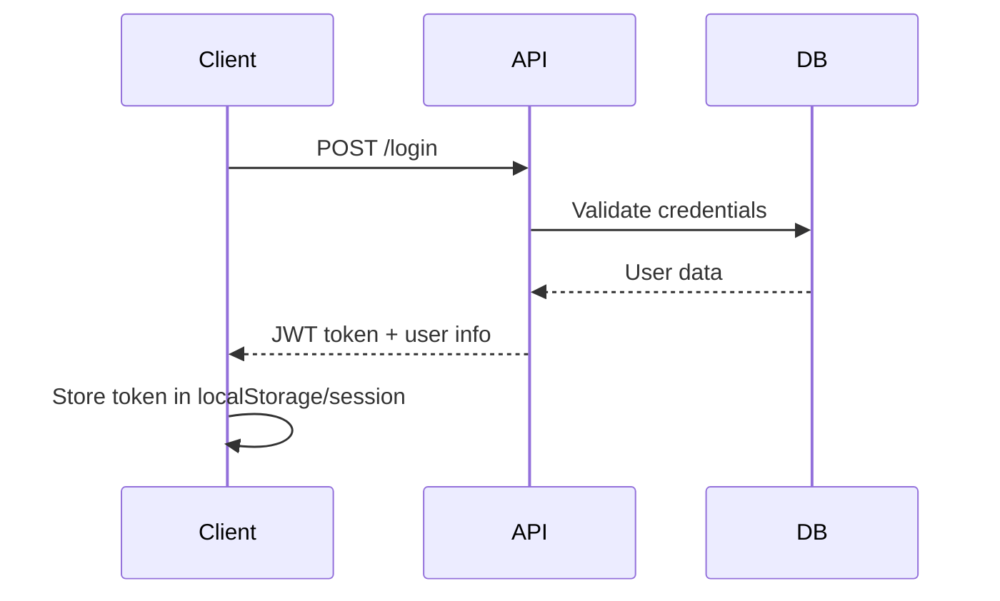
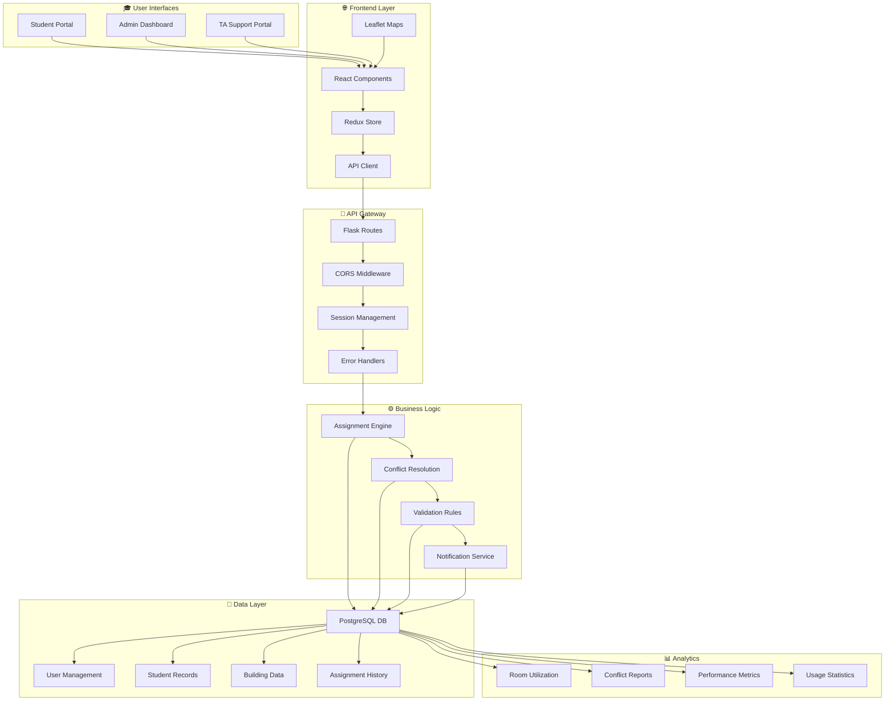
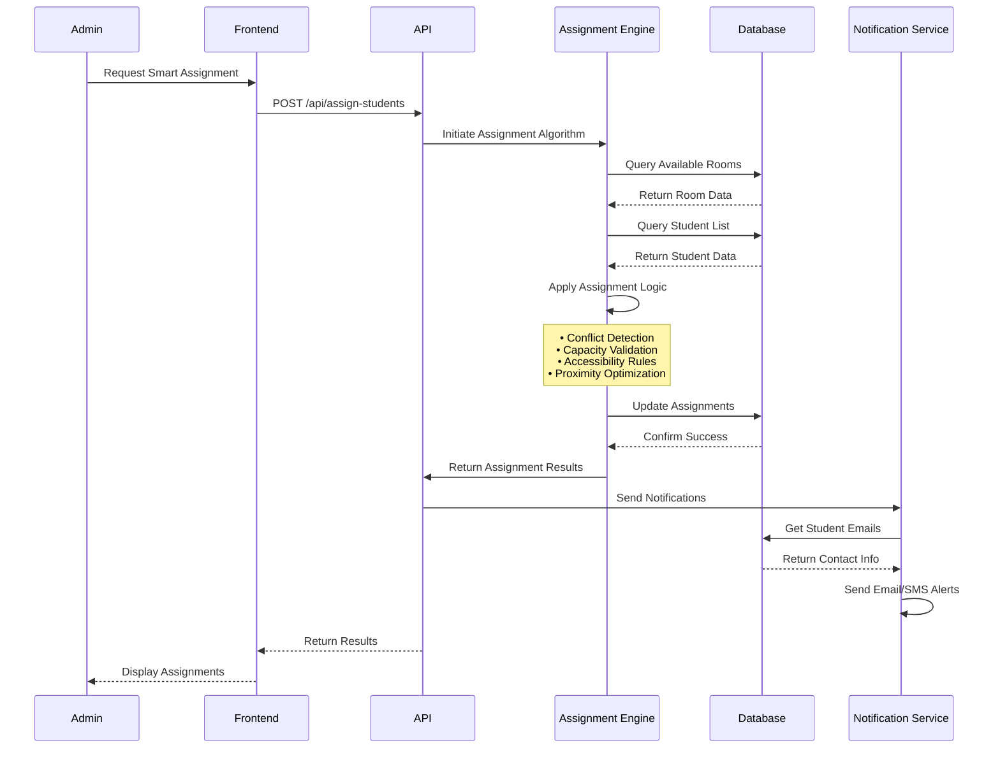

# 🔧 API Reference

## Overview

Complete REST API documentation for SmartRoomAssigner backend services.

## Base URL
```
http://localhost:5000/api
```

## Authentication

All API endpoints require authentication. Include session cookies or JWT tokens in requests.

### Headers
```
Content-Type: application/json
Cookie: session=your-session-id
```

## 📊 Data Models

### Student
```json
{
  "id": "integer",
  "first_name": "string",
  "last_name": "string",
  "student_number": "string",
  "student_id": "string",
  "department": "string",
  "courses": "string"
}
```

### Room
```json
{
  "id": "integer",
  "building_id": "integer",
  "room_number": "string",
  "capacity": "integer",
  "floor": "integer",
  "type": "string",
  "allowed": "boolean"
}
```

### Building
```json
{
  "id": "integer",
  "name": "string",
  "code": "string",
  "address": "string"
}
```

### Exam
```json
{
  "id": "integer",
  "course_name": "string",
  "course_code": "string",
  "exam_date": "date",
  "start_time": "time",
  "end_time": "time",
  "created_by": "integer"
}
```

## 🛠️ Endpoints

### Students

#### Get All Students
```http
GET /students
```

**Query Parameters:**
- `page` (integer): Page number (default: 1)
- `per_page` (integer): Items per page (default: 10)

**Response:**
```json
{
  "students": [
    {
      "id": 1,
      "first_name": "John",
      "last_name": "Doe",
      "student_number": "S2023001",
      "student_id": "john.doe@student.edu"
    }
  ],
  "total_pages": 5,
  "current_page": 1,
  "total_items": 50
}
```

#### Create Student
```http
POST /students
```

**Request Body:**
```json
{
  "first_name": "John",
  "last_name": "Doe",
  "student_number": "S2023001",
  "student_id": "john.doe@student.edu",
  "department": "Computer Science"
}
```

#### Update Student
```http
PUT /students/{id}
```

#### Delete Student
```http
DELETE /students/{id}
```

### Rooms

#### Get All Rooms
```http
GET /rooms
```

#### Create Room
```http
POST /rooms
```

**Request Body:**
```json
{
  "building_name": "Main Building",
  "room_number": "101",
  "capacity": 30,
  "floor": 1,
  "type": "Lecture"
}
```

### Buildings

#### Get All Buildings
```http
GET /buildings
```

**Response:**
```json
{
  "buildings": [
    {
      "building_name": "BA - Bahen Centre Information Tech",
      "total_rooms": 15,
      "total_capacity": 450,
      "available_rooms": 12,
      "rooms": [...]
    }
  ]
}
```

### Assignments

#### Generate Smart Assignments
```http
POST /assign-students
```

**Response:**
```json
{
  "assignments": [
    {
      "room_id": 1,
      "building_name": "Main Building",
      "room_number": "101",
      "assigned_students": [...],
      "remaining_capacity": 5
    }
  ],
  "unassigned_students": [...],
  "message": "Students assigned successfully"
}
```

#### Get Student Assignment
```http
GET /student-assignment
```

**Response:**
```json
{
  "student_name": "John Doe",
  "student_id": "john.doe@student.edu",
  "room": {
    "building_name": "Main Building",
    "room_number": "101"
  },
  "course": "CS 301",
  "exam_date": "2025-12-10"
}
```

### Data Import/Export

#### Import Students (Bulk)
```http
POST /students/bulk-import
Content-Type: multipart/form-data

file: students.csv
```

#### Import Buildings
```http
POST /import-buildings
Content-Type: multipart/form-data

file: buildings.csv
```

#### Export Assignments (CSV)
```http
GET /export-assignments-csv
```

#### Export Assignments (PDF)
```http
GET /export-assignments-pdf
```

## 🔐 Authentication Endpoints

### Login
```http
POST /login
```

**Request Body:**
```json
{
  "email": "user@example.com",
  "password": "password"
}
```

**Response:**
```json
{
  "user": {
    "id": 1,
    "email": "user@example.com",
    "role": "admin"
  },
  "token": "session-token"
}
```

### Register
```http
POST /register
```

### Logout
```http
POST /logout
```

### Get Current User
```http
GET /current_user
```

## ⚠️ Error Handling

### Error Response Format
```json
{
  "error": "Error description",
  "code": "ERROR_CODE",
  "details": {}
}
```

### Common HTTP Status Codes
- `200`: Success
- `201`: Created
- `400`: Bad Request
- `401`: Unauthorized
- `403`: Forbidden
- `404`: Not Found
- `422`: Unprocessable Entity
- `500`: Internal Server Error

## 📝 Content Types

### Request Content Types
- `application/json` - For JSON data
- `multipart/form-data` - For file uploads

### Response Content Types
- `application/json` - Default response format
- `text/csv` - CSV export responses
- `application/pdf` - PDF export responses

## 🔍 Filtering and Pagination

Most list endpoints support:

### Query Parameters
- `page`: Page number (default: 1)
- `per_page`: Items per page (default: 10, max: 100)
- `search`: Search term for filtering
- `sort_by`: Field to sort by
- `sort_order`: `asc` or `desc`

### Example
```http
GET /students?page=2&per_page=20&search=john&sort_by=last_name&sort_order=asc
```

## 🚀 Rate Limiting

API calls are rate limited to prevent abuse:
- **100 requests per minute** for authenticated users
- **10 requests per minute** for unauthenticated users

## 📊 Response Metadata

Paginated responses include metadata:

```json
{
  "data": [...],
  "pagination": {
    "page": 1,
    "per_page": 10,
    "total_items": 50,
    "total_pages": 5
  }
}
```

## 🔧 Development

### Running the API Server
```bash
cd backend
python app.py
```

### API Base URL in Development
```
http://localhost:5000
```

### Testing API Endpoints
#### **📋 Get All Students**
```bash
curl -X GET "http://localhost:5000/api/students?page=1&per_page=10" \
  -H "Content-Type: application/json" \
  -H "Authorization: Bearer YOUR_JWT_TOKEN"
```

**Python Example:**
```python
import requests

url = "http://localhost:5000/api/students"
headers = {
    "Content-Type": "application/json",
    "Authorization": "Bearer YOUR_JWT_TOKEN"
}
params = {"page": 1, "per_page": 10}

response = requests.get(url, headers=headers, params=params)
students = response.json()
```

**JavaScript Example:**
```javascript
// Using fetch API
const getStudents = async (page = 1, perPage = 10) => {
  const response = await fetch('/api/students?page=${page}&per_page=${perPage}', {
    method: 'GET',
    headers: {
      'Content-Type': 'application/json',
      'Authorization': 'Bearer YOUR_JWT_TOKEN'
    }
  });
  const data = await response.json();
  return data;
};
```

#### **📝 Create New Student**
```bash
curl -X POST "http://localhost:5000/api/students" \
  -H "Content-Type: application/json" \
  -H "Authorization: Bearer YOUR_JWT_TOKEN" \
  -d '{
    "first_name": "John",
    "last_name": "Doe",
    "student_number": "S2023001",
    "student_id": "john.doe@student.edu",
    "department": "Computer Science"
  }'
```

**Python Example:**
```python
import requests

url = "http://localhost:5000/api/students"
headers = {
    "Content-Type": "application/json",
    "Authorization": "Bearer YOUR_JWT_TOKEN"
}
student_data = {
    "first_name": "John",
    "last_name": "Doe",
    "student_number": "S2023001",
    "student_id": "john.doe@student.edu",
    "department": "Computer Science"
}

response = requests.post(url, headers=headers, json=student_data)
result = response.json()
```

#### **🎯 Smart Room Assignment**
```bash
curl -X POST "http://localhost:5000/api/assign-students" \
  -H "Content-Type: application/json" \
  -H "Authorization: Bearer YOUR_JWT_TOKEN"
```

**Response Flow Diagram:**
```
POST /api/assign-students
        ↓
   Algorithm Runs
        ↓
┌─────────────────┐
│ Process:        │
│ • Check conflicts│
│ • Optimize seats │
│ • Validate rules │
└─────────────────┘
        ↓
   Assignments Made
        ↓
┌─────────────────┐
│ Response:       │
│ {               │
│   "assignments":[]
│   "message": "OK"│
│ }               │
└─────────────────┘
```

**JavaScript Example with Error Handling:**
```javascript
const assignRooms = async () => {
  try {
    const response = await fetch('/api/assign-students', {
      method: 'POST',
      headers: {
        'Content-Type': 'application/json',
        'Authorization': 'Bearer YOUR_JWT_TOKEN'
      }
    });

    if (!response.ok) {
      throw new Error(`Assignment failed: ${response.statusText}`);
    }

    const result = await response.json();

    // Handle successful assignment
    console.log('Assignments created:', result.assignments);

    // Check for unassigned students
    if (result.unassigned_students?.length > 0) {
      console.warn('Unassigned students:', result.unassigned_students);
    }

  } catch (error) {
    console.error('Error:', error.message);
    // Handle error (show user message, retry, etc.)
  }
};
```

## 📊 **Authentication Flow**

### **Login Process**


**Complete Login Example:**
```javascript
const login = async (email, password) => {
  try {
    const response = await fetch('/api/login', {
      method: 'POST',
      headers: { 'Content-Type': 'application/json' },
      body: JSON.stringify({ email, password })
    });

    if (response.ok) {
      const data = await response.json();
      // Store token
      localStorage.setItem('authToken', data.token);
      localStorage.setItem('user', JSON.stringify(data.user));
      return { success: true, user: data.user };
    } else {
      const error = await response.json();
      return { success: false, error: error.message };
    }
  } catch (error) {
    return { success: false, error: 'Network error' };
  }
};
```

## 📁 **File Upload Examples**

### **Bulk Student Import**
```bash
curl -X POST "http://localhost:5000/api/students/bulk-import" \
  -H "Authorization: Bearer YOUR_JWT_TOKEN" \
  -F "file=@students.csv"
```

**JavaScript File Upload:**
```javascript
const uploadStudentsCSV = async (file) => {
  const formData = new FormData();
  formData.append('file', file);

  const response = await fetch('/api/students/bulk-import', {
    method: 'POST',
    headers: {
      'Authorization': 'Bearer YOUR_JWT_TOKEN'
      // Don't set Content-Type, let browser set it with boundary
    },
    body: formData
  });

  const result = await response.json();
  return result;
};
```

**Progress Tracking Example:**
```javascript
const uploadWithProgress = (file, onProgress) => {
  return new Promise((resolve, reject) => {
    const xhr = new XMLHttpRequest();

    xhr.upload.addEventListener('progress', (event) => {
      if (event.lengthComputable) {
        const percentComplete = (event.loaded / event.total) * 100;
        onProgress(percentComplete);
      }
    });

    xhr.addEventListener('load', () => {
      if (xhr.status === 200) {
        resolve(JSON.parse(xhr.responseText));
      } else {
        reject(new Error('Upload failed'));
      }
    });

    xhr.addEventListener('error', () => reject(new Error('Network error')));

    const formData = new FormData();
    formData.append('file', file);

    xhr.open('POST', '/api/students/bulk-import');
    xhr.setRequestHeader('Authorization', 'Bearer YOUR_JWT_TOKEN');
    xhr.send(formData);
  });
};
```

## 🔄 **System Data Flow Architecture**

### **Complete Application Data Flow**


### **Real-Time Assignment Process Flow**


## 🔒 Security Considerations

- All endpoints require authentication
- Input validation on all endpoints
- SQL injection prevention via ORM
- XSS protection on frontend
- CSRF protection enabled
- Secure session management

## 📞 Support

For API-related questions:
- Check this documentation first
- Review the troubleshooting guide
- Contact: api-support@smartroomassigner.com

---

*API Version: 2.1.0*
*Last Updated: October 2025*
