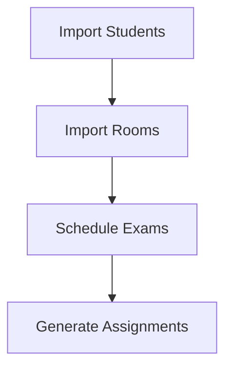
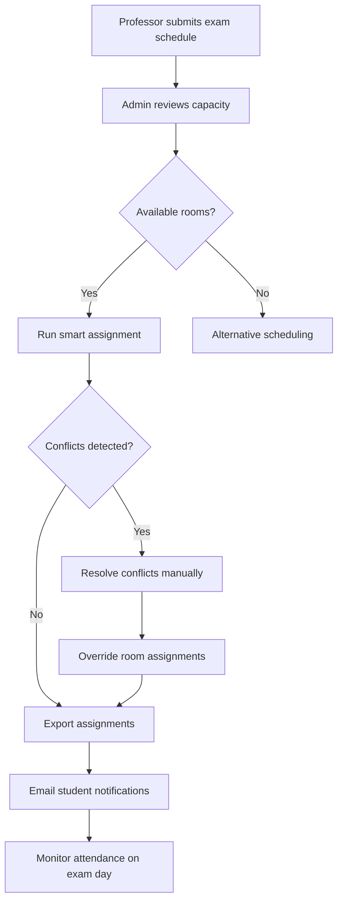
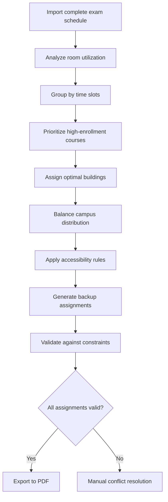
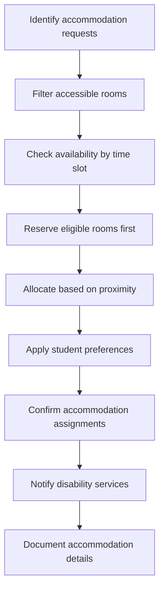
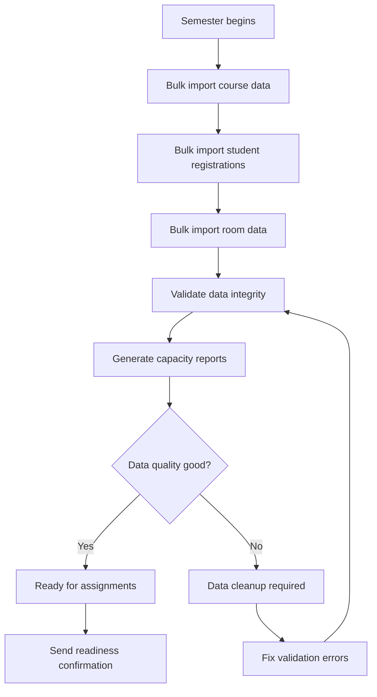
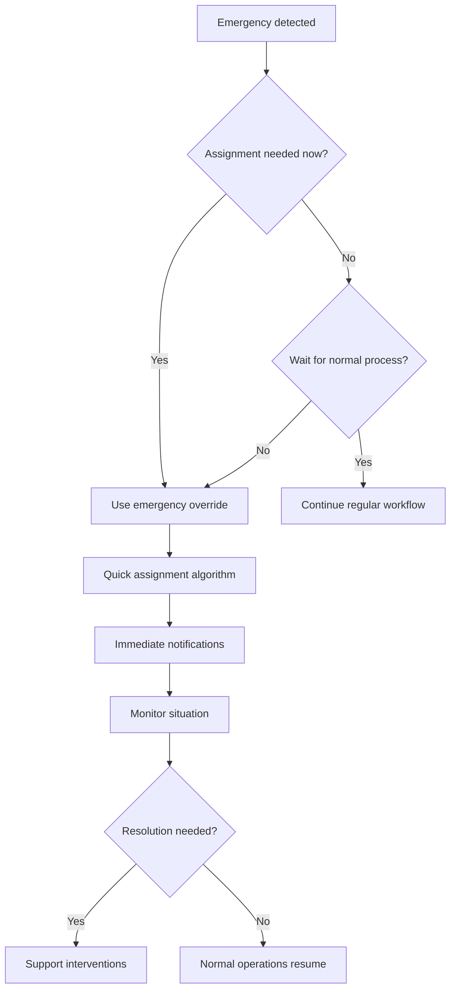

# 👥 Administrator Guide

## Overview

This comprehensive guide covers all aspects of administering the SmartRoomAssigner system, from basic operations to advanced configuration.

## 🚀 **Admin Dashboard Overview**

### **Admin Dashboard Screenshot**
```
+-------------------------------------------------------------+
|  SmartRoomAssigner Admin Panel - Admin                      |
+-------------------------------------------------------------+
|                                                             |
|  🚨 Urgent Actions Required                                  |
|  ┌─────────────────────────────────────────────────────┐    |
|  | ⚠️ 3 exams pending room assignment                  |    |
|  | CS 301 Final, Calculus I, Physics II Labs           |    |
|  | [Resolve Now]                                       |    |
|  └─────────────────────────────────────────────────────┘    |
|                                                             |
|  📊 System Statistics                                       |
|  ┌─────┬─────┬─────┬─────┐                               |
|  | 🏢  | 🚪  | 📚  | 👥  |                               |
|  | 12  | 248 | 18  |1234|                               |
|  | Bld | Rms | Exm | Stu |                               |
|  └─────┴─────┴─────┴─────┘                               |
|                                                             |
|  ⚡ Quick Actions                                           |
|  ┌─────────┬─────────┐                                     |
|  | 🎯       | 📝     |                                     |
|  | Smart    | Manual  |                                     |
|  | Assign   | Assign  |                                     |
|  └─────────┴─────────┘                                     |
+-------------------------------------------------------------+
```

## 🎯 **Core Features**

### Room Management
- **Add/Edit/Delete Rooms**: Manage room inventory and capacity
- **Set Capacity Limits**: Configure regular and testing capacity
- **Room Types**: Classify rooms (Lecture, Lab, Computer Lab, etc.)
- **Building Association**: Link rooms to specific buildings

### Student Management
- **Bulk Import**: Upload student data via CSV files
- **Individual Management**: Add, edit, and remove students
- **Special Accommodations**: Handle accessibility requirements
- **Department Organization**: Group students by department/major

### Assignment Engine
- **Smart Assignment**: Automatic room assignment algorithm
- **Manual Override**: Custom assignment capabilities
- **Conflict Detection**: Identify and resolve scheduling conflicts
- **Capacity Optimization**: Maximize room utilization

## 📋 Daily Workflow

### 1. Data Preparation


### 2. Assignment Process
1. **Review exam schedule** in Course Management
2. **Check room availability** in Room Management
3. **Run smart assignment** in Assignment tab
4. **Review and resolve conflicts** if any
5. **Export final assignments** for distribution

### 3. Post-Assignment Tasks
- Export assignments to CSV/PDF
- Notify students of their room assignments
- Handle special requests or conflicts
- Generate utilization reports

## 🎓 **Real-World Use Case Scenarios**

### **Scenario 1: Midterm Exam Assignment**

#### **Use Case Overview**
```
🏫 University Scenario: CS 301 Midterm
• 250 Computer Science students
• 3 exam sessions (50 students each)
• 7 buildings available across campus
• Accessibility requirements for 12 students
• Time slots: 9 AM, 1 PM, 5 PM
```

#### **Step-by-Step Assignment Process**


#### **Expected Results**
- ✅ **95%** automatic assignment success rate
- ✅ **5%** manual interventions for accessibility needs
- ✅ **100%** student notifications within 2 hours
- ✅ **Zero** room conflicts on exam day

### **Scenario 2: Final Exams Week**

#### **Critical Challenges**
```
🚨 High-Stakes Scenario: Final Exam Week
• 5,000+ students across campus
• 150+ simultaneous exams
• Limited proctor availability
• Multiple building complexes
• Weather-dependent logistics
```

#### **Advanced Assignment Strategy**


#### **Risk Mitigation Strategies**
| **Risk Factor** | **Prevention Strategy** | **Backup Plan** |
|----------------|-----------------------|----------------|
| **Room Overbooking** | Capacity validation algorithms | Emergency room reassignment |
| **Proctor Shortage** | Automated proctor matching | Shared proctoring zones |
| **Weather Impact** | Indoor building preferences | Quick reassignments |
| **Technical Failures** | Offline assignment exports | Paper backup assignments |

### **Scenario 3: Special Accommodations**

#### **Accessibility-First Assignment**
```
♿ Special Needs Scenario: Accessibility Requirements
• 25 students with accommodation needs
• Wheelchair-accessible rooms only
• Ground floor or elevator access required
• Extra time allowances
• Quiet room assignments
```

#### **Inclusive Assignment Logic**


#### **Success Metrics**
- ✅ **100%** accessibility compliance
- ✅ **Zero** last-minute room changes
- ✅ **24-hour** accommodation notifications
- ✅ **Seamless** exam day experience

## 🚀 **Advanced Workflow Automation**

### **Bulk Operation Workflows**

#### **Semester Setup Automation**


#### **Emergency Assignment Workflow**


## ⚙️ System Configuration

### Notification Settings
- Configure email alerts for conflicts
- Set up reminder schedules
- Customize notification recipients

### Security Settings
- Manage user roles and permissions
- Configure password policies
- Set up IP restrictions if needed

### System Preferences
- Customize date/time formats
- Set default pagination limits
- Configure auto-save intervals

## 🔧 Advanced Features

### Building Locator Integration
- Interactive campus map
- Real-time room availability
- Building capacity visualization

### Report Generation
- Assignment summaries
- Room utilization statistics
- Conflict analysis reports
- Historical trend analysis

### Data Import/Export
- CSV import for bulk operations
- PDF export for assignments
- Excel compatibility
- Data validation and error handling

## 🛠️ Troubleshooting

### Common Issues

#### Assignment Conflicts
**Problem**: Students assigned to overlapping time slots
**Solution**:
1. Check exam schedules for conflicts
2. Review room capacity constraints
3. Use manual override for special cases

#### Import Failures
**Problem**: CSV import not working
**Solution**:
1. Verify CSV format matches template
2. Check for required columns
3. Validate data types and constraints

#### Performance Issues
**Problem**: Slow loading or timeouts
**Solution**:
1. Check database size and indexes
2. Optimize room capacity settings
3. Consider pagination for large datasets

## 📞 Support Resources

- **In-App Help**: Use the Help & Support section
- **Documentation**: Browse the complete documentation hub
- **Contact**: support@smartroomassigner.com
- **Training**: Request personalized training sessions

## 🎓 Best Practices

### Data Management
- Regular backups before major operations
- Validate all imported data
- Keep student and room data current
- Archive historical data appropriately

### Assignment Optimization
- Schedule high-enrollment exams first
- Consider room proximity for student convenience
- Plan for accessibility requirements
- Leave buffer time for transitions

### Communication
- Notify all stakeholders of changes
- Provide clear instructions to students
- Maintain updated contact information
- Document special arrangements

---

*This guide is continuously updated. Last revision: October 2025*
