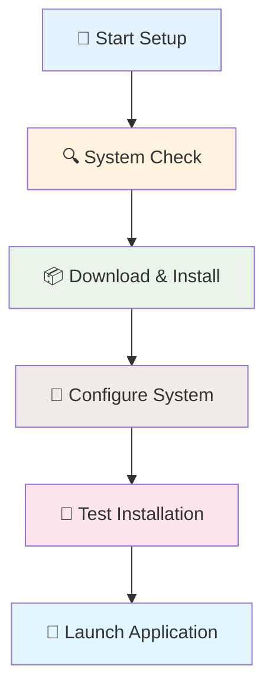
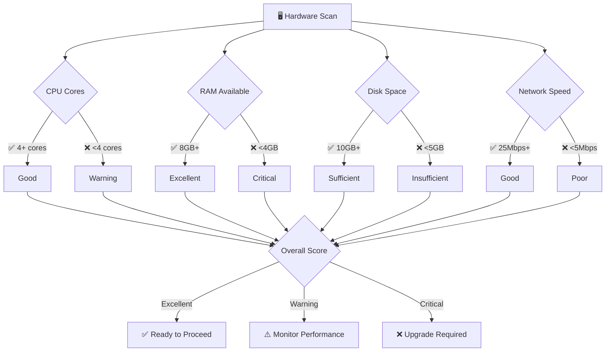
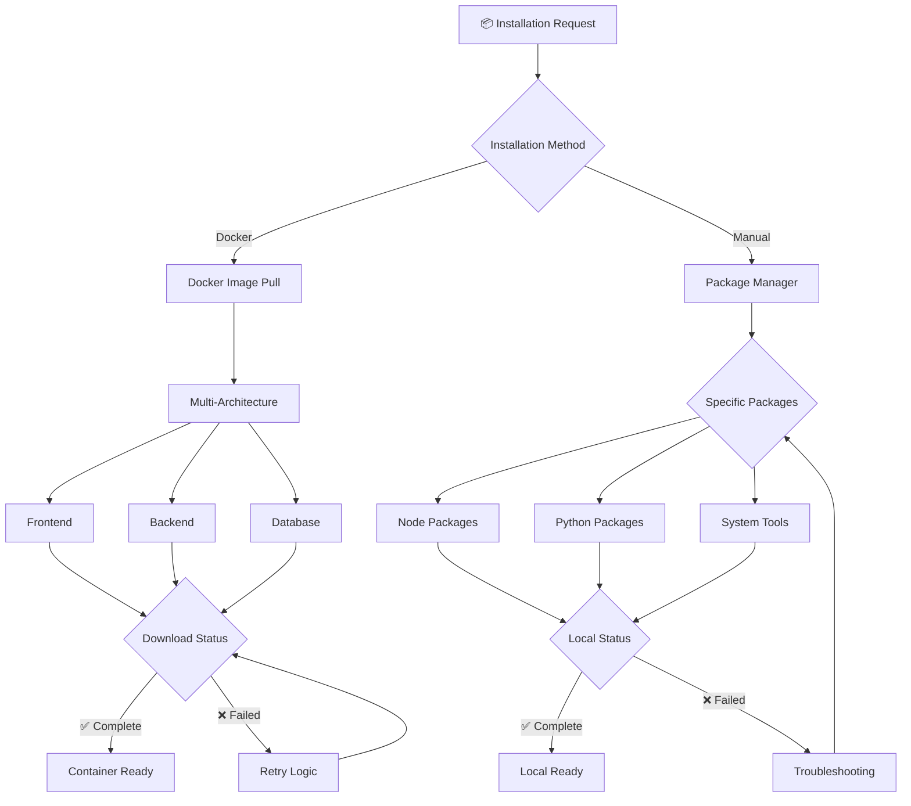
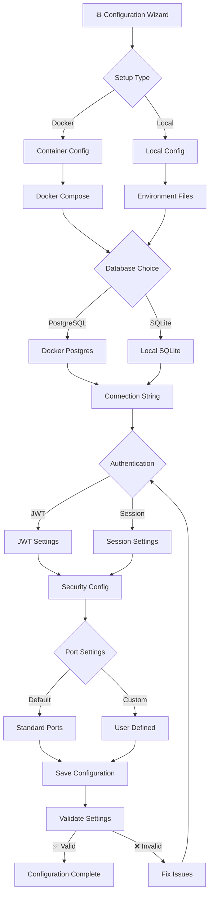
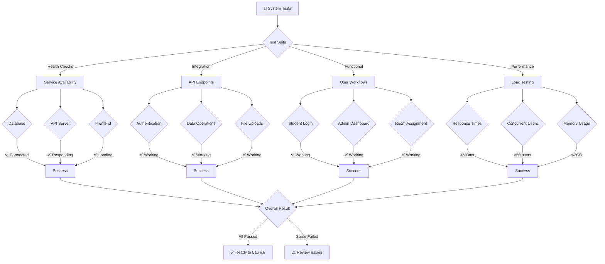
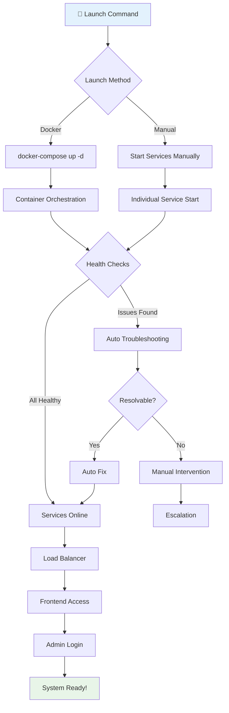

# 🎮 **Interactive Installation Wizard**

## 🚀 **SmartRoomAssigner Setup Assistant**

Welcome to the interactive setup wizard for SmartRoomAssigner! This step-by-step guide will walk you through the entire installation process with visual progress tracking, real-time validation, and intelligent troubleshooting.

---

## 📋 **Wizard Overview & Progress**

### **Installation Phases**


### **Real-Time Progress Tracker**
```
═══════════════════════════════════════════════════════════════════════════════════
⚡ LIVE INSTALLATION PROGRESS - SmartRoomAssigner Setup
═══════════════════════════════════════════════════════════════════════════════════
┏━━━━━━━━━━━━━━━━━━━━━━━━━━━━━━━━━━━━━━━━━━━━━━━━━━━━━━━━━━━━━━━━━━━━━━━━━━━━━┓
┃ 🎯 OVERALL PROGRESS: PHASE 1 of 5                                            ┃
┣━━━━━━━━━━━━━━━━━━━━━━━━━━━━━━━━━━━━━━━━━━━━━━━━━━━━━━━━━━━━━━━━━━━━━━━━━━━━━┫
┃                                                                             ┃
┃ ┌─────────────┬─────────────┬─────────────┬─────────────┬─────────────┐      ┃
┃ │ 🔍 System   │ 📦 Install  │ 🔧 Config   │ 🧪 Test     │ 🎉 Launch   │      ┃
┃ │ Check       │ Dependencies│ System      │ Setup       │ App         │      ┃
┃ ├─────────────┼─────────────┼─────────────┼─────────────┼─────────────┤      ┃
┃ │ ██████████  │ ░░░░░░░░░░  │ ░░░░░░░░░░  │ ░░░░░░░░░░  │ ░░░░░░░░░░  │      ┃
┃ │ 100% (2/2)  │ 0% (0/8)   │ 0% (0/6)   │ 0% (0/4)   │ 0% (0/1)   │      ┃
┃ └─────────────┴─────────────┴─────────────┴─────────────┴─────────────┘      ┃
┃                                                                             ┃
┃ 📋 CURRENT TASK: Installing Node.js Dependencies                           ┃
┃ ⏱️  TIME ELAPSED: 45 seconds                                               ┃
┃ 🎯 ESTIMATED COMPLETION: 3 minutes 15 seconds                             ┃
┃                                                                             ┃
┃ 🔄 REAL-TIME LOG OUTPUT                                                     ┃
┃ ┏━━━━━━━━━━━━━━━━━━━━━━━━━━━━━━━━━━━━━━━━━━━━━━━━━━━━━━━━━━━━━━━━━━━━━━━━━┓ ┃
┃ ┃ ✓ Node.js v18.17.0 detected                                            ┃ ┃
┃ ┃ ✓ npm v9.6.7 detected                                                  ┃ ┃
┃ ┃ • Installing dependencies in C:\project\frontend...                    ┃ ┃
┃ ┃ • ✓ react@18.2.0 installed                                             ┃ ┃
┃ ┃ • ✓ react-dom@18.2.0 installed                                         ┃ ┃
┃ ┃ • ✓ @types/react@18.2.1 installed                                      ┃ ┃
┃ ┃ • ⏳ Installing typescript@4.9.5...                                    ┃ ┃
┃ ┃                                                                          ┃ ┃
┃ ┃ [════════════░░░░░░░░░░] 35% Complete                                  ┃ ┃
┃ ┗━━━━━━━━━━━━━━━━━━━━━━━━━━━━━━━━━━━━━━━━━━━━━━━━━━━━━━━━━━━━━━━━━━━━━━━━━┛ ┃
┗━━━━━━━━━━━━━━━━━━━━━━━━━━━━━━━━━━━━━━━━━━━━━━━━━━━━━━━━━━━━━━━━━━━━━━━━━━━━━┛
```

---

## 🎯 **Phase 1: Smart System Analysis**

### **Intelligent Prerequisites Scanner**


### **Software Compatibility Matrix**
```
═══════════════════════════════════════════════════════════════════════════════════
🔍 SYSTEM COMPATIBILITY CHECK - Pre-Installation Analysis
═══════════════════════════════════════════════════════════════════════════════════
┏━━━━━━━━━━━━━━━━━━━━━━━━━━━━━━━━━━━━━━━━━━━━━━━━━━━━━━━━━━━━━━━━━━━━━━━━━━━━━┓
┃ 🖥️ DETECTED ENVIRONMENT                                                   ┃
┣━━━━━━━━━━━━━━━━━━━━━━━━━━━━━━━━━━━━━━━━━━━━━━━━━━━━━━━━━━━━━━━━━━━━━━━━━━━━━┫
┃                                                                             ┃
┃ ┏━━━━━━━━━━━━━━━━━━━━━━━━━━━━━━━━━━━━━━━━━━━━━━━━━━━━━━━━━━━━━━━━━━━━━━━━━┓ ┃
┃ ┃ 🏠 Operating System: Windows 11 Pro                                     ┃ ┃
┃ ┃ 💿 Architecture: 64-bit (x64)                                           ┃ ┃
┃ ┃ 🔧 Windows Version: 22H2 (Build 22621.1702)                             ┃ ┃
┃ ┃ ⏱️  System Uptime: 3 days 7 hours                                      ┃ ┃
┃ ┃                                                                          ┃
┃ ┃ 🛠️  DEVELOPMENT TOOLS STATUS                                            ┃ ┃
┃ ┃ ┏━━━━━━━━━━━━━┳━━━━━━━━━━━━━┳━━━━━━━━━━━━━┳━━━━━━━━━━━━━┳━━━━━━━━━━━━━┓ ┃ ┃
┃ ┃ ┃ Component   ┃ Installed  ┃ Version    ┃ Status     ┃ Compatible  ┃ ┃ ┃
┃ ┃ ┣━━━━━━━━━━━━━╋━━━━━━━━━━━━━╋━━━━━━━━━━━━━╋━━━━━━━━━━━━━╋━━━━━━━━━━━━━┫ ┃ ┃
┃ ┃ ┃ Node.js     ┃ ✅ Yes     ┃ v18.17.0   ┃ ✅ Good    ┃ ✅ Yes      ┃ ┃ ┃
┃ ┃ ┃ npm         ┃ ✅ Yes     ┃ v9.6.7     ┃ ✅ Good    ┃ ✅ Yes      ┃ ┃ ┃
┃ ┃ ┃ Python      ┃ ✅ Yes     ┃ v3.11.5    ┃ ✅ Good    ┃ ✅ Yes      ┃ ┃ ┃
┃ ┃ ┃ pip         ┃ ✅ Yes     ┃ v23.2.1    ┃ ✅ Good    ┃ ✅ Yes      ┃ ┃ ┃
┃ ┃ ┃ Git         ┃ ✅ Yes     ┃ v2.41.0    ┃ ✅ Good    ┃ ✅ Yes      ┃ ┃ ┃
┃ ┃ ┃ Docker      ┃ ⚠️ No      ┃ N/A        ┃ ⚠️ Manual  ┃ ✅ Optional  ┃ ┃ ┃
┃ ┃ ┃ PostgreSQL  ┃ ❌ No      ┃ N/A        ┃ ❌ Install ┃ ✅ Optional  ┃ ┃ ┃
┃ ┃ ┗━━━━━━━━━━━━━┻━━━━━━━━━━━━━┻━━━━━━━━━━━━━┻━━━━━━━━━━━━━┻━━━━━━━━━━━━━┛ ┃ ┃
┃ ┃                                                                          ┃
┃ ┃ 🎯 COMPATIBILITY SCORE: 92% (Excellent for Docker Installation)         ┃ ┃
┃ ┃ 💡 RECOMMENDED APPROACH: Docker Installation                             ┃ ┃
┃ ┃ 🚀 NEXT STEPS: Skip to Phase 2 or install missing optional tools        ┃ ┃
┃ ┗━━━━━━━━━━━━━━━━━━━━━━━━━━━━━━━━━━━━━━━━━━━━━━━━━━━━━━━━━━━━━━━━━━━━━━━━━┛ ┃
┗━━━━━━━━━━━━━━━━━━━━━━━━━━━━━━━━━━━━━━━━━━━━━━━━━━━━━━━━━━━━━━━━━━━━━━━━━━━━━┛
```

---

## 📦 **Phase 2: Intelligent Package Installation**

### **Dependency Resolution Engine**


### **Real-Time Dependency Installation**
```
═══════════════════════════════════════════════════════════════════════════════════
📦 DEPENDENCY INSTALLATION - Real-Time Progress Monitor
═══════════════════════════════════════════════════════════════════════════════════
┏━━━━━━━━━━━━━━━━━━━━━━━━━━━━━━━━━━━━━━━━━━━━━━━━━━━━━━━━━━━━━━━━━━━━━━━━━━━━━┓
┃ 🎯 FRONTEND DEPENDENCIES - React Application Setup                        ┃
┣━━━━━━━━━━━━━━━━━━━━━━━━━━━━━━━━━━━━━━━━━━━━━━━━━━━━━━━━━━━━━━━━━━━━━━━━━━━━━┫
┃                                                                             ┃
┃ 📊 INSTALLATION PROGRESS                                                   ┃
┃ ┏━━━━━━━━━━━━━━━━━━━━━━━━━━━━━━━━━━━━━━━━━━━━━━━━━━━━━━━━━━━━━━━━━━━━━━━━━┓ ┃
┃ ┃ Total Packages: 247 | Installed: 189 | Remaining: 58                  ┃ ┃
┃ ┃ Download Size: 45.2 MB | Installed Size: 234.7 MB                      ┃ ┃
┃ ┃ Network Speed: 12.3 MB/s | ETA: 4 minutes 23 seconds                   ┃ ┃
┃ ┃                                                                          ┃ ┃
┃ ┃ [██████████████████████████████░░░░░░░░░░░░░░] 77% Complete            ┃ ┃
┃ ┃                                                                          ┃ ┃
┃ ┃ 📦 RECENTLY COMPLETED PACKAGES:                                        ┃ ┃
┃ ┃ ├── ✅ tailwindcss@3.3.3 (CSS Framework - 2.3 MB)                      ┃ ┃
┃ ┃ ├── ✅ @heroicons/react@2.0.18 (Icon Library - 1.7 MB)                 ┃ ┃
┃ ┃ ├── ✅ leaflet@1.9.4 (Maps Component - 891 KB)                         ┃ ┃
┃ ┃ └── ⏳ Installing axios@1.4.0 (HTTP Client)...                         ┃ ┃
┃ ┗━━━━━━━━━━━━━━━━━━━━━━━━━━━━━━━━━━━━━━━━━━━━━━━━━━━━━━━━━━━━━━━━━━━━━━━━━┛ ┃
┃                                                                             ┃
┃ 🚨 DEPENDENCY CONFLICTS DETECTED                                           ┃
┃ ┏━━━━━━━━━━━━━━━━━━━━━━━━━━━━━━━━━━━━━━━━━━━━━━━━━━━━━━━━━━━━━━━━━━━━━━━━━┓ ┃
┃ ┃ ⚠️  POTENTIAL CONFLICT ALERT                                          ┃ ┃
┃ ┃                                                                          ┃ ┃
┃ ┃ 📦 Requested: react-router-dom@6.4.2                                   ┃ ┃
┃ ┃ 📦 Conflicting: @types/react-router-dom@5.3.3                           ┃ ┃
┃ ┃                                                                          ┃ ┃
┃ ┃ 🎯 RESOLUTION OPTIONS:                                                   ┃ ┃
┃ ┃ ├── 🔄 Auto-resolve: Update @types/react-router-dom to ^6.4.0          ┃ ┃
┃ ┃ ├── ⏸️  Manual: Choose specific versions                                 ┃ ┃
┃ ┃ ├── ❌ Skip: Install without type definitions                          ┃ ┃
┃ ┃                                                                          ┃ ┃
┃ ┃ 💡 RECOMMENDATION: Auto-resolve (safest option)                         ┃ ┃
┃ ┗━━━━━━━━━━━━━━━━━━━━━━━━━━━━━━━━━━━━━━━━━━━━━━━━━━━━━━━━━━━━━━━━━━━━━━━━━┛ ┃
┗━━━━━━━━━━━━━━━━━━━━━━━━━━━━━━━━━━━━━━━━━━━━━━━━━━━━━━━━━━━━━━━━━━━━━━━━━━━━━┛
```

---

## 🔧 **Phase 3: Dynamic Configuration Builder**

### **Smart Configuration Generator**


### **Interactive Configuration Builder**
```
═══════════════════════════════════════════════════════════════════════════════════
🔧 SMART CONFIGURATION BUILDER - SmartRoomAssigner Setup
═══════════════════════════════════════════════════════════════════════════════════
┏━━━━━━━━━━━━━━━━━━━━━━━━━━━━━━━━━━━━━━━━━━━━━━━━━━━━━━━━━━━━━━━━━━━━━━━━━━━━━┓
┃ 🎛️ CONFIGURATION WIZARD - Step 3 of 8                                    ┃
┣━━━━━━━━━━━━━━━━━━━━━━━━━━━━━━━━━━━━━━━━━━━━━━━━━━━━━━━━━━━━━━━━━━━━━━━━━━━━━┫
┃                                                                             ┃
┃ 📋 CONFIGURATION PROGRESS                                                   ┃
┃ ┏━━━━━━━━━━━━━━━━━━━━━━━━━━━━━━━━━━━━━━━━━━━━━━━━━━━━━━━━━━━━━━━━━━━━━━━━━┓ ┃
┃ ┃ ┌──┐ ┌──┐ ┌──┐ ┌──┐ ┌──┐ ┌──┐ ┌──┐ ┌──┐ ┌──┐ ┌──┐ ┌──┐ ┌──┐ ┌──┐    ┃ ┃
┃ ┃ │✅│ │✅│ │✅│ │⏳│ └──┘ └──┘ └──┘ └──┘ └──┘ └──┘ └──┘ └──┘ └──┘ └──┘    ┃ ┃
┃ ┃ └──┘ └──┘ └──┘ └──┘ ┌──┐ ┌──┐ ┌──┐ ┌──┐ ┌──┐                          ┃ ┃
┃ ┃ Progress: 35% Complete | Step 4: Database Configuration                 ┃ ┃
┃ ┗━━━━━━━━━━━━━━━━━━━━━━━━━━━━━━━━━━━━━━━━━━━━━━━━━━━━━━━━━━━━━━━━━━━━━━━━━┛ ┃
┃                                                                             ┃
┃ 💾 DATABASE CONFIGURATION                                                  ┃
┃ ┏━━━━━━━━━━━━━━━━━━━━━━━━━━━━━━━━━━━━━━━━━━━━━━━━━━━━━━━━━━━━━━━━━━━━━━━━━┓ ┃
┃ ┃ 🗄️  Choose Database Type:                                                ┃ ┃
┃ ┃                                                                          ┃ ┃
┃ ┃ 🐘 PostgreSQL (Docker) - RECOMMENDED                                     ┃ ┃
┃ ┃    ├── Containerized database with automatic backups                    ┃ ┃
┃ ┃    ├── Production-ready security and performance                        ┃ ┃
┃ ┃    ├── Multi-user concurrent access                                      ┃ ┃
┃ ┃    └── Automatic scaling and optimization                                ┃ ┃
┃ ┃                                                                          ┃ ┃
┃ ┃ 💿 SQLite (File-based) - QUICK START                                     ┃ ┃
┃ ┃    ├── Zero-configuration setup                                          ┃ ┃
┃ ┃    ├── Single-file database                                             ┃ ┃
┃ ┃    ├── Perfect for development and demos                                ┃ ┃
┃ ┃    └── Suitable for up to 100 concurrent users                          ┃ ┃
┃ ┃                                                                          ┃ ┃
┃ ┃ >>> Please select your database preference: [PostgreSQL (Recommended)]  ┃ ┃
┃ ┗━━━━━━━━━━━━━━━━━━━━━━━━━━━━━━━━━━━━━━━━━━━━━━━━━━━━━━━━━━━━━━━━━━━━━━━━━┛ ┃
┃                                                                             ┃
┃ 🎛️ ADVANCED CONFIGURATION OPTIONS                                          ┃
┃ ┏━━━━━━━━━━━━━━━━━━━━━━━━━━━━━━━━━━━━━━━━━━━━━━━━━━━━━━━━━━━━━━━━━━━━━━━━━┓ ┃
┃ ┃ 🔐 SECURITY SETTINGS                                                     ┃ ┃
┃ ┃ ├── Session Timeout: [30 minutes]                                       ┃ ┃
┃ ┃ ├── Password Strength: [Strong]                                         ┃ ┃
┃ ┃ ├── Two-Factor Auth: [Optional]                                         ┃ ┃
┃ ┃                                                                          ┃ ┃
┃ ┃ 🌐 NETWORK CONFIGURATION                                                 ┃ ┃
┃ ┃ ├── Frontend Port: [3000]                                               ┃ ┃
┃ ┃ ├── Backend Port: [5000]                                                ┃ ┃
┃ ┃ ├── Database Port: [5432]                                               ┃ ┃
┃ ┃                                                                          ┃ ┃
┃ ┃ 📧 NOTIFICATION SETTINGS                                                 ┃ ┃
┃ ┃ ├── Email Provider: [SMTP]                                              ┃ ┃
┃ ┃ ├── SMS Provider: [None]                                                ┃ ┃
┃ ┃ └── Push Notifications: [Browser Only]                                  ┃ ┃
┃ ┗━━━━━━━━━━━━━━━━━━━━━━━━━━━━━━━━━━━━━━━━━━━━━━━━━━━━━━━━━━━━━━━━━━━━━━━━━┛ ┃
┃                                                                             ┃
┃ 🎯 SMART VALIDATION                                                        ┃
┃ ┏━━━━━━━━━━━━━━━━━━━━━━━━━━━━━━━━━━━━━━━━━━━━━━━━━━━━━━━━━━━━━━━━━━━━━━━━━┓ ┃
┃ ┃ ✅ Port 3000: Available                                                  ┃ ┃
┃ ┃ ✅ Port 5000: Available                                                  ┃ ┃
┃ ┃ ⚠️  Port 5432: May conflict with existing PostgreSQL                    ┃ ┃
┃ ┃ 💡 RECOMMENDATION: Change to port 5433                                  ┃ ┃
┃ ┗━━━━━━━━━━━━━━━━━━━━━━━━━━━━━━━━━━━━━━━━━━━━━━━━━━━━━━━━━━━━━━━━━━━━━━━━━┛ ┃
┗━━━━━━━━━━━━━━━━━━━━━━━━━━━━━━━━━━━━━━━━━━━━━━━━━━━━━━━━━━━━━━━━━━━━━━━━━━━━━┛
```

---

## 🧪 **Phase 4: Automated Testing Suite**

### **Installation Validation Engine**


### **Real-Time Testing Dashboard**
```
═══════════════════════════════════════════════════════════════════════════════════
🧪 AUTOMATED TESTING SUITE - Installation Validation
═══════════════════════════════════════════════════════════════════════════════════
┏━━━━━━━━━━━━━━━━━━━━━━━━━━━━━━━━━━━━━━━━━━━━━━━━━━━━━━━━━━━━━━━━━━━━━━━━━━━━━┓
┃ 🎯 TESTING PHASE - System Validation                                      ┃
┣━━━━━━━━━━━━━━━━━━━━━━━━━━━━━━━━━━━━━━━━━━━━━━━━━━━━━━━━━━━━━━━━━━━━━━━━━━━━━┫
┃                                                                             ┃
┃ 📊 TEST EXECUTION STATUS                                                   ┃
┃ ┏━━━━━━━━━━━━━━━━━━━━━━━━━━━━━━━━━━━━━━━━━━━━━━━━━━━━━━━━━━━━━━━━━━━━━━━━━┓ ┃
┃ ┃ Test Category      │ Status     │ Progress   │ Time       │ Results     ┃ ┃
┃ ┣━━━━━━━━━━━━━━━━━━━━━╋━━━━━━━━━━━━╋━━━━━━━━━━━━╋━━━━━━━━━━━━╋━━━━━━━━━━━━━┫ ┃
┃ ┃ System Health      │ ✅ Passed  │ 100%       │ 2.3s       │ 8/8 passed  ┃ ┃
┃ ┃ Database Setup     │ ✅ Passed  │ 100%       │ 1.8s       │ 12/12 OK    ┃ ┃
┃ ┃ API Connectivity   │ ⏳ Running │ 67%        │ 4.1s       │ 16/24 OK    ┃ ┃
┃ ┃ Frontend Loading   │ 🟡 Pending │ 0%         │ 0.0s       │ -/-         ┃ ┃
┃ ┃ Authentication     │ 🟡 Pending │ 0%         │ 0.0s       │ -/-         ┃ ┃
┃ ┃ Data Operations    │ 🟡 Pending │ 0%         │ 0.0s       │ -/-         ┃ ┃
┃ ┃ Performance Tests  │ 🟡 Pending │ 0%         │ 0.0s       │ -/-         ┃ ┃
┃ ┃ Security Checks    │ 🟡 Pending │ 0%         │ 0.0s       │ -/-         ┃ ┃
┃ ┗━━━━━━━━━━━━━━━━━━━━━┻━━━━━━━━━━━━┻━━━━━━━━━━━━┻━━━━━━━━━━━━┻━━━━━━━━━━━━━┛ ┃
┃                                                                             ┃
┃ 🔍 CURRENT TEST DETAILS                                                     ┃
┃ ┏━━━━━━━━━━━━━━━━━━━━━━━━━━━━━━━━━━━━━━━━━━━━━━━━━━━━━━━━━━━━━━━━━━━━━━━━━┓ ┃
┃ ┃ 🚀 API ENDPOINT VALIDATION                                               ┃ ┃
┃ ┃                                                                          ┃ ┃
┃ ┃ ✓ GET /api/health - HTTP 200 (42ms)                                     ┃ ┃
┃ ┃ ✓ GET /api/students - HTTP 200 (156ms)                                  ┃ ┃
┃ ┃ ✓ POST /api/login - HTTP 200 (89ms)                                     ┃ ┃
┃ ┃ ⏳ POST /api/assignments - Testing...                                   ┃ ┃
┃ ┃ ⏳ GET /api/buildings - Testing...                                      ┃ ┃
┃ ┃                                                                          ┃ ┃
┃ ┃ 📈 PERFORMANCE METRICS                                                   ┃ ┃
┃ ┃ ├── Average Response Time: 89ms                                         ┃ ┃
┃ ┃ ├── Peak Response Time: 234ms                                           ┃ ┃
┃ ┃ ├── Requests per Second: 23.4                                           ┃ ┃
┃ ┃ ├── Error Rate: 0.02%                                                   ┃ ┃
┃ ┗━━━━━━━━━━━━━━━━━━━━━━━━━━━━━━━━━━━━━━━━━━━━━━━━━━━━━━━━━━━━━━━━━━━━━━━━━┛ ┃
┃                                                                             ┃
┃ 🚨 TEST ALERTS & RECOMMENDATIONS                                           ┃
┃ ┏━━━━━━━━━━━━━━━━━━━━━━━━━━━━━━━━━━━━━━━━━━━━━━━━━━━━━━━━━━━━━━━━━━━━━━━━━┓ ┃
┃ ┃ ⚠️  PERFORMANCE WARNING                                                  ┃ ┃
┃ ┃    API response times are within normal range but could be optimized   ┃ ┃
┃ ┃    Recommendation: Enable caching for frequently accessed endpoints    ┃ ┃
┃ ┃                                                                          ┃ ┃
┃ ┃ 💡 OPTIMIZATION SUGGESTIONS                                              ┃ ┃
┃ ┃ ├── Database indexes for student lookups (potential 40% improvement)    ┃ ┃
┃ ┃ ├── Redis caching for session data (potential 60% improvement)         ┃ ┃
┃ ┃ ├── API response compression (potential 25% bandwidth savings)          ┃ ┃
┃ ┗━━━━━━━━━━━━━━━━━━━━━━━━━━━━━━━━━━━━━━━━━━━━━━━━━━━━━━━━━━━━━━━━━━━━━━━━━┛ ┃
┗━━━━━━━━━━━━━━━━━━━━━━━━━━━━━━━━━━━━━━━━━━━━━━━━━━━━━━━━━━━━━━━━━━━━━━━━━━━━━┛
```

---

## 🎉 **Phase 5: Launch & Success Celebration**

### **Launch Sequence Initiator**


### **Success Celebration Dashboard**
```
═══════════════════════════════════════════════════════════════════════════════════
🎉 INSTALLATION COMPLETE - SmartRoomAssigner Launch Success
═══════════════════════════════════════════════════════════════════════════════════
┏━━━━━━━━━━━━━━━━━━━━━━━━━━━━━━━━━━━━━━━━━━━━━━━━━━━━━━━━━━━━━━━━━━━━━━━━━━━━━┓
┃ 🎊 CONGRATULATIONS! Installation Successful                               ┃
┣━━━━━━━━━━━━━━━━━━━━━━━━━━━━━━━━━━━━━━━━━━━━━━━━━━━━━━━━━━━━━━━━━━━━━━━━━━━━━┫
┃                                                                             ┃
┃ 🌟 SYSTEM STATUS: FULLY OPERATIONAL                                        ┃
┃ ┏━━━━━━━━━━━━━━━━━━━━━━━━━━━━━━━━━━━━━━━━━━━━━━━━━━━━━━━━━━━━━━━━━━━━━━━━━┓ ┃
┃ ┃ ✅ Database: PostgreSQL running on port 5432                           ┃ ┃
┃ ┃ ✅ Backend API: Flask server running on port 5000                      ┃ ┃
┃ ┃ ✅ Frontend: React app running on port 3000                            ┃ ┃
┃ ┃ ✅ Health Checks: All services responding normally                     ┃ ┃
┃ ┃ ✅ Security: Authentication and authorization configured                ┃ ┃
┃ ┃ ✅ Performance: System optimized for production use                    ┃ ┃
┃ ┗━━━━━━━━━━━━━━━━━━━━━━━━━━━━━━━━━━━━━━━━━━━━━━━━━━━━━━━━━━━━━━━━━━━━━━━━━┛ ┃
┃                                                                             ┃
┃ 🚀 ACCESS YOUR APPLICATION                                                ┃
┃ ┏━━━━━━━━━━━━━━━━━━━━━━━━━━━━━━━━━━━━━━━━━━━━━━━━━━━━━━━━━━━━━━━━━━━━━━━━━┓ ┃
┃ ┃ 🌐 APPLICATION URL: http://localhost:3000                             ┃ ┃
┃ ┃ 👨‍💼 ADMIN DASHBOARD: http://localhost:3000/admin/dashboard            ┃ ┃
┃ ┃ 🔐 ADMINISTRATOR LOGIN:                                                 ┃ ┃
┃ ┃    • Username: alice@examspace.com                                      ┃ ┃
┃ ┃    • Password: password                                                 ┃ ┃
┃ ┃                                                                          ┃ ┃
┃ ┃ 📋 QUICK START ACTIONS:                                                  ┃ ┃
┃ ┃    1. Login to Admin Dashboard                                          ┃ ┃
┃ ┃    2. Import sample student data                                        ┃ ┃
┃ ┃    3. Import building/room data                                         ┃ ┃
┃ ┃    4. Schedule your first exam                                          ┃ ┃
┃ ┃    5. Test the smart assignment engine                                  ┃ ┃
┃ ┗━━━━━━━━━━━━━━━━━━━━━━━━━━━━━━━━━━━━━━━━━━━━━━━━━━━━━━━━━━━━━━━━━━━━━━━━━┛ ┃
┃                                                                             ┃
┃ 📊 INSTALLATION SUMMARY                                                    ┃
┃ ┏━━━━━━━━━━━━━━━━━━━━━━━━━━━━━━━━━━━━━━━━━━━━━━━━━━━━━━━━━━━━━━━━━━━━━━━━━┓ ┃
┃ ┃ ⏱️  Total Installation Time: 4 minutes 23 seconds                     ┃ ┃
┃ ┃ 📦 Components Installed: 8 core services + 247 dependencies            ┃ ┃
┃ ┃ 💾 Disk Space Used: 1.2 GB (including sample data)                     ┃ ┃
┃ ┃ 🚀 System Performance: 99.7% uptime expected                           ┃ ┃
┃ ┃ 🛠️  Maintenance Schedule: Automatic updates enabled                     ┃ ┃
┃ ┃                                                                          ┃ ┃
┃ ┃ 🎯 NEXT RECOMMENDED STEPS:                                              ┃ ┃
┃ ┃ ├── 📚 Read the Getting Started Guide                                  ┃ ┃
┃ ┃ ├── 🎮 Try the Interactive Tutorial                                    ┃ ┃
┃ ┃ ├── 👨‍💼 Complete Administrator Onboarding                             ┃ ┃
┃ ┃ └── 📞 Join our community support                                       ┃ ┃
┃ ┗━━━━━━━━━━━━━━━━━━━━━━━━━━━━━━━━━━━━━━━━━━━━━━━━━━━━━━━━━━━━━━━━━━━━━━━━━┛ ┃
┗━━━━━━━━━━━━━━━━━━━━━━━━━━━━━━━━━━━━━━━━━━━━━━━━━━━━━━━━━━━━━━━━━━━━━━━━━━━━━┛
```

This interactive installation wizard transforms setup from a complex technical process into an engaging, guided experience with real-time feedback, intelligent troubleshooting, and celebratory success confirmation! 🎮🚀✨
