# 🎮 Interactive Tutorial: SmartRoomAssigner Walkthrough

## 🎯 Welcome to Your Interactive Learning Experience

This comprehensive tutorial provides step-by-step visual guidance through the SmartRoomAssigner system. Each section includes:

- 📸 **High-Fidelity Interface Screenshots**
- 🔄 **Interactive Flow Diagrams**
- 💡 **Best Practices & Tips**
- 🚨 **Common Pitfalls to Avoid**
- ✅ **Progress Checklists**

---

## 🚀 Tutorial 1: Complete Student Journey

### **Phase 1: Login & Dashboard Overview**
```
═══════════════════════════════════════════════════════════════════════════════════
🌐 BROWSER: http://localhost:3000 (SmartRoomAssigner Student Portal)
═══════════════════════════════════════════════════════════════════════════════════
┏━━━━━━━━━━━━━━━━━━━━━━━━━━━━━━━━━━━━━━━━━━━━━━━━━━━━━━━━━━━━━━━━━━━━━━━━━━━━━┓
┃ 🎓 SMART ROOM ASSIGNER                           🔗 Login Required          ┃
┣━━━━━━━━━━━━━━━━━━━━━━━━━━━━━━━━━━━━━━━━━━━━━━━━━━━━━━━━━━━━━━━━━━━━━━━━━━━━━┫
┃                                                                             ┃
┃                          ┌─────────────────────────────────────┐              ┃
┃                          │         LOGIN FORM                 │              ┃
┃                          ├─────────────────────────────────────┤              ┃
┃                          │ Email:    [alice@examspace.com ]   │              ┃
┃                          │ Password: [********]              │              ┃
┃                          │                                     │              ┃
┃                          │          [🔐 LOGIN]                │              ┃
┃                          └─────────────────────────────────────┘              ┃
┃                                                                             ┃
┃                    Welcome to SmartRoomAssigner v2.1                   ┃
┃                                                                             ┃
┗━━━━━━━━━━━━━━━━━━━━━━━━━━━━━━━━━━━━━━━━━━━━━━━━━━━━━━━━━━━━━━━━━━━━━━━━━━━━━┛
```

#### **Login Credentials Reference**
| **User Type** | **Email** | **Password** | **Purpose** |
|---------------|-----------|--------------|-------------|
| Student | `alice@examspace.com` | `password` | View assignments |
| TA | `bob@university.edu` | `password` | Support students |
| Admin | `tom@university.edu` | `password` | Manage system |

### **Phase 2: Student Dashboard Deep Dive**
```
═══════════════════════════════════════════════════════════════════════════════════
🌟 STUDENT DASHBOARD - Post Login State
═══════════════════════════════════════════════════════════════════════════════════
┏━━━━━━━━━━━━━━━━━━━━━━━━━━━━━━━━━━━━━━━━━━━━━━━━━━━━━━━━━━━━━━━━━━━━━━━━━━━━━┓
┃ 🎓 SmartRoom Assignments                    👤 Alice (Student)    🔔       ┃
┣━━━━━━━━━━━━━━━━━━━━━━━━━━━━━━━━━━━━━━━━━━━━━━━━━━━━━━━━━━━━━━━━━━━━━━━━━━━━━┫
┃ ┌─────────────────────────────────────────────────────────────────────────┐ ┃
┃ │ 📅 UPCOMING EXAMS ALERTS                                               │ ┃
┃ │                                                                         │ ┃
┃ │ 🚨 HIGH PRIORITY: Final Exam - CS301                                   │ ┃
┃ │    📅 Tomorrow 9:00 AM                                                │ ┃
┃ │    🏢 Room MB-101, Seat A5                                             │ ┃
┃ │    ⏱️ 1 day 2 hours remaining                                         │ ┃
┃ │                                                                         │ ┃
┃ │ 📢 MEDIUM PRIORITY: Math Quiz - MATH201                                │ ┃
┃ │    📅 Dec 15, 2025 2:00 PM                                            │ ┃
┃ └─────────────────────────────────────────────────────────────────────────┘ ┃
┃                                                                             ┃
┃ ┌─────────────────────────────────────────────────────────────────────────┐ ┃
┃ │ 📚 YOUR EXAM ASSIGNMENTS                                               │ ┃
┃ │ ┏━━━━━━━━━━━━━━━━━━━━━━━━━━━━━━━━━━━━━━━━━━━━━━━━━━━━━━━━━━━━━━━━━━━━━┓ │ ┃
┃ │ ┃ 🏫 CS301 - Computer Science III           Dr. Smith                 ┃ │ ┃
┃ │ ┃ ━━━━━━━━━━━━━━━━━━━━━━━━━━━━━━━━━━━━━━━━━━━━━━━━━━━━━━━━━━━━━━━━━━━━━━┃ │ ┃
┃ │ ┃ 📅 Date: Dec 10, 2025  🕒 09:00 (180 min)                          ┃ │ ┃
┃ │ ┃ 🏢 Building: MB Main Building                                        ┃ │ ┃
┃ │ ┃ 🚪 Room: MB-101                     💺 Seat: A5                      ┃ │ ┃
┃ │ ┃ 👥 Capacity: 48/50 students remaining                                ┃ │ ┃
┃ │ ┃ ⏱️ Time until exam: 1d 2h                                          ┃ │ ┃
┃ │ ┃                                                                     ┃ │ ┃
┃ │ ┃ [📅 Add to Calendar]           [🗺️ Get Directions]                   ┃ │ ┃
┃ │ ┗━━━━━━━━━━━━━━━━━━━━━━━━━━━━━━━━━━━━━━━━━━━━━━━━━━━━━━━━━━━━━━━━━━━━━┛ │ ┃
┃ └─────────────────────────────────────────────────────────────────────────┘ ┃
┗━━━━━━━━━━━━━━━━━━━━━━━━━━━━━━━━━━━━━━━━━━━━━━━━━━━━━━━━━━━━━━━━━━━━━━━━━━━━━┛
```

#### **Student Dashboard Analysis**

**🔴 High Priority Alerts:**
- Color-coded red background
- Displayed in reverse chronological order
- Show time-critical information
- Include key exam details upfront

**📊 Assignment Cards:**
- Course code prominently displayed
- Professor name for verification
- Complete scheduling information
- Interactive action buttons
- Real-time countdown timers

### **Phase 3: Navigation & Campus Map Integration**
```
═══════════════════════════════════════════════════════════════════════════════════
🗺️ CAMPUS NAVIGATION - Interactive Map Feature
═══════════════════════════════════════════════════════════════════════════════════
┏━━━━━━━━━━━━━━━━━━━━━━━━━━━━━━━━━━━━━━━━━━━━━━━━━━━━━━━━━━━━━━━━━━━━━━━━━━━━━┓
┃ 🗺️ Campus Map & Directions                                                 ┃
┣━━━━━━━━━━━━━━━━━━━━━━━━━━━━━━━━━━━━━━━━━━━━━━━━━━━━━━━━━━━━━━━━━━━━━━━━━━━━━┫
┃                                                                             ┃
┃     ┌────────────────────────────────────────────────────────────────────┐    ┃
┃     │  🗺️ Interactive Campus Map  [Zoom: 15]  [Layers: On/Off]          │    ┃
┃     │                                                                    │    ┃
┃     │           🏢 MAIN CAMPUS BUILDINGS                               │    ┃
┃     │                                                                    │    ┃
┃     │    ┌─────────┐    ┌─────────┐    ┌─────────┐    ┌─────────┐       │    ┃
┃     │    │ BA      │    │ MP      │    │ GB      │    │ MS      │       │    ┃
┃     │    │ Bahen   │    │ McLennan│    │ Galbraith│    │ Medical │       │    ┃
┃     │    │ Centre  │    │ Labs    │    │ Building│    │ Sciences│       │    ┃
┃     │    │ ⭐ MB-101│    │         │    │         │    │         │       │    ┃
┃     │    └─────────┘    └─────────┘    └─────────┘    └─────────┘       │    ┃
┃     │                                                                    │    ┃
┃     │ 📍 YOUR LOCATION            📍 EXAM LOCATION (MB-101)            │    ┃
┃     │ 🔵 Current GPS              🔴 Targeted Exam Room                 │    ┃
┃     │                                                                    │    ┃
┃     │ 📊 WALKING DIRECTIONS                                             │    ┃
┃     │ ├── Distance: 0.8 km (10 min walk)                                │    ┃
┃     │ ├── ETA: 9:00 AM (Exam Time)                                      │    ┃
┃     │ ├── Route: East Quad → Library → Computer Science Wing           │    ┃
┃     │ └── Turn-by-turn: 7 steps total                                   │    ┃
┃     └────────────────────────────────────────────────────────────────────┘    ┃
┃                                                                             ┃
┃ 🎯 QUICK ACTIONS                                                          ┃
┃ ┌─────────────────┬─────────────────┬─────────────────┐                  ┃
┃ │ 🏢 Campus Map   │ 💬 Contact TA   │ 🚨 Report Issue  │                  ┃
┃ └─────────────────┴─────────────────┴─────────────────┘                  ┃
┗━━━━━━━━━━━━━━━━━━━━━━━━━━━━━━━━━━━━━━━━━━━━━━━━━━━━━━━━━━━━━━━━━━━━━━━━━━━━━┛
```

---

## 👨‍💼 Tutorial 2: Admin Dashboard Mastery

### **Phase 1: Critical Alerts & System Overview**
```
═══════════════════════════════════════════════════════════════════════════════════
🎛️ ADMIN DASHBOARD - System Control Center
═══════════════════════════════════════════════════════════════════════════════════
┏━━━━━━━━━━━━━━━━━━━━━━━━━━━━━━━━━━━━━━━━━━━━━━━━━━━━━━━━━━━━━━━━━━━━━━━━━━━━━┓
┃ 👨‍💼 SmartRoomAssigner Admin                👤 Admin User       ⚙️     ┃
┣━━━━━━━━━━━━━━━━━━━━━━━━━━━━━━━━━━━━━━━━━━━━━━━━━━━━━━━━━━━━━━━━━━━━━━━━━━━━━┫
┃                                                                             ┃
┃ 🚨 URGENT ACTIONS REQUIRED                                                 ┃
┃ ┏━━━━━━━━━━━━━━━━━━━━━━━━━━━━━━━━━━━━━━━━━━━━━━━━━━━━━━━━━━━━━━━━━━━━━━━━━┓ ┃
┃ ┃ ⚠️ CRITICAL: 3 exams pending room assignment                           ┃ ┃
┃ ┃ 📝 CS 301 Final, Calculus I, Physics II Labs                           ┃ ┃
┃ ┃ 🔴 IMPACT: 247 students affected                                       ┃ ┃
┃ ┃ 🕒 DEADLINE: Assignment needed within 2 hours                          ┃ ┃
┃ ┃ ══════════════════════════════════════════════════════════════════════════┃ ┃
┃ ┃ ⚡ ACTIONS AVAILABLE:                                                   ┃ ┃
┃ ┃ ├── [🚀 Run Smart Assignment]  → Auto-assign rooms                      ┃ ┃
┃ ┃ ├── [📝 Manual Override]        → Custom assignments                     ┃ ┃
┃ ┃ └── [🔔 Notify Students]       → Send update alerts                     ┃ ┃
┃ ┗━━━━━━━━━━━━━━━━━━━━━━━━━━━━━━━━━━━━━━━━━━━━━━━━━━━━━━━━━━━━━━━━━━━━━━━━━┛ ┃
┃                                                                             ┃
┃ 📊 SYSTEM STATISTICS OVERVIEW                                              ┃
┃ ┏━━━━━━━┳━━━━━━━┳━━━━━━━┳━━━━━━━┓                                        ┃
┃ ┃       ┃ 📊    ┃ 📚    ┃ 👥    ┃                                        ┃
┃ ┃ BLDGS ┃ ROOMS  ┃ EXAMS ┃ STUDS ┃                                        ┃
┃ ┃━━━━━━━╋━━━━━━━╋━━━━━━━╋━━━━━━━┫                                        ┃
┃ ┃  ┏━┓  ┃ ┏━┓   ┃ ┏━┓   ┃ ┏━┓   ┃                                        ┃
┃ ┃  ┃12┃  ┃ ┃248┃  ┃ ┃18┃  ┃ ┃1234┃  ┃                                      ┃
┃ ┃  ┗━┛  ┃ ┗━┛   ┃ ┗━┛   ┃ ┗━┛   ┃                                        ┃
┃ ┃  +2/mo ┃ +15av ┃ +3pend┃ +27un ┃                                        ┃
┃ ┗━━━━━━━┻━━━━━━━┻━━━━━━━┻━━━━━━━┻━━━━━━━━━━━━━━━━━━━━━━━━━━━━━━━━━━━━━━━━━┛ ┃
┃                                                                             ┃
┃ ⚡ QUICK ACTIONS PANEL                                                     ┃
┃ ┏━━━━━━━━━━━━━━━━━━━━━━━━━━━━━━━━━━━━━━━━━━━━━━━━━━━━━━━━━━━━━━━━━━━━━━━━━┓ ┃
┃ ┃ 🎯 SMART ASSIGN │ 📝 MANUAL ASSIGN │ 📚 SCHEDULE EXAM │ 📊 REPORTS    ┃ ┃
┃ ┃ Auto-assign all │ Custom control   │ Create new exam │ Analytics      ┃ ┃
┃ ┃ rooms instantly │ over assignments │ sessions        │ & metrics      ┃ ┃
┃ ┗━━━━━━━━━━━━━━━━━━━━━━━━━━━━━━━━━━━━━━━━━━━━━━━━━━━━━━━━━━━━━━━━━━━━━━━━━┛ ┃
┗━━━━━━━━━━━━━━━━━━━━━━━━━━━━━━━━━━━━━━━━━━━━━━━━━━━━━━━━━━━━━━━━━━━━━━━━━━━━━┛
```

### **Phase 2: Smart Assignment Process**
```
═══════════════════════════════════════════════════════════════════════════════════
🎯 SMART ROOM ASSIGNMENT - Algorithm Execution
═══════════════════════════════════════════════════════════════════════════════════
┏━━━━━━━━━━━━━━━━━━━━━━━━━━━━━━━━━━━━━━━━━━━━━━━━━━━━━━━━━━━━━━━━━━━━━━━━━━━━━┓
┃ 🎯 Smart Room Assignment Engine                                            ┃
┣━━━━━━━━━━━━━━━━━━━━━━━━━━━━━━━━━━━━━━━━━━━━━━━━━━━━━━━━━━━━━━━━━━━━━━━━━━━━━┫
┃                                                                             ┃
┃ 📊 ASSIGNMENT PARAMETERS                                                   ┃
┃ ┏━━━━━━━━━━━━━━━━━━━━━━━━━━━━━━━━━━━━━━━━━━━━━━━━━━━━━━━━━━━━━━━━━━━━━━━━━┓ ┃
┃ ┃ 🎓 STUDENTS: 1,234 total | 247 requiring assignment                 75% ┃ ┃
┃ ┃ 🏢 BUILDINGS: 12 available | 248 rooms total                       100% ┃ ┃
┃ ┃ 📚 EXAMS: 18 scheduled | 15 fully assigned                           83% ┃ ┃
┃ ┃ ⚙️ CONSTRAINTS: Capacity limits,Accessibility,Time conflicts     Active┃ ┃
┃ ┗━━━━━━━━━━━━━━━━━━━━━━━━━━━━━━━━━━━━━━━━━━━━━━━━━━━━━━━━━━━━━━━━━━━━━━━━━┛ ┃
┃                                                                             ┃
┃ 🔄 ALGORITHM PROGRESS                                                      ┃
┃ ┏━━━━━━━━━━━━━━━━━━━━━━━━━━━━━━━━━━━━━━━━━━━━━━━━━━━━━━━━━━━━━━━━━━━━━━━━━┓ ┃
┃ ┃ ┌─────────┐ ┌─────────┐ ┌─────────┐ ┌─────────┐ ┌─────────┐           ┃ ┃
┃ ┃ │ Phase 1 │▶│ Phase 2 │▶│ Phase 3 │▶│ Phase 4 │▶│ Phase 5 │           ┃ ┃
┃ ┃ │  Load   │ │ Conflict│ │ Capacity│ │ Access │ │ Validate │           ┃ ┃
┃ ┃ │  Data   │ │ Detect  │ │ Balance │ │ Rules   │ │ Results  │           ┃ ┃
┃ ┃ └─────────┘ └─────────┘ └─────────┘ └─────────┘ └─────────┘           ┃ ┃
┃ ┃ [==================═ 85% Complete ==================] 247/291 assigned ┃ ┃
┃ ┗━━━━━━━━━━━━━━━━━━━━━━━━━━━━━━━━━━━━━━━━━━━━━━━━━━━━━━━━━━━━━━━━━━━━━━━━━┛ ┃
┃                                                                             ┃
┃ 🎯 LIVE ASSIGNMENT RESULTS                                                ┃
┃ ┏━━━━━━━━━━━━━━━━━━━━━━━━━━━━━━━━━━━━━━━━━━━━━━━━━━━━━━━━━━━━━━━━━━━━━━━━━┓ ┃
┃ ┃ ✅ ASSIGNED: 247 students (95% success rate)                          ┃ ┃
┃ ┃ ⚠️  PENDING: 44 students (accessibility/special needs)                 ┃ ┃
┃ ┃ ❌ CONFLICTS: 0 detected (100% resolution)                             ┃ ┃
┃ ┃ 📊 UTILIZATION: 182/248 rooms used (73% efficiency)                   ┃ ┃
┃ ┗━━━━━━━━━━━━━━━━━━━━━━━━━━━━━━━━━━━━━━━━━━━━━━━━━━━━━━━━━━━━━━━━━━━━━━━━━┛ ┃
┗━━━━━━━━━━━━━━━━━━━━━━━━━━━━━━━━━━━━━━━━━━━━━━━━━━━━━━━━━━━━━━━━━━━━━━━━━━━━━┛
```

### **Phase 3: Export & Notification Management**
```
═══════════════════════════════════════════════════════════════════════════════════
📤 ASSIGNMENT EXPORT & COMMUNICATION CENTER
═══════════════════════════════════════════════════════════════════════════════════
┏━━━━━━━━━━━━━━━━━━━━━━━━━━━━━━━━━━━━━━━━━━━━━━━━━━━━━━━━━━━━━━━━━━━━━━━━━━━━━┓
┃ 📤 Export Assignments                                                    ┃
┣━━━━━━━━━━━━━━━━━━━━━━━━━━━━━━━━━━━━━━━━━━━━━━━━━━━━━━━━━━━━━━━━━━━━━━━━━━━━━┫
┃                                                                             ┃
┃ 📋 EXPORT OPTIONS                                                         ┃
┃ ┌─────────────────┬─────────────────┬─────────────────┬─────────────────┐  ┃
┃ │ 📄 PDF Report  │ 📊 Excel Sheet  │ 📋 CSV Raw Data │ 🖨️ Print View   │  ┃
┃ │ Complete        │ Advanced        │ Machine        │ Physical         │  ┃
┃ │ formatted       │ analytics       │ readable       │ distribution     │  ┃
┃ │ assignments     │ capabilities    │ format         │ ready            │  ┃
┃ └─────────────────┴─────────────────┴─────────────────┴─────────────────┘  ┃
┃                                                                             ┃
┃ 📧 NOTIFICATION MANAGEMENT                                                ┃
┃ ┏━━━━━━━━━━━━━━━━━━━━━━━━━━━━━━━━━━━━━━━━━━━━━━━━━━━━━━━━━━━━━━━━━━━━━━━━━┓ ┃
┃ ┃ 📧 EMAIL NOTIFICATIONS:                                                ┃ ┃
┃ ┃ ├── 247/247 students notified ✅                                       ┃ ┃
┃ ┃ ├── Email delivery: 99.2% success rate                                ┃ ┃
┃ ┃ ├── Average delivery time: 2.3 minutes                                ┃ ┃
┃ ┃                                                                          ┃ ┃
┃ ┃ 📱 SMS ALERTS (Optional):                                             ┃ ┃
┃ ┃ ├── 89 students opted-in                                               ┃ ┃
┃ ┃ ├── 89/89 SMS sent ✅                                                  ┃ ┃
┃ ┃ ├── Delivery rate: 98.8%                                              ┃ ┃
┃ ┃                                                                          ┃ ┃
┃ ┃ ⏰ PUSH NOTIFICATIONS:                                                ┃ ┃
┃ ┃ ├── Mobile app users: 156 active                                      ┃ ┃
┃ ┃ ├── Notifications sent: 156/156 ✅                                    ┃ ┃
┃ ┃ └── Engagement rate: 87.3% (viewed within 30 min)                     ┃ ┃
┃ ┗━━━━━━━━━━━━━━━━━━━━━━━━━━━━━━━━━━━━━━━━━━━━━━━━━━━━━━━━━━━━━━━━━━━━━━━━━┛ ┃
┃                                                                             ┃
┃ 📈 ASSIGNMENT METRICS                                                    ┃
┃ ┌─────────────────┬────────────┬─────────────────┐                      ┃
┃ │ Assignment Type │ Count      │ Success Rate   │                      ┃
┃ ├─────────────────┼────────────┼─────────────────┤                      ┃
┃ │ Smart Assigned  │ 203        │ 100%          │                      ┃
┃ │ Manual Override │ 44         │ 100%          │                      ┃
┃ │ Accessibility   │ 15         │ 100%          │                      ┃
┃ └─────────────────┴────────────┴─────────────────┘                      ┃
┗━━━━━━━━━━━━━━━━━━━━━━━━━━━━━━━━━━━━━━━━━━━━━━━━━━━━━━━━━━━━━━━━━━━━━━━━━━━━━┛
```

---

## 📊 Tutorial 3: Analytics Dashboard Deep Dive

### **Real-Time System Analytics**
```
═══════════════════════════════════════════════════════════════════════════════════
📊 ANALYTICS DASHBOARD - Live System Metrics
═══════════════════════════════════════════════════════════════════════════════════
┏━━━━━━━━━━━━━━━━━━━━━━━━━━━━━━━━━━━━━━━━━━━━━━━━━━━━━━━━━━━━━━━━━━━━━━━━━━━━━┓
┃ 📊 System Analytics & Performance                                        ┃
┣━━━━━━━━━━━━━━━━━━━━━━━━━━━━━━━━━━━━━━━━━━━━━━━━━━━━━━━━━━━━━━━━━━━━━━━━━━━━━┫
┃                                                                             ┃
┃ ┌───────────────────────────────────┬───────────────────────────────────┐      ┃
┃ │ 📈 ROOM UTILIZATION CHART        │ 📊 ASSIGNMENT SUCCESS RATE       │      ┃
┃ │                                   │                                   │      ┃
┃ │        ████████████████████░      │        ██████████████████████     │      ┃
┃ │     ███░░░░░░░░░░░░░░░░░░░░░███   │     ███░░░░░░░░░░░░░░░░░░░░░███   │      ┃
┃ │   ██░░░░░░░░░░░░░░░░░░░░░░░░░░░██ │   ██░░░░░░░░░░░░░░░░░░░░░░░░░░░██ │      ┃
┃ │  █░░░░░░░░░░░░░░░░░░░░░░░░░░░░░░░█│  █░░░░░░░░░░░░░░░░░░░░░░░░░░░░░░░█│      ┃
┃ │ █░░░░░░░░░░░░░░░░░░░░░░░░░░░░░░░░░█│ █░░░░░░░░░░░░░░░░░░░░░░░░░░░░░░░░░█│      ┃
┃ │ █░░░░░░░░░░░░░░░░░░░░░░░░░░░░░░░░░█│ █░░░░░░░░░░░░░░░░░░░░░░░░░░░░░░░░░█│      ┃
┃ │  █░░░░░░░░░░░░░░░░░░░░░░░░░░░░░░░█│  █░░░░░░░░░░░░░░░░░░░░░░░░░░░░░░░█│      ┃
┃ │   ██░░░░░░░░░░░░░░░░░░░░░░░░░░░██ │   ██░░░░░░░░░░░░░░░░░░░░░░░░░░░██ │      ┃
┃ │     ███░░░░░░░░░░░░░░░░░░░░░███   │     ███░░░░░░░░░░░░░░░░░░░░░███   │      ┃
┃ │        ████████████████████░      │        ██████████████████████     │      ┃
┃ │         73% Utilization           │         95% Success Rate         │      ┃
┃ └───────────────────────────────────┴───────────────────────────────────┘      ┃
┃                                                                             ┃
┃ ┌───────────────────────────────────┬───────────────────────────────────┐      ┃
┃ │ ⚡ SYSTEM PERFORMANCE             │ 🔔 ALERT MONITORING              │      ┃
┃ │ • Response Time: 245ms           │ • Critical Alerts: 0             │      ┃
┃ │ • Uptime: 99.97%                 │ • Warnings: 2                    │      ┃
┃ │ • Error Rate: 0.02%              │ • Info Messages: 8               │      ┃
┃ │ • Peak Users: 1,247              │ • Resolution Rate: 94%           │      ┃
┃ │ • DB Queries/sec: 23.4           │ • Avg Response: 2.1 hrs          │      ┃
┃ └───────────────────────────────────┴───────────────────────────────────┘      ┃
┃                                                                             ┃
┃ 📊 TREND ANALYSIS                                                          ┃
┃ ┏━━━━━━━━━━━━━━━━━━━━━━━━━━━━━━━━━━━━━━━━━━━━━━━━━━━━━━━━━━━━━━━━━━━━━━━━━┓ ┃
┃ ┃ 📈 WEEKLY ASSIGNMENT TRENDS                                             ┃ ┃
┃ ┃                                                                          ┃ ┃
┃ ┃  ┌──┐   ┌──┐   ┌──┐   ┌──┐   ┌──┐   ┌──┐   ┌──┐                     ┃ ┃
┃ ┃  │██├─► │██├─► │██├─► │██├─► │██├─► │██├─► │██│                     ┃ ┃
┃ ┃  └──┘   └──┘   └──┘   └──┘   └──┘   └──┘   └──┘                     ┃ ┃
┃ ┃  Mon    Tue    Wed    Thu    Fri    Sat    Sun                      ┃ ┃
┃ ┃                                                                          ┃ ┃
┃ ┃ 🔵 Students Assigned ▬▬ Avg: 234/day                                   ┃ ┃
┃ ┃ 🟢 Rooms Utilized ▬▬▬▬ Avg: 182/day                                   ┃ ┃
┃ ┃ 🟡 Conflicts Resolved ▬ Avg: 3/day                                     ┃ ┃
┃ ┗━━━━━━━━━━━━━━━━━━━━━━━━━━━━━━━━━━━━━━━━━━━━━━━━━━━━━━━━━━━━━━━━━━━━━━━━━┛ ┃
┗━━━━━━━━━━━━━━━━━━━━━━━━━━━━━━━━━━━━━━━━━━━━━━━━━━━━━━━━━━━━━━━━━━━━━━━━━━━━━┛
```

---

## 🎯 Tutorial 4: Complete System Workflow

### **End-to-End Assignment Process**

```mermaid
graph TD
    A[🏫 Professor Creates Exam] --> B[📅 Exam Scheduled in System]
    B --> C{Student Registration Opens}

    C --> D[👨‍🎓 Students Register]
    D --> E[👨‍💼 Admin Reviews Schedule]

    E --> F{Ready for Assignment?}
    F -->|Yes| G[🎯 Run Smart Assignment]
    F -->|No| H[Resolve Scheduling Issues]

    H --> I[Adjust Time Slots]
    I --> J[Update Room Availability]
    J --> G

    G --> K{Algorithm Successful?}
    K -->|Yes| L[✅ Assignments Generated]
    K -->|No| M[⚠️ Manual Intervention Required]

    M --> N[Review Conflict Details]
    N --> O[Apply Manual Overrides]
    O --> P[Validate Final Assignments]
    P --> L

    L --> Q[📤 Export Assignment Reports]
    Q --> R[📧 Send Student Notifications]

    R --> S[👨‍🎓 Students Receive Assignments]
    S --> T[Students Plan Navigation]

    T --> U[📅 Add to Personal Calendars]
    U --> V[🗺️ Check Campus Directions]

    V --> W[👨‍🎓 Students Arrive at Exams]
    W --> X{Exam Day Issues?}

    X -->|No| Y[✅ Exam Completed Successfully]
    X -->|Yes| Z[👨‍💼 Support Team Resolution]
    Z --> Y
```


---

## ✅ **Tutorial Progress Checklist**

### **🎓 Student Journey**
- [x] Login process
- [x] Dashboard navigation
- [x] Assignment viewing
- [x] Campus map usage
- [x] Calendar integration

### **👨‍💼 Admin Mastery**
- [x] Dashboard overview
- [x] Critical alerts management
- [x] Smart assignment execution
- [x] Export and notification processes

### **📊 Advanced Analytics**
- [x] System metrics interpretation
- [x] Performance monitoring
- [x] Trend analysis understanding

### **🔄 Complete Workflows**
- [x] End-to-end assignment process
- [x] Issue resolution workflows
- [x] Multi-user coordination

---

## 🚀 **Next Steps: Apply Your Knowledge**

Now that you've completed the interactive tutorial, you're ready to:

1. **🎯 Launch the real application** using the installation guide
2. **📝 Practice the assignments** with sample data
3. **🧪 Experiment with different scenarios** from the admin panel
4. **📊 Monitor system performance** through analytics

### **Advanced Tutorials Available:**
- [Real-Time Collaboration Scenarios](../../advanced/real-time-collaboration.md)
- [Performance Optimization Techniques](../../advanced/performance-tuning.md)
- [Integration API Walkthroughs](../../technical/api-integration-tutorial.md)
- [Custom Workflow Creation](../../advanced/workflow-automation.md)

**Happy Learning! Your SmartRoomAssigner expertise begins now. 🎓🚀**
