# 👨‍🎓 Student Portal Guide

## Welcome to SmartRoomAssigner Student Portal!

This guide will help you navigate and use the student features of the SmartRoomAssigner system effectively.

## 🎯 Quick Start Guide

### **Step 1: Login & Access Dashboard**
```
🌐 Open your browser to: http://localhost:3000
👤 Login with your student credentials
📱 Dashboard loads automatically
```

#### **Student Dashboard Screenshot**
```
+----------------------------------------------------+
|  ↑ [SR] SmartRoom Assignments        ⌘ Report Issue |
+----------------------------------------------------+
|                                                    |
|  📅 Upcoming Exams                                  |
|  ┌─────────────────────────────────────────────┐   |
|  | ⏰ High Priority Alert                     |   |
|  | CS301 Final Exam tomorrow at 9:00 AM        |   |
|  | Room: MB-101, Seat: A5                       |   |
|  └─────────────────────────────────────────────┘   |
|                                                    |
|  Your Exam Assignments                            |
|  ┌─────────────────────────────────────────────┐   |
|  | 🏫 CS301 - Computer Science III              |   |
|  |    Dr. Smith                                  |   |
|  |    📅 Dec 10, 2025  🕢 09:00 (3 hours)        |   |
|  |    🏢 MB-101, Main Building - Seat A5         |   |
|  |    ⏱️ 1d 2h remaining                          |   |
|  |    📅 Add to Calendar      🗺️ Directions       |   |
|  └─────────────────────────────────────────────┘   |
+----------------------------------------------------+
```

### **Step 2: Check Your Assignments**
- ✅ View all scheduled exam assignments
- ✅ Note your **room number, building, and seat**
- ✅ Check exam date, time, and duration
- ✅ Use "Directions" button for campus navigation
- ✅ Add exams to your personal calendar

### **Step 3: Get Help When Needed**
- 📞 Contact Teaching Assistants for immediate support
- 🐛 Report issues through the in-app reporting system
- 🗺️ Access interactive campus maps and directions
- 📧 Email support for non-urgent matters

## 📋 Student Dashboard Features

### **📅 Upcoming Exams Section**
Shows time-sensitive alerts and reminders:

| **Alert Type** | **Color** | **Example** |
|----------------|-----------|-------------|
| High Priority | 🔴 Red | Final exams within 24 hours |
| Medium Priority | 🟡 Yellow | Exams within 3-7 days |
| Low Priority | 🔵 Blue | General reminders |

### **🏫 Exam Assignments Card**
Detailed view of your room assignments:

```
📚 Course Information
├── Course Code & Name
├── Instructor Name
└── Course Description

📅 Exam Details
├── Date & Time
├── Duration
└── Special Instructions

🏢 Location Information
├── Building Name & Code
├── Room Number
├── Floor Level
└── Seat Assignment

⏱️ Countdown Timer
└── Days/Hours until exam
```

### Student Experience Flow Diagram

```mermaid
graph TD
    A[Student Logs In] --> B[View Dashboard]
    B --> C{Check Upcoming Exams}
    C --> D[Time-Sensitive Alerts]
    C --> E[Assignment Details]

    D --> F{Within 24 Hours?}
    F -->|Yes| G[🔴 High Priority Alert]
    F -->|No| H[🟡 Medium Priority Alert]

    E --> I[📚 Course Information]
    I --> J[📅 Exam Date & Time]
    J --> K[🏢 Room & Building Details]
    K --> L[💺 Seat Assignment]

    L --> M[Quick Actions]
    M --> N[📅 Add to Calendar]
    M --> O[🗺️ Get Directions]
    M --> P[🐛 Report Issue]

    G --> Q[Arrive Early]
    H --> Q
    N --> Q
    O --> Q
    P --> R[Support Response]
    R --> S[Problem Resolved]

    Q --> T[Find Exam Room]
    T --> U[Enter Building]
    U --> V[Locate Seat]
    V --> W[Take Exam]
```


## 🗺️ Finding Your Exam Room

### Using the Interactive Map
1. **Click on your exam** in the dashboard
2. **View building location** on the interactive campus map
3. **Get walking directions** and estimated travel time
4. **See room details** including floor and accessibility info

### Building Codes Reference
- **BA**: Bahen Centre for Information Technology
- **MP**: McLennan Physical Laboratories
- **GB**: Galbraith Building
- **MS**: Medical Sciences Building
- **UC**: University College

## 📱 Mobile Access

### Mobile Features
- **Responsive design** works on all devices
- **GPS navigation** to exam rooms
- **Push notifications** for important updates
- **Offline access** to your assignments

### Mobile Tips
- Enable location services for better navigation
- Save important locations as favorites
- Set reminders for exam times
- Use the mobile map for real-time directions

## 🆘 Getting Help

### Contact Support
- **TA Support**: Available during business hours
- **Virtual Assistant**: 24/7 automated help
- **Emergency Contacts**: For urgent issues

### Common Issues & Solutions
- **Can't find room**: Use the building locator map
- **Assignment missing**: Contact your TA or professor
- **Accessibility needs**: Notify administration in advance
- **Schedule conflicts**: Contact academic advising

## 📧 Notifications

### Stay Informed
- **Email notifications** for assignment changes
- **SMS alerts** for urgent updates (optional)
- **In-app notifications** for real-time updates
- **Calendar integration** with your personal calendar

### Notification Preferences
- Choose how you want to be notified
- Set quiet hours for important notifications
- Opt-in for reminder notifications

## 🎓 Exam Day Checklist

### Before the Exam
- [ ] Check your room assignment online
- [ ] Verify exam time and date
- [ ] Plan your route using the campus map
- [ ] Set a reminder 30 minutes before exam
- [ ] Prepare required materials (ID, pencils, etc.)

### On Exam Day
- [ ] Arrive 15 minutes early
- [ ] Bring valid student ID
- [ ] Follow building signage to your room
- [ ] Check the seating chart if available
- [ ] Report any issues to proctors immediately

## 🔒 Privacy & Security

### Your Data Protection
- All student data is encrypted and secure
- Room assignments are private and confidential
- Personal information is protected under FERPA
- You control your notification preferences

### Account Security
- Use a strong, unique password
- Enable two-factor authentication when available
- Don't share your login credentials
- Log out when using shared computers

## 📞 Support Resources

### Help Options
1. **In-App Help**: Use the Help & Support section
2. **TA Support**: Contact your teaching assistant
3. **Professor**: Reach out to your course instructor
4. **Tech Support**: For technical issues with the portal

### Emergency Contacts
- **Campus Security**: Emergency phone number
- **Student Services**: For academic support
- **Accessibility Services**: For accommodation needs
- **IT Help Desk**: For technical problems

## 🎯 Best Practices

### Exam Preparation
- Check assignments regularly for updates
- Use the map feature to practice navigation
- Plan extra time for finding new buildings
- Save important locations in your phone

### Communication
- Respond promptly to TA messages
- Report issues as soon as they occur
- Keep your contact information updated
- Use official channels for support requests

### Time Management
- Set multiple reminders for exam times
- Plan travel time between buildings
- Account for weather and campus conditions
- Leave buffer time for unexpected delays

## 🆕 What's New

### Recent Updates
- **Mobile navigation improvements**
- **Enhanced map accuracy**
- **Better notification system**
- **Improved accessibility features**

### Coming Soon
- **Offline assignment access**
- **Calendar integration**
- **Study group coordination**
- **Real-time room availability**

## 📈 Your Feedback Matters

Help us improve the student experience:
- Rate your exam room assignment experience
- Suggest improvements for navigation
- Report accessibility issues
- Share ideas for new features

---

*This student guide is regularly updated based on user feedback and system improvements.*
